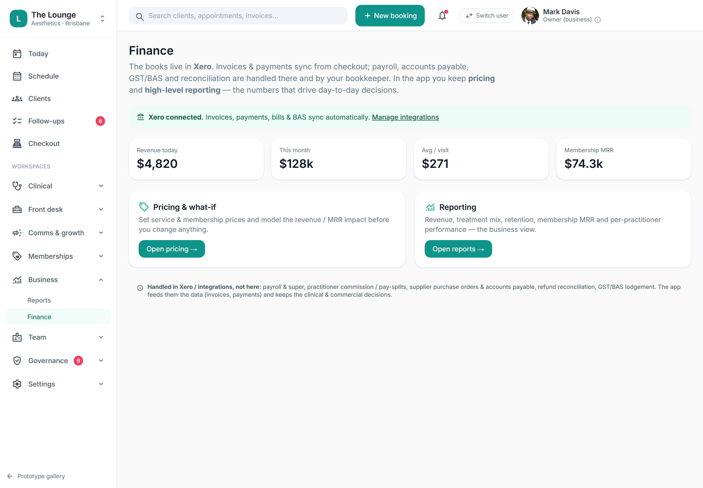

# Owner-only financial (.fin) capability gating

> **Epic:** [PLATFORM — Platform shell, navigation & cross-cutting UX](../epics/PLATFORM.md)  ·  **Key:** `PLATFORM/FIN-GATING`  ·  **Type:** Story  ·  **Stage:** M1  ·  **Priority:** P0  ·  **Estimate:** 5 pts  ·  **Area:** backend
>
> **Depends on:** `PRD-01/RBAC`

## Background

As a owner, I want all revenue/MRR/pricing figures hidden from non-owner roles across the app and API, so that financials stay owner-only.
Project rule + prototype: revenue, MRR and pricing figures must stay gated behind the owner financial capability; non-owner roles (e.g. reception) see memberships but no money figures. The prototype tags these with a .fin class toggled by capability.

## How it works

The project's owner-only-financials rule made structural: all revenue, MRR and pricing figures are gated behind the owner financial capability (finance.read — the prototype's .fin class), hidden from non-owner roles across the app AND the API. The prototype's applyFin() shows/hides every .fin element based on the active persona's caps.financials; this story makes that a server-side guarantee, not a CSS toggle.
Enforced server-side (ADR-0008): the API never returns a gated figure to an unauthorised role — money fields are stripped/denied at the query/serialisation layer, so a non-owner can't see revenue by reading the network response or hitting the endpoint directly. The UI .fin hiding is then just presentation over an already-safe payload. Attempted direct access to a gated figure is denied and audited (scope_block via AUTH-AUDIT).
The split is operational-vs-financial: non-owner roles see operational data (membership status, who's a member, appointment counts, stock levels) but never the money (MRR, plan pricing, revenue, avg-per-visit). The prototype Finance screen (finance.png) is owner-only and shows exactly the gated cards — Revenue today $4,820, This month $128k, Avg/visit $271, Membership MRR $74.3k — while Reception sees memberships without those figures, and the Memberships 'Pricing & what-if' sub-nav is itself .fin-gated.
Coverage: dashboards/Today (money cards), checkout (totals visible to whoever takes payment but revenue aggregates owner-only), Finance, Memberships (pricing/MRR), Reports, and global search invoice results. The gate is one capability applied everywhere money appears, so there's no per-screen leak to maintain.

## Requirements

- All revenue/MRR/pricing figures hidden from non-owner roles across the app and API.
- Compliance: [C4](https://github.com/danpowell88/tlapoc/blob/main/docs/02-requirements.md#6-compliance-requirements-auqld--restated-as-acceptance-criteria), [C10](https://github.com/danpowell88/tlapoc/blob/main/docs/02-requirements.md#6-compliance-requirements-auqld--restated-as-acceptance-criteria)

## Acceptance Criteria

- [ ] A financial capability gates money figures in dashboards, checkout, finance, memberships and reports.
- [ ] Non-owner roles see operational data (e.g. membership status) but no revenue/MRR/pricing.
- [ ] Gating is enforced server-side (API never returns gated figures to unauthorised roles), not just hidden in UI.
- [ ] Attempted access is denied and audited.

## UI designs / screenshots

- Prototype: money figures tagged .fin are shown only when the active persona has caps.financials (applyFin) — Finance screen (finance.png) cards (Revenue today / This month / Avg per visit / Membership MRR), the Memberships 'Pricing & what-if' sub-nav, Reports, and dashboard money cards.
- Non-owner roles (Reception, RN, NP) see operational data (membership status, counts, stock) but no revenue/MRR/pricing anywhere; the owner sees all.

## Suggested data model

- **Capability finance.read (.fin)** — gates money fields (revenue, MRR, plan pricing, avg-per-visit, cost) server-side across dashboards, checkout, finance, memberships, reports, search
  - _API strips/denies gated figures for roles lacking the capability; attempted access denied + audited (AUTH-AUDIT). Independent of clinical roles (MULTI-ROLE)._

## Technical notes (high level)

- Architecture decisions: [ADR-0017](https://github.com/danpowell88/tlapoc/blob/main/docs/adr/decision-log.md)

## Other

- Source PRD: [README.md](https://github.com/danpowell88/tlapoc/blob/main/docs/ux/README.md)

## Tasks (dev pickup)

- [ ] **Server-side financial gate (strip/deny money fields by capability)**
  Make finance.read (.fin) the single capability that gates money fields, and enforce it at the query/serialisation layer so the API never returns revenue/MRR/pricing/avg-per-visit/cost to a role lacking it — strip the fields, don't merely hide them. Apply it uniformly across the money-bearing read models (dashboards/Today, checkout aggregates, Finance, Memberships pricing/MRR, Reports, search invoice results) so there's no per-endpoint leak. Deny + audit (AUTH-AUDIT scope_block) any direct attempt to read a gated figure. Keep it independent of clinical roles (an NP isn't owner — MULTI-ROLE).
- [ ] **Apply .fin presentation gating across the web app**
  Render the .fin presentation layer over the already-safe payloads: hide money figures (the prototype's .fin elements + applyFin behaviour) for non-owner roles across Today, checkout, Finance (finance.png), Memberships (incl. the Pricing & what-if sub-nav), Reports and search. Non-owner roles still see operational data (membership status, counts, stock) — only money disappears.
- [ ] **Verify no money leaks to non-owner roles end-to-end**
  Confirm the gate holds across every money-bearing surface and the direct API: a non-owner role (Reception/RN/NP) sees operational data but no revenue/MRR/pricing in dashboards, checkout, finance, memberships, reports or search responses, and a denied direct read is audited. (Verification slice for the owner-only-financials rule — design-level, not a separate test task.)
