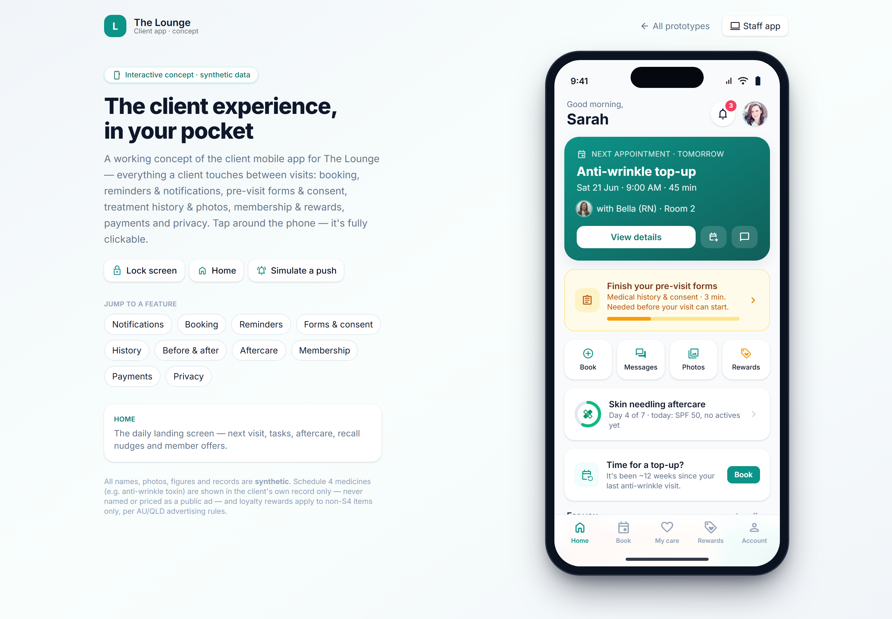

# Client privacy: collection notice, access & correction (DSAR)

> **Epic:** [PRD-01 — Foundations & tenancy (auth, RBAC, audit, data model)](../epics/PRD-01.md)  ·  **Key:** `PRD-01/PRIVACY-RIGHTS`  ·  **Type:** Story  ·  **Stage:** M1  ·  **Priority:** P1  ·  **Estimate:** 3 pts  ·  **Area:** backend
>
> **Depends on:** `PRD-01/TENANT`

## Background

As a client, I want to see a clear collection notice, access a copy of my data and request a correction, so that my privacy rights under the Privacy Act are respected.
Plainly: this gives clients their legal privacy rights — a clear notice at sign-up, a way to get a copy of their own data, and a way to request a correction or deletion. It is a Foundations governance story built on tenancy. Client-facing self-service lives in the client app and the staff side is a queue in Governance; it links to the retention story, since some records must be kept even after a deletion request. Clients have APP 12/13 (Australian Privacy Principles 12 and 13 — access and correction rights) rights: a collection notice/consent at sign-up, and the ability to access and request correction of their own data (DSAR (data subject access request — a person's legal request to access or correct their data) clock ≤30 days).

## How it works

Clients get their Privacy Act APP 12/13 rights (C21, REQ-SEC-5/8/9): a clear collection notice + consent captured at sign-up (recorded with the notice version), the ability to view/export a copy of their own personal and health data, and the ability to request a correction — every request tracked against the DSAR <=30-day clock and audited.
Self-service lives in the client app privacy area (client-app.html -> Account -> Privacy & consents): a trust card 'Your data is stored securely in Australia — only you and your care team can access your record', the client's current consents, a 'Download a copy of my data' action that opens an access request, and 'Request account deletion'. The app correctly states the retention caveat: some clinical records must be kept for a legally required period even after a deletion request (this ties to RETENTION — a deletion request does not override a legal retention period or a litigation hold).
Staff handle the resulting requests via a DSAR queue in Governance: each PrivacyRequest (access | correction | deletion) carries opened_at and a due_at = opened_at + 30 days, with a status tracked to resolution. A correction is applied as an appended, linked change (clinical records are immutable — ADR-0010 — so a correction never overwrites the original). All access/correction/deletion actions are audited (AC: every action audited), and access/export reuses the AUDIT read-capture so 'who exported this client's data' is on the record.
Edge cases: a deletion request on a record under legal retention or hold is acknowledged but deferred with the reason shown to the client; an access export is delivered via a short-lived signed URL to AU-resident storage (RESIDENCY).

## Requirements

- To see a clear collection notice, access a copy of my data and request a correction.
- Compliance: [C21](https://github.com/danpowell88/tlapoc/blob/main/docs/02-requirements.md#6-compliance-requirements-auqld--restated-as-acceptance-criteria)

## Acceptance Criteria

- [ ] Collection notice + consent shown and recorded at sign-up.
- [ ] A client can view/export their own personal/health data.
- [ ] A correction request is tracked to resolution against the DSAR clock.
- [ ] All access/correction actions are audited.

## UI designs / screenshots

- Client app: Account -> Privacy & consents (client-app.png) — AU-residency trust card, 'Your consents' list, 'Download a copy of my data', 'Request account deletion', and the retention caveat note.
- Staff side: a DSAR queue in Governance — each request with type, opened/due dates, the 30-day clock and status to resolution; correction applied as an appended linked change.
- Collection notice + consent shown and recorded at sign-up (notice version stored).

## Suggested data model

- **PrivacyRequest** — id, tenant_id, client_id, type(access|correction|deletion), opened_at, due_at, status(open|in_progress|resolved|deferred), resolution, handled_by
  - _DSAR clock = opened_at + 30d; a deletion under retention/hold is deferred with a reason (links RETENTION)._
- **ConsentToCollect** — id, tenant_id, client_id, notice_version, granted_at
  - _Captured at sign-up; the collection-notice version is recorded for evidence._
- **CorrectionEntry** — id, request_id, target_ref, appended_change, at, by
  - _Correction is appended + linked, never an overwrite (ADR-0010 immutability)._

## Other

- Source PRD: [PRD-01-foundations-tenancy.md](https://github.com/danpowell88/tlapoc/blob/main/docs/prds/PRD-01-foundations-tenancy.md)

## Tasks (dev pickup)

- [ ] **Collection notice/consent at sign-up + DSAR request model**
  Capture and record the collection notice + consent at client sign-up (ConsentToCollect with notice_version + granted_at). Model PrivacyRequest (access|correction|deletion) with opened_at and due_at = opened_at + 30d and a status tracked to resolution. A deletion request that hits a legal retention period or litigation hold (RETENTION) is acknowledged but deferred with a stored reason. Every privacy action writes an AuditEvent; access/export reuses the AUDIT read-capture.
- [ ] **Self-service privacy in the client app**
  Build client-app Account -> Privacy & consents (client-app.png): the AU-residency trust card, the current-consents list, 'Download a copy of my data' (opens an access request; export delivered via a short-lived signed URL to AU-resident storage), 'Request account deletion' (opens a deletion request with the retention caveat shown), and the legal-retention note. Wire each action to create the corresponding PrivacyRequest.
- [ ] **Staff DSAR queue in Governance + correction handling**
  Build the Governance DSAR (data subject access request — a person's legal request to access or correct their data) queue: each request with type, opened/due dates, the 30-day clock and status to resolution, plus the fulfilment actions. A correction is applied as an appended, linked CorrectionEntry against the immutable record (never an overwrite). Surface overdue/at-risk requests; capability-gate to compliance/owner. All actions audited.
