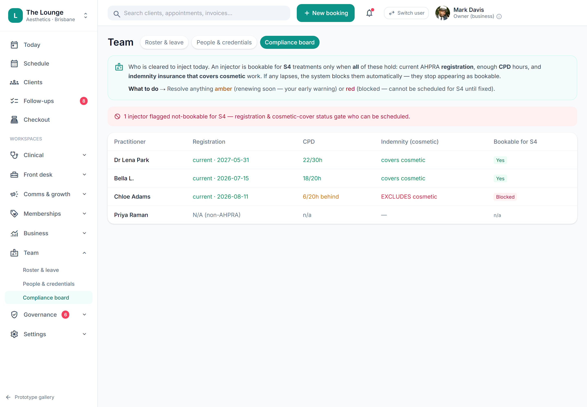

# Registration / PII / CPD expiry alerting

> **Epic:** [PRD-01 — Foundations & tenancy (auth, RBAC, audit, data model)](../epics/PRD-01.md)  ·  **Key:** `PRD-01/REG-WATCH`  ·  **Type:** Story  ·  **Stage:** M1  ·  **Priority:** P1  ·  **Estimate:** 3 pts  ·  **Area:** backend
>
> **Depends on:** `PRD-01/CREDENTIALS`

## Background

As a owner, I want to be alerted before a practitioner's registration, cosmetic insurance or CPD lapses, so that we never treat with an unregistered or uninsured practitioner.
Staff must be alerted before registration, insurance or CPD lapses so the clinic is never unknowingly non-compliant.

## How it works

A watchlist surfaces any credential within N days of expiry (registration, cosmetic insurance, CPD) so the clinic is never unknowingly non-compliant; on lapse, canInject flips to not-cleared and the practitioner stops being bookable.
Feeds the owner 'needs attention' digest and the compliance board.

## Requirements

- To be alerted before a practitioner's registration, cosmetic insurance or CPD lapses.
- Compliance: [C19](https://github.com/danpowell88/tlapoc/blob/main/docs/02-requirements.md#6-compliance-requirements-auqld--restated-as-acceptance-criteria)

## Acceptance Criteria

- [ ] Items within N days of expiry surface on an alert/watchlist (also feeds PRD-08).
- [ ] On lapse, the practitioner's canInject flips to not-cleared automatically.
- [ ] Alerts are role-targeted and dismiss/acknowledge is audited.
- [ ] AHPRA register auto-verification (PIE) is supported with a first-class manual-verify fallback.

## UI designs / screenshots

- Prototype: Team -> Compliance board (team-compliance.png) — the 'cleared to treat' board with per-practitioner status chips and expiry countdowns; alerts on items due.
- Role-targeted alerts; acknowledge/dismiss is audited.

## Suggested data model

- **CredentialAlert** — id, tenant_id, credential_id, type(expiring|lapsed), due_date, acknowledged_by, acknowledged_at
  - _Generated by a scheduled job (Sprint-0 JOBS-SCHEDULER)._

## Technical notes (high level)

- Stack: .NET API (domain/services)
- Architecture decisions: [ADR-0029](https://github.com/danpowell88/tlapoc/blob/main/docs/adr/decision-log.md)

## Other

- Source PRD: [PRD-01-foundations-tenancy.md](https://github.com/danpowell88/tlapoc/blob/main/docs/prds/PRD-01-foundations-tenancy.md)

## Tasks (dev pickup)

- [ ] **Data model & migrations** — Entities/columns + relationships; tenant_id + RLS.
- [ ] **Backend: domain logic, rules & API endpoint(s)** — Behaviour + invariants + the OpenAPI contract the UI/clients consume.
- [ ] **Enforce compliance gate + audit events** — Server-side (C19); blocked path explains why.
