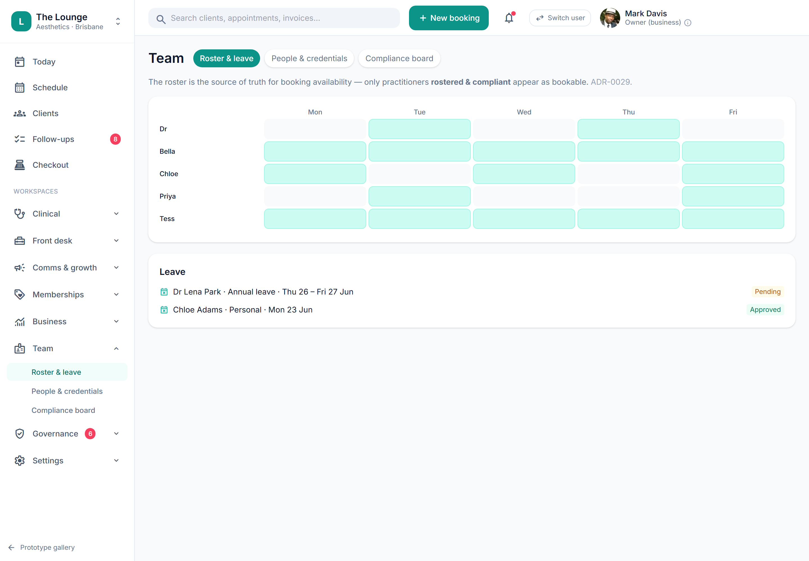

# Rosters & engagement type

> **Epic:** [PRD-01 — Foundations & tenancy (auth, RBAC, audit, data model)](../epics/PRD-01.md)  ·  **Key:** `PRD-01/ROSTER`  ·  **Type:** Story  ·  **Stage:** M1  ·  **Priority:** P1  ·  **Estimate:** 3 pts  ·  **Area:** backend
>
> **Depends on:** `PRD-01/CREDENTIALS`

## Background

As a manager, I want to record staff rosters/time-off and each person's engagement type, so that booking availability reflects who is actually working and cleared.
A roster (plus employee/contractor engagement type) drives booking availability and feeds commission/pay attribution downstream.

## How it works

The roster records who is working when (and time-off) per staff and location. Booking availability is derived from roster intersected with canInject, so the diary only offers slots with a rostered, cleared practitioner.
Engagement type (employee/contractor) is recorded for downstream commission/pay attribution.

## Requirements

- To record staff rosters/time-off and each person's engagement type.

## Acceptance Criteria

- [ ] Rosters and time-off are recorded per staff member and location.
- [ ] Booking availability is derived from roster ∩ canInject (consumed by PRD-02).
- [ ] Engagement type (employee/contractor) is recorded per staff member.
- [ ] Roster changes are audited.

## UI designs / screenshots

- Prototype: Team -> Roster & leave (team-roster.png) — a weekly roster grid per practitioner with shifts and leave; drives availability in Schedule.

## Suggested data model

- **RosterShift** — id, tenant_id, staff_id, location_id, start, end, role
  - _Availability = shifts - time-off, intersected with canInject._
- **TimeOff** — id, staff_id, start, end, type, status
  - _Blocks availability._

## Technical notes (high level)

- Architecture decisions: [ADR-0028](https://github.com/danpowell88/tlapoc/blob/main/docs/adr/decision-log.md), [ADR-0029](https://github.com/danpowell88/tlapoc/blob/main/docs/adr/decision-log.md)

## Other

- Source PRD: [PRD-01-foundations-tenancy.md](https://github.com/danpowell88/tlapoc/blob/main/docs/prds/PRD-01-foundations-tenancy.md)

## Tasks (dev pickup)

- [ ] **Data model & migrations** — Entities/columns + relationships; tenant_id + RLS.
- [ ] **Backend: domain logic, rules & API endpoint(s)** — Behaviour + invariants + the OpenAPI contract the UI/clients consume.
