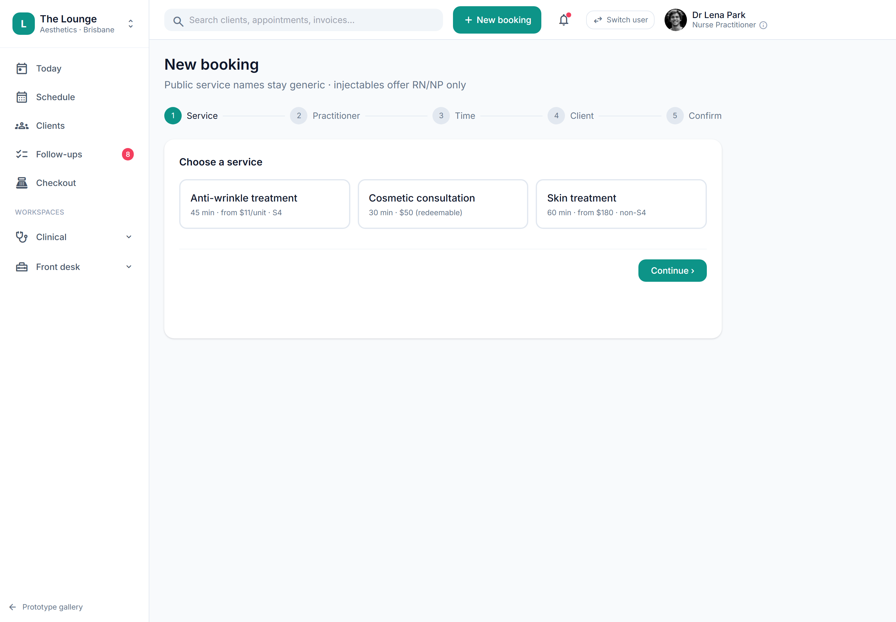

# Staff booking wizard (service → practitioner → time → client → confirm)

> **Epic:** [PRD-02 — Booking & scheduling (+ client/CRM basics)](../epics/PRD-02.md)  ·  **Key:** `PRD-02/BOOKING-WIZARD`  ·  **Type:** Story  ·  **Stage:** M2  ·  **Priority:** P1  ·  **Estimate:** 3 pts  ·  **Area:** web
>
> **Depends on:** `PRD-02/CALENDAR`, `PRD-02/SERVICE-CATALOGUE`

## Background

As a front desk, I want a guided booking wizard to create an appointment in a few steps, so that I can book clients quickly at the desk or over the phone.
The prototype's front-desk 'New booking' wizard (service select, slot pick, client attach, confirm) is the staff counterpart to client self-booking, and the entry point most bookings flow through.

## How it works

The staff booking wizard is the desk/phone counterpart to online self-booking and the path most bookings flow through: service → practitioner → time slot → client → confirm. It uses the same scope-aware availability engine as everything else, so the practitioner step for an injectable offers only cleared RN/NP (and a 'Next available' shortcut to the soonest eligible injector), and the slot grid reflects roster ∩ availability with taken slots struck through.
At the client step the desk attaches an existing (returning) client or creates one inline (new) — returning gets a quick medical re-screen, new gets full intake + medical history + BDD screen + consent; under-18 is flagged. A checkbox sends the intake + consent links now with the note 'treatment can't start until complete' (ties to PRD-03 GATING).
Confirm shows the booking summary, the cancellation policy, and schedules the reminder (e.g. 24h prior, via PRD-07). The created Appointment is source=desk — identical entity/flow to online and walk-in.

## Requirements

- A guided booking wizard to create an appointment in a few steps.
- Compliance: [C4](https://github.com/danpowell88/tlapoc/blob/main/docs/02-requirements.md#6-compliance-requirements-auqld--restated-as-acceptance-criteria)

## Acceptance Criteria

- [ ] Wizard steps: service → practitioner → time slot → client → confirm.
- [ ] Scope-aware: injectable services offer only cleared RN/NP (C4); slots reflect roster ∩ availability.
- [ ] An existing client can be attached or a new one created inline; under-18 is flagged.
- [ ] Confirmation shows the cancellation policy and schedules reminders (PRD-07).

## UI designs / screenshots

_Prototype screen: prototype.html — Schedule, 'New booking' wizard, Clients directory & 360._

- Prototype: 'New booking' wizard (booking-wizard.png) — stepper (1 Service · 2 Practitioner · 3 Time · 4 Client · 5 Confirm). Step 1 service cards show duration/price/schedule (e.g. 'Anti-wrinkle · 45 min · from $11/unit · S4'); header note 'Public service names stay generic · injectables offer RN/NP only'.
- Step 2: 'RN/NP only — injectable' with 'rostered today · availability respects shifts & existing bookings'; step 3 slot grid with taken slots struck through; step 4 attach Returning/New client + reason + 'Send intake + consent links now (treatment can't start until complete)'.
- Step 5 confirm: summary, 'Intake + consent SMS sent', 'Reminder scheduled for 24h prior'.

## Suggested data model

- **Appointment** — (as CALENDAR) source=desk
  - _Created via the wizard; same entity/flow as online + walk-in._
- **Client (ref)** — new|returning, dob/under_18, reason
  - _Attach existing or create inline; under-18 flagged; drives intake type + cooling-off._

## Other

- Source PRD: [PRD-02-booking-scheduling.md](https://github.com/danpowell88/tlapoc/blob/main/docs/prds/PRD-02-booking-scheduling.md)

## Tasks (dev pickup)

- [ ] **Wizard stepper UI (service→practitioner→time→client→confirm)**
  Angular 5-step wizard with progress stepper. Step 1 service cards (duration/price/schedule, generic names). Step 2 practitioner cards filtered by scope for S4 (+ 'Next available' = soonest eligible). Step 3 slot grid from the availability engine with taken slots disabled/struck-through. Back/Continue nav; state held until confirm.
- [ ] **Client step: attach existing or create inline + under-18 flag**
  Step 4: search/attach an existing (returning) client or create one inline (new) capturing DOB; toggle Returning/New changes the intake hint (returning=quick re-screen; new=full intake+history+BDD+consent). Derive + stamp under_18. Capture reason/notes. Checkbox 'Send intake + consent links now (treatment can't start until complete)' wires to the PRD-03 send.
- [ ] **Confirm step: policy display + create (source=desk) + reminder schedule**
  Step 5: show the booking summary + the cancellation policy; on confirm, call the create endpoint (source=desk, full server-side scope/conflict checks), schedule the reminder (PRD-07, e.g. 24h prior) and trigger the intake/consent send if selected. Show 'Intake + consent sent · Reminder scheduled'.
- [ ] **Scope-aware practitioner/slot filtering (shared engine)**
  Ensure steps 2–3 call the SAME server-side availability engine as CALENDAR/online so an injectable never offers an ineligible practitioner and slots honour roster ∩ canInject ∩ free-resource. No client-side scope logic — the server returns only eligible practitioners/slots.
