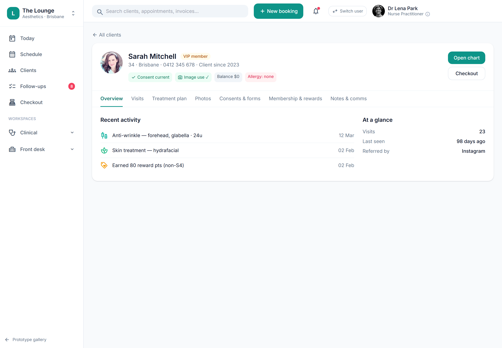

# Client 360° profile

> **Epic:** [PRD-02 — Booking & scheduling (+ client/CRM basics)](../epics/PRD-02.md)  ·  **Key:** `PRD-02/CLIENT-360`  ·  **Type:** Story  ·  **Stage:** M2  ·  **Priority:** P1  ·  **Estimate:** 3 pts  ·  **Area:** web
>
> **Depends on:** `PRD-01/CLIENT-CORE`

## Background

As a staff member, I want a single 360° client profile pulling together history, medical flags, consents, photos, memberships, balances and comms, so that I have the full picture in one place.
The Client 360 profile is the single record everything in Reception (PRD-02) hangs off — the CRM (client relationship management) view any staff member opens to see one client whole. It builds on the core client record from Foundations (PRD-01/CLIENT-CORE) and aggregates data owned by the consent (PRD-03), clinical (PRD-04/05), payments (PRD-06) and compliance (PRD-11) modules. It is a read aggregation, not a source of truth: this story composes and presents the picture (with the at-a-glance gate chips a clinician reads before charting), while each underlying part stays owned by its module; the directory story (PRD-02/CLIENT-DIR) is how staff find their way into it.  Any staff member can open a client's full profile: history, contacts, medical flags, consents, photos, memberships, balances, comms and complaints.

## How it works

A single 360° client profile pulls together everything any staff member needs in one place: overview/at-a-glance, visit history, treatment plan, photos (image-use gated), consents & forms, membership & rewards, billing and notes/comms — surfacing data OWNED by PRD-03/04/05/06/11 via the API (this story is the read aggregation + header, not the source of truth for each part).
The header carries the compliance/age chips — Consent current, Image use ✓, Balance, Allergy flags, and (when applicable) an under-18 cooling-off chip — so a clinician sees the gate state at a glance before opening the chart. Quick actions: Open chart (capability-gated) and Checkout.
Access is RBAC-scoped and audited (C10): reception sees limited clinical info (no full clinical record), money figures stay behind the .fin capability (owner-only), and every read of clinical/PII data writes an AuditEvent.

## Requirements

- A single 360° client profile pulling together history, medical flags, consents, photos, memberships, balances and comms.
- Compliance: [C10](https://github.com/danpowell88/tlapoc/blob/main/docs/02-requirements.md#6-compliance-requirements-auqld--restated-as-acceptance-criteria)

## Acceptance Criteria

- [ ] Profile aggregates overview, medical/contraindications, consents, photos, visits, memberships, balance, comms, complaints.
- [ ] Consent/age chips render on the header (consent ✓ / image-use ✓ / under-18 cooling-off).
- [ ] Access is RBAC-scoped (reception sees limited clinical info) and audited.
- [ ] Surfaces data owned by PRD-03/04/05/06/11 via the API.

## UI designs / screenshots

_Prototype screen: prototype.html — Schedule, 'New booking' wizard, Clients directory & 360._

- Prototype: Client 360 (client-360.png) — header with avatar, name, VIP/member tag, demographics, and compliance chips: 'Consent current', 'Image use ✓', 'Balance $0', 'Allergy: none'. Quick actions 'Open chart' / 'Checkout'.
- Tabbed sections: Overview (recent activity + at-a-glance: visits, last seen, referred-by; lifetime spend is .fin-gated), Visits, Treatment plan, Photos (image-use consent on file), Consents & forms, Membership & rewards, Billing (.fin), Notes & comms.
- Reception sees limited clinical info; money tabs/figures gated behind .fin (owner-only).

## Suggested data model

- **Client (aggregate read view)** — joins Client + IntakeResponse + ConsentSignature + ImageConsent + Photo + Appointment/Visit + Membership + AccountBalance + RewardLedger + Complaint
  - _Read aggregation; each part owned by its module; RBAC filters fields; .fin gates money._
- **AuditEvent (ref)** — actor, client_id, fields-viewed, at
  - _Every clinical/PII read is audited (C10, ADR-0010)._

## Other

- Source PRD: [PRD-02-booking-scheduling.md](https://github.com/danpowell88/tlapoc/blob/main/docs/prds/PRD-02-booking-scheduling.md)

## Tasks (dev pickup)

- [ ] **Client 360 read-aggregation API (RBAC + .fin + audit)**
  Behaviour: a read endpoint that composes the profile from each owning module (intake, consent, image-consent, visits, plan, membership, balance, rewards, complaints) — this story is the read aggregation, not the source of truth. Requirements: apply RBAC field filtering server-side (reception gets limited clinical info; money fields require the .fin capability — owner-only); write an AuditEvent for every clinical/PII read (C10, ADR-0010); return the header chip state (consent current, image-use, under-18 cooling-off) computed from the gates.
- [ ] **Profile header: compliance/age chips + quick actions**
  Behaviour: the header shows avatar, name, member/VIP tag and demographics, with chips for Consent current / Image use / Balance / Allergy / under-18 cooling-off (the mandatory wait before a cosmetic procedure can proceed), plus Open chart and Checkout quick actions. Requirements: chips are driven by the gate state and are the at-a-glance read a clinician makes before charting; Open chart is hidden unless the role has chart capability; the Balance chip honours .fin (owner-only).
- [ ] **Overview tab (recent activity + at-a-glance)**
  Behaviour: the default tab showing recent activity (treatments, rewards, skin) and an at-a-glance panel (visits count, last seen, referred-by). Requirements: lifetime spend / money figures in the at-a-glance are .fin-gated (owner-only); reads via the aggregation API; deep-links into the relevant record.
- [ ] **Clinical & visit tabs (Visits / Treatment plan / Consents & forms)**
  Behaviour: tabs rendering visit history, the treatment plan, and consents & forms. Requirements: each reads its owning module's data via the aggregation API and respects RBAC (reception sees limited clinical info, not the full clinical record); deep-links into charting / follow-ups; clinical reads are audited.
- [ ] **Commercial tabs (Membership & rewards / Billing / Notes & comms)**
  Behaviour: tabs for membership & rewards, billing, and notes & comms. Requirements: the Billing tab and any money figures are gated behind the .fin capability (owner-only) and stripped for non-owner roles such as Reception (who may see memberships but no money); reads via the aggregation API; deep-links into checkout.
