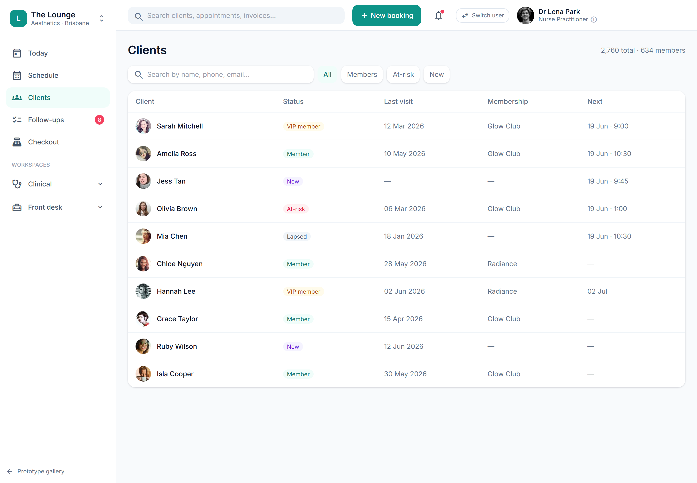

# Client directory — basic search & list

> **Epic:** [PRD-02 — Booking & scheduling (+ client/CRM basics)](../epics/PRD-02.md)  ·  **Key:** `PRD-02/CLIENT-DIR`  ·  **Type:** Story  ·  **Stage:** M2  ·  **Priority:** P2  ·  **Estimate:** 2 pts  ·  **Area:** web
>
> **Depends on:** `PRD-02/CLIENT-360`

## Background

As a front desk, I want to search and filter clients, merge duplicates and soft-delete with audit, so that the client list stays accurate and findable.
The client directory is how the front desk finds anyone fast and keeps the client list clean. It sits in Reception (PRD-02) directly on top of the Client 360 profile (PRD-02/CLIENT-360) — a directory row opens that profile — and powers the global header search across the staff app shell. In the flow it is the entry point into a client record: search and filter find the person, duplicate-merge and audited soft-delete keep the record accurate, and true destruction is left to the retention policy in Foundations (PRD-01/RETENTION) rather than done here. As front desk, I want to search and filter clients, merge duplicates and soft-delete with audit, so that the client list stays accurate and findable.  A searchable client directory with duplicate merge and audited soft-delete keeps the record clean.

## How it works

A fast, searchable client directory so the front desk can find anyone by name/phone/email and filter by segment (All / Members / At-risk / New). A row opens the Client 360. The global header search jumps straight to a client from anywhere in the shell.
Duplicate detection + merge keeps the record clean: candidate duplicates are surfaced, and a merge re-points all child records (appointments, consents, photos, invoices, memberships) to the surviving primary while preserving history, writing a MergeLog (audited, reversible reference).
Soft-delete sets deleted_at (audited) and excludes the client from active views without destroying history — respecting retention obligations (records can't simply be hard-deleted; PRD-01 RETENTION governs true destruction).

## Requirements

- To search and filter clients, merge duplicates and soft-delete with audit.
- Compliance: [C10](https://github.com/danpowell88/tlapoc/blob/main/docs/02-requirements.md#6-compliance-requirements-auqld--restated-as-acceptance-criteria)

## Acceptance Criteria

- [ ] Fast search/filter across the directory.
- [ ] Duplicate detection + merge that preserves history and audit.
- [ ] Soft-delete with audit; deleted clients excluded from active views.
- [ ] Quick client search is reachable from the front-desk shell.

## UI designs / screenshots

_Prototype screen: prototype.html — Schedule, 'New booking' wizard, Clients directory & 360._

- Prototype: Clients (clients.png) — search by name/phone/email; segment filters (All / Members / At-risk / New); table columns Client, Status, Last visit, Lifetime (.fin), Membership, Next; a row opens Client 360.
- Merge-duplicates and soft-delete actions; global header search ('Search clients, appointments, invoices…') jumps straight to a client.

## Suggested data model

- **Client** — (as PRD-01 CLIENT-CORE) + search_index, deleted_at
  - _Soft-delete sets deleted_at and excludes from active views; never hard-deleted (retention)._
- **MergeLog** — id, tenant_id, primary_id, merged_id, at, actor_id, repointed_counts(json)
  - _Audited; merge re-points child records to the primary and preserves history._

## Other

- Source PRD: [PRD-02-booking-scheduling.md](https://github.com/danpowell88/tlapoc/blob/main/docs/prds/PRD-02-booking-scheduling.md)

## Tasks (dev pickup)

- [ ] **Directory search/filter API + index**
  Behaviour: a searchable, paginated directory over name/phone/email. Requirements: back it with a search index for fast prefix/fuzzy match; tenant RLS (row-level security); exclude soft-deleted clients from active results; money columns (lifetime) flagged .fin so the UI can gate them (owner-only).
- [ ] **Clients table (row opens Client 360)**
  Behaviour: the Clients screen — a search box and a table (Client / Status / Last visit / Lifetime[.fin] / Membership / Next) where a row opens Client 360. Requirements: the Lifetime column is .fin-gated (owner-only); reads the directory search API. Segment filters, audited soft-delete and the global header search wiring are follow-ups.
