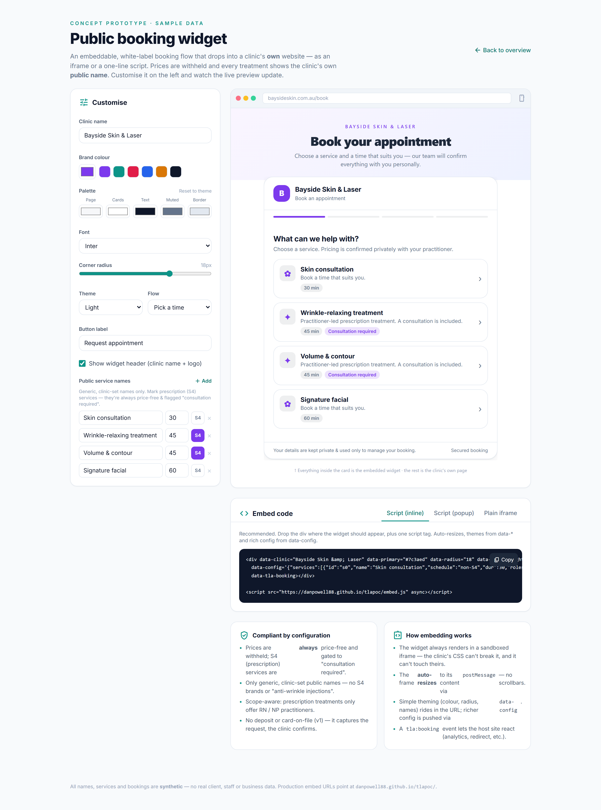

# Online self-booking (scope-aware)

> **Epic:** [PRD-02 — Booking & scheduling (+ client/CRM basics)](../epics/PRD-02.md)  ·  **Key:** `PRD-02/ONLINE-BOOK`  ·  **Type:** Story  ·  **Stage:** M2  ·  **Priority:** P0  ·  **Estimate:** 5 pts  ·  **Area:** web
>
> **Depends on:** `PRD-02/CALENDAR`, `PRD-01/CREDENTIALS`

## Background

As a client, I want to book a consult/treatment online by choosing service, practitioner and time, so that I can book without calling the clinic.
Online self-booking is the public, client-facing front door to Reception (PRD-02): it lets a client book themselves onto the same diary the front desk runs, reusing the multi-resource calendar (PRD-02/CALENDAR) availability engine and the credentialing from Foundations (PRD-01/CREDENTIALS). It sits early in the clinic-first flow but faces outward, so it is deliberately constrained: an injectable can only ever offer a cleared injector, prices and brand names for prescription medicines are withheld, and a completed booking hands straight off to the Intake/Consent step (PRD-03) that must be satisfied before any treatment can proceed.  Clients self-book service → practitioner → slot online; injectable services only offer cleared RN/NP and the public page uses generic names (C4/C9).

## How it works

Client-facing self-booking on the public page / embeddable widget: service → practitioner → slot → account → intake/consent. It reuses the EXACT same scope-aware availability engine as the desk, so an injectable (S4) service only offers cleared RN/NP and presents the consult as part of a gated flow — the public surface can never book an uncredentialled injector.
The public surface is advertising-constrained by configuration (C9, shared with PRD-07 BOOKING-PAGE): services show clinic-customised GENERIC display names (no S4 brands or 'anti-wrinkle injection' wording), S4 prices are withheld and the service is tagged 'Consultation required' / price-free. None of this is an automated linter — it is a per-tenant PublicBookingConfig setting.
On account creation the DOB is captured; a booking for a client under 18 is flagged so PRD-03 can later enforce the 7-day cooling-off and payment block. The booked Appointment is identical to a desk booking (source=online) and triggers the intake + consent send.

## Requirements

- To book a consult/treatment online by choosing service, practitioner and time.
- Compliance: [C4](https://github.com/danpowell88/tlapoc/blob/main/docs/02-requirements.md#6-compliance-requirements-auqld--restated-as-acceptance-criteria), [C6](https://github.com/danpowell88/tlapoc/blob/main/docs/02-requirements.md#6-compliance-requirements-auqld--restated-as-acceptance-criteria), [C9](https://github.com/danpowell88/tlapoc/blob/main/docs/02-requirements.md#6-compliance-requirements-auqld--restated-as-acceptance-criteria)

## Acceptance Criteria

- [ ] Booking wizard: service → practitioner → time → client → confirm.
- [ ] Injectable services offer only cleared RN/NP (scope-aware, per C4); others never appear bookable for it.
- [ ] Public service names are generic and S4 prices withheld by configuration (C9, see PRD-07).
- [ ] Under-18 bookings are flagged for downstream cooling-off (feeds PRD-03).

## UI designs / screenshots

_Prototype screen: prototype.html — Schedule, 'New booking' wizard, Clients directory & 360._

- Prototype: public booking widget (booking-widget.png) and the embeddable/customise view (public-booking.png) — 'What can we help with?' service list with generic display names, S4 services tagged 'Consultation required' and shown price-free, 'Pricing is confirmed privately with your practitioner'.
- Flow steps (progress bar): service → practitioner (RN/NP only for S4) → slot grid → your details/account → intake & consent handoff; 'Your details are kept private & used only to manage your booking'.
- public-booking.png also shows the owner's 'Compliant by configuration' panel: generic names, withheld prices, S4 always price-free + 'consultation required', and 'no deposit / card on file in v1'.

## Suggested data model

- **Appointment** — (as CALENDAR) source=online
  - _Same entity; created via the public flow; triggers intake/consent send (PRD-03)._
- **PublicBookingConfig** — tenant_id, generic_names(bool), withhold_s4_prices(bool), display_name_overrides(map), embed_token
  - _Drives naming/pricing per C9 (shared with PRD-07 BOOKING-PAGE); a config setting, not a linter._
- **Client (ref)** — dob, under_18(derived)
  - _DOB captured at account create; under-18 flag feeds PRD-03 cooling-off (C6)._

## Other

- Source PRD: [PRD-02-booking-scheduling.md](https://github.com/danpowell88/tlapoc/blob/main/docs/prds/PRD-02-booking-scheduling.md)

## Tasks (dev pickup)

- [ ] **Service-selection step ('What can we help with?')**
  Behaviour: the public service list rendered as generic-named cards; S4 (Schedule 4 prescription-only medicine) services carry a 'Consultation required' tag, no price, and 'Pricing is confirmed privately with your practitioner' copy. Requirements: reads PublicBookingConfig (generic_names, display_name_overrides, withhold_s4_prices); the server returns ALREADY-SANITISED data so the browser never receives an S4 brand or price (C9, configuration policy not an advertising linter); only bookable services appear.
- [ ] **Practitioner step (scope-filtered for S4)**
  Behaviour: after a service is chosen, offer only practitioners who can perform it — for an S4 service only cleared RN/NP (the canInject gate), with a 'next available' shortcut. Requirements: the eligible-practitioner list comes from the SAME server-side availability engine as the desk (CALENDAR); an ineligible practitioner is never returned for an S4 service (C4); 'no preference' picks the soonest eligible injector.
- [ ] **Slot-grid step (public availability)**
  Behaviour: a date/time slot grid showing only genuinely bookable slots for the chosen service + practitioner. Requirements: slots = roster ∩ canInject ∩ free room/chair/device for the whole block incl. buffers, identical to the desk engine; taken/over-capacity slots are not selectable; the surface is rate-limited and bot-protected since it is public.
- [ ] **Details / account step (DOB capture + under-18 flag)**
  Behaviour: capture the client's details, create or match an account, and capture date of birth; show 'Your details are kept private & used only to manage your booking'. Requirements: derive under_18 from DOB and stamp it on the resulting Appointment so PRD-03 COOLING-OFF/GATING can enforce the 7-day cooling-off (the mandatory wait before a cosmetic procedure can proceed) + payment block; emit a domain event (a fact emitted when something happens in the system) so downstream gates react; guardian/contact capture is deferred to PRD-03.
- [ ] **Confirm step + create (source=online) + intake/consent handoff**
  Behaviour: a confirmation/summary that commits the booking and hands straight off to the intake + consent send. Requirements: the create endpoint sets source=online and re-runs the same server-side conflict/scope checks as the desk (an S4 booking with an ineligible practitioner is rejected); on success it triggers the PRD-03 intake + consent send and shows the 'kept private' assurance; the created Appointment is identical to a desk/walk-in booking.
- [ ] **Owner customise panel ('Compliant by configuration')**
  Behaviour: the owner-facing embed/customise view (brand colour, clinic name, service selection) plus the 'Compliant by configuration' summary — generic names, withheld prices, S4 always price-free + 'consultation required', 'no deposit / card on file in v1'. Requirements: writes PublicBookingConfig (incl. embed_token for the embeddable widget); shared policy with PRD-07 BOOKING-PAGE; capability-gated to owner.
