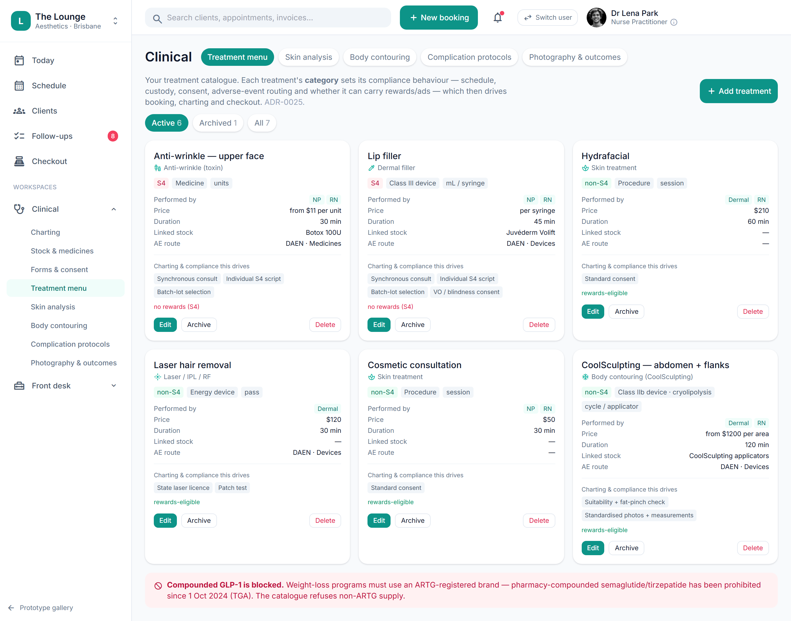

# Services & treatment-menu admin (durations, eligible roles, S4 flag)

> **Epic:** [PRD-02 — Booking & scheduling (+ client/CRM basics)](../epics/PRD-02.md)  ·  **Key:** `PRD-02/SERVICE-CATALOGUE`  ·  **Type:** Story  ·  **Stage:** M2  ·  **Priority:** P1  ·  **Estimate:** 3 pts  ·  **Area:** web
>
> **Depends on:** `PRD-04/PRODUCT-CATALOGUE`

## Background

As a owner / manager, I want to manage the menu of services with durations, eligible roles and the S4 flag, so that booking, rewards and the public page all behave correctly per service.
The prototype's clinical Treatment menu + admin services list defines bookable services with durations, eligible roles, and the S4/non-S4 flag that drives scope-aware booking, rewards eligibility and public-page naming.

## How it works

The services / treatment menu defines every bookable service with duration/buffer, eligible roles, price and the S4/non-S4 flag. That single flag drives scope-aware booking (C4), rewards eligibility (C9) and public-page naming (PRD-07).
Linked to the medicines/products catalogue (PRD-04) where a service consumes a product.

## Requirements

- To manage the menu of services with durations, eligible roles and the S4 flag.
- Compliance: [C4](https://github.com/danpowell88/tlapoc/blob/main/docs/02-requirements.md#6-compliance-requirements-auqld--restated-as-acceptance-criteria), [C9](https://github.com/danpowell88/tlapoc/blob/main/docs/02-requirements.md#6-compliance-requirements-auqld--restated-as-acceptance-criteria)

## Acceptance Criteria

- [ ] Services carry duration/buffer, eligible roles, price and the S4/non-S4 flag.
- [ ] The S4 flag drives scope-aware booking (C4), rewards eligibility (C9) and public naming (PRD-07).
- [ ] Capability-gated admin; changes are audited.
- [ ] Linked to the medicines/products catalogue (PRD-04) where a service consumes a product.

## UI designs / screenshots

_Prototype screen: prototype.html — Schedule, 'New booking' wizard, Clients directory & 360._

- Prototype: Clinical -> Treatment menu (clinical-menu.png) and admin Services & products — each service row shows duration, eligible roles, price, S4 flag; capability-gated admin; changes audited.
- The S4 tag visibly marks services and disables reward/discount controls on them.

## Suggested data model

- **Service** — id, tenant_id, name, public_name, duration, buffer, price, schedule(S4|non-S4), eligible_roles[], product_id?
  - _schedule flag is the master classification (ADR-0014)._

## Technical notes (high level)

- Architecture decisions: [ADR-0014](https://github.com/danpowell88/tlapoc/blob/main/docs/adr/decision-log.md)

## Other

- Source PRD: [PRD-02-booking-scheduling.md](https://github.com/danpowell88/tlapoc/blob/main/docs/prds/PRD-02-booking-scheduling.md)

## Tasks (dev pickup)

- [ ] **Data model & migrations**
  Model + migrate (EF Core; every table carries tenant_id with an RLS policy):
  - Service — id, tenant_id, name, public_name, duration, buffer, price, schedule(S4|non-S4), eligible_roles[], product_id? (schedule flag is the master classification (ADR-0014).)
  - Add the FKs/relationships above; index the columns this story filters or looks up on; make records append-only/immutable where the story requires it.
- [ ] **Backend: domain logic, rules & API endpoint(s)**
  Domain logic + the API the web/Flutter clients call; enforce every rule server-side (never trust the UI):
  - Endpoints: the commands + queries for the entities above and each action in the acceptance criteria.
  - Rule: Services carry duration/buffer, eligible roles, price and the S4/non-S4 flag.
  - Rule: The S4 flag drives scope-aware booking (C4), rewards eligibility (C9) and public naming (PRD-07).
  - Rule: Capability-gated admin; changes are audited.
  - Emit domain events for read-models / notifications / follow-up jobs where relevant.
  - Publish the OpenAPI contract so the generated clients update.
  - Depends on: PRD-04/PRODUCT-CATALOGUE.
- [ ] **Enforce compliance gate + audit events**
  Enforce C4, C9 as a server-side invariant that cannot be bypassed via the API:
  - Block the action when prerequisites are missing; return a clear reason for the blocked-action banner (what's blocked / which rule / how to resolve / who can resolve).
  - Write an immutable AuditEvent for the attempt and its outcome.
  - Capability-gated admin; changes are audited.
- [ ] **Web UI**
  Build on the Angular web app: the clinical-menu per the UI spec. Wire to the API with loading/empty/error states; capability-gate controls; responsive; show the blocked-action banner / gate chips where gated; respect owner-only .fin gating for money figures.
  Key elements (from the prototype):
  - Prototype: Clinical -> Treatment menu (clinical-menu.png) and admin Services & products — each service row shows duration, eligible roles, price, S4 flag; capability-gated admin; changes audited.
  - The S4 tag visibly marks services and disables reward/discount controls on them.
