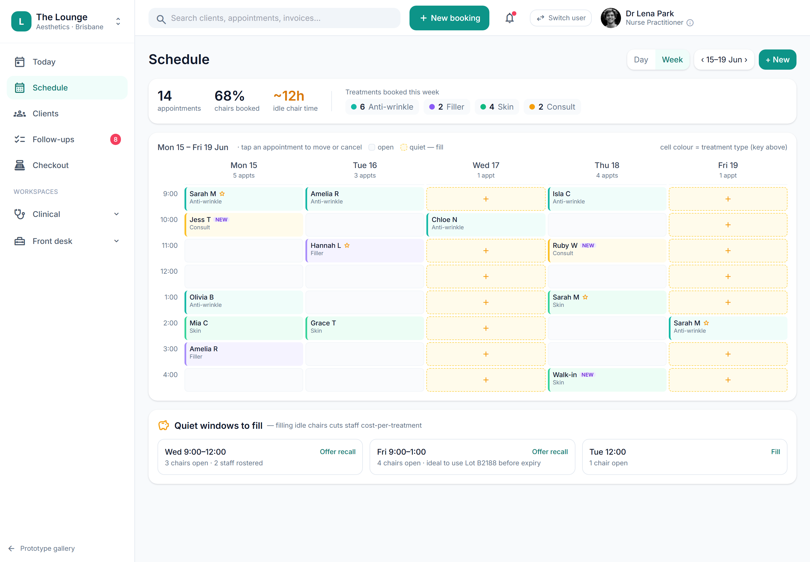

# Waitlist & cancellation backfill

> **Epic:** [PRD-02 — Booking & scheduling (+ client/CRM basics)](../epics/PRD-02.md)  ·  **Key:** `PRD-02/WAITLIST`  ·  **Type:** Story  ·  **Stage:** M2  ·  **Priority:** P1  ·  **Estimate:** 3 pts  ·  **Area:** web
>
> **Depends on:** `PRD-02/REMINDERS`

## Background

As a front desk, I want a waitlist that auto-offers a freed slot when an appointment cancels or no-shows, so that we keep the diary full.
The waitlist keeps the diary full by auto-offering a freed slot when a booking cancels or no-shows. It sits late in Reception (PRD-02), built on top of reminders (PRD-02/REMINDERS, which emit the slot-freed event) and the calendar (PRD-02/CALENDAR, whose utilisation data surfaces the quiet windows to fill). It is the demand-side counterpart to the lifecycle and reminder flow: where those free a slot, the waitlist matches a waiting client to it — always re-running the same scope/resource availability checks so a backfilled booking still honours the rules. As front desk, I want a waitlist that auto-offers a freed slot when an appointment cancels or no-shows, so that we keep the diary full.  Clients can join a waitlist; cancellations/no-shows auto-offer the freed slot to fill quiet windows.

## How it works

A waitlist captures clients who want an earlier slot for a service/window. When an appointment cancels or no-shows, the freed slot is automatically offered to matching waitlist entries (FIFO/priority) to keep the diary full and fill quiet windows.
An offer has a short hold/expiry: offered → accepted (books the slot, reusing the availability engine so scope/resource rules still hold) or expired (rolls to the next entry). Quiet-window fill suggestions surface from the calendar's utilisation data (the amber cells / 'Quiet windows to fill' panel) and can trigger a recall offer.
Offered/accepted/expired states are tracked per entry so the desk can see who was offered what and when.

## Requirements

- A waitlist that auto-offers a freed slot when an appointment cancels or no-shows.

## Acceptance Criteria

- [ ] Clients can be added to a waitlist for a service/window.
- [ ] Cancelling/no-showing a slot offers it to the waitlist.
- [ ] Quiet-window fill suggestions surface from utilisation data.
- [ ] Offered/accepted/expired waitlist states are tracked.

## UI designs / screenshots

_Prototype screen: prototype.html — Schedule, 'New booking' wizard, Clients directory & 360._

- Prototype: Schedule (schedule.png) — 'Quiet windows to fill' panel (open chairs per day, 'Offer recall' / 'Fill') and a backfill prompt when an appointment cancels/no-shows.
- Waitlist management: add a client to a waitlist for a service/window; see offered/accepted/expired status.

## Suggested data model

- **WaitlistEntry** — id, tenant_id, client_id, service_id, window(date/time range), priority, status(waiting|offered|accepted|expired), offered_at, expires_at
  - _Backfills on cancel/no-show; offer holds the slot until expiry, then rolls on._

## Technical notes (high level)

- Architecture decisions: [ADR-0026](https://github.com/danpowell88/tlapoc/blob/main/docs/adr/decision-log.md)

## Other

- Source PRD: [PRD-02-booking-scheduling.md](https://github.com/danpowell88/tlapoc/blob/main/docs/prds/PRD-02-booking-scheduling.md)

## Tasks (dev pickup)

- [ ] **Waitlist entry + matching/backfill engine**
  WaitlistEntry CRUD (client, service, desired window, priority). Subscribe to the slot-freed event (cancel/no-show from REMINDERS/LIFECYCLE); match freed slots to waiting entries (service + window + scope/resource feasible per the availability engine), create an offer with expires_at, and dispatch it (PRD-07). On accept → book via the create endpoint (full scope/conflict checks) and mark accepted; on expiry → mark expired and roll to the next entry. Idempotent, tenant-scoped.
- [ ] **Quiet-window fill suggestions from utilisation**
  Derive open/quiet chair windows from the calendar (roster − bookings, idle resource blocks) and expose them as fill suggestions. Drive the Schedule 'Quiet windows to fill' panel (open chairs per day, ideal-for-recall hints e.g. lot expiry) with 'Offer recall' (push to waitlist/recall) and 'Fill' actions.
- [ ] **Waitlist management UI + backfill prompt**
  UI to add/view/remove waitlist entries for a service/window and see offered/accepted/expired status. When an appointment is cancelled/no-showed, show the backfill prompt ('offer this slot to the waitlist'). Wire the Schedule quiet-window panel actions to the matching engine.
