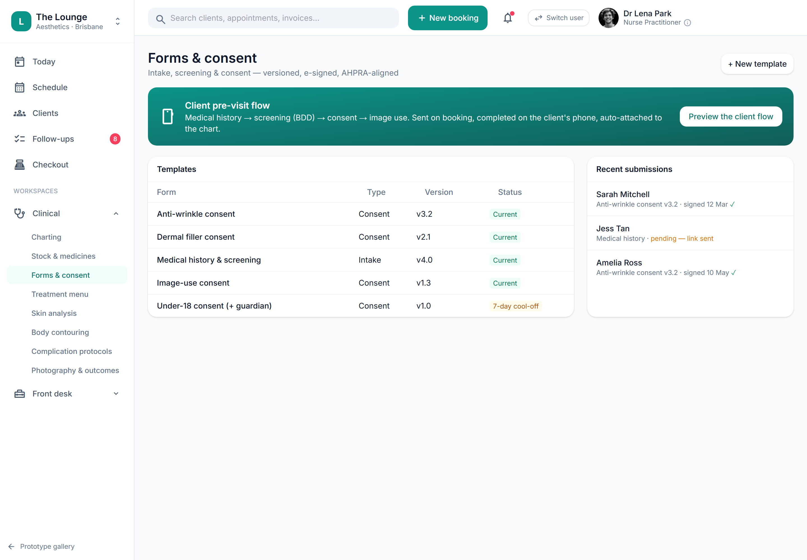

# Consent templates: mandated-content validation gate on publish

> **Epic:** [PRD-03 — Intake, consent & compliance gating](../epics/PRD-03.md)  ·  **Key:** `PRD-03/CONSENT-TEMPLATE-MANDATED-GATE`  ·  **Type:** Story  ·  **Stage:** M2  ·  **Priority:** P2  ·  **Estimate:** 2 pts  ·  **Area:** —
>
> **Depends on:** `PRD-03/CONSENT-TEMPLATE-ADMIN`

## Background

As a owner / manager, I want a consent version blocked from publishing unless it covers every mandated section, so that every consent a client signs is legally complete.
Plainly: the check that a consent template version cannot go live unless it covers every AHPRA-mandated content section. Where it fits: a follow-up to the consent templates basic versioned templates (PRD-03/CONSENT-TEMPLATE-ADMIN) that adds the publish gate on top of the versioned template. It enforces compliance criterion C5 (mandated consent content) server-side, regardless of the UI. It sits in Intake & Consent (PRD-03).

## How it works

The basic story models versioned consent templates; this follow-up adds the publish gate that makes each version legally complete. A version can only go live once it covers every required mandated-content section.
The mandated_fields[] checklist — nature of the procedure, risks/benefits/alternatives, practitioner qualifications, costs, realistic-outcome language (no minimising/overstating), and complaint mechanisms including the explicit right to complain to AHPRA despite any NDA — is validated server-side.
Publish is blocked until every mandated section is present (C5), and the rule is enforced regardless of the UI so a version can never be published incomplete via the API.

## Requirements

- A consent version blocked from publishing unless it covers every mandated section.
- Compliance: [C5](https://github.com/danpowell88/tlapoc/blob/main/docs/02-requirements.md#6-compliance-requirements-auqld--restated-as-acceptance-criteria)

## Acceptance Criteria

- [ ] A version cannot be published unless it covers every mandated-content section (nature, risks/benefits/alternatives, practitioner qualifications, costs, realistic-outcome language, complaint mechanisms incl. AHPRA-despite-NDA).
- [ ] The mandated_fields[] checklist is validated server-side.
- [ ] Publish is blocked until all mandated sections are present (C5).
- [ ] The rule is enforced regardless of the UI.

## UI designs / screenshots

- Prototype: Forms & consent (forms-consent.png) — a publish action disabled until all mandated sections are filled.
- The mandated-content sections are named, required blocks in the template editor.
- Publish is blocked server-side until the mandated_fields[] checklist is satisfied (C5).

## Suggested data model

- **ConsentTemplate (extends CONSENT-TEMPLATE-ADMIN)** — mandated_fields[] checklist gates publish
  - _Server-side validation; publish blocked until every mandated section is present (C5)._

## Other

- Source PRD: [PRD-03-intake-consent-gating.md](https://github.com/danpowell88/tlapoc/blob/main/docs/prds/PRD-03-intake-consent-gating.md)

## Tasks (dev pickup)

- [ ] **Mandated-content validation gate on publish**
  Behaviour: a version can only go live once it covers every required section. Requirements: validate the mandated_fields[] checklist (nature, risks/benefits/alternatives, practitioner qualifications, costs, realistic-outcome language, complaint mechanisms incl. AHPRA-despite-NDA) server-side; block publish until all are present (C5); the rule is enforced regardless of the UI.
