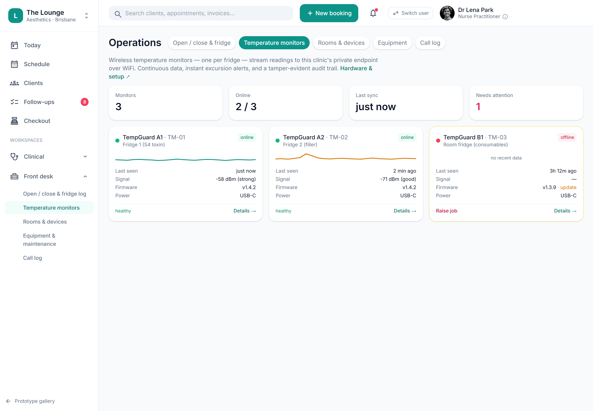

# Temperature logging & excursion alerts

> **Epic:** [PRD-04 — Consult, prescribing & S4 medicines governance (the moat)](../epics/PRD-04.md)  ·  **Key:** `PRD-04/COLD-CHAIN`  ·  **Type:** Story  ·  **Stage:** M3  ·  **Priority:** P1  ·  **Estimate:** 3 pts  ·  **Area:** backend, integration
>
> **Depends on:** `PRD-04/CUSTODY-STORAGE`

## Background

As a owner, I want temperature logging for the medicine fridge with excursion alerts, so that we never use medicine that breached cold-chain.
Plainly: this keeps the medicine cold enough to be safe. Botulinum toxin must stay between 2 and 8 degrees; this story logs the fridge temperature continuously and quarantines any stock that gets too warm. Where it fits: it sits on secure storage (PRD-04/CUSTODY-STORAGE) within the moat. A lot that breaches cold-chain is quarantined and becomes unselectable at the administration gate (PRD-04/ADMIN-GATE), and a breach raises a facility job in compliance ops (PRD-11).  Toxin must stay 2–8°C; temperature logging raises excursion alerts and flags affected stock (C13). Integrates with the optional ESP32 cold-chain monitor.

## How it works

Botulinum toxin must be stored at 2-8C (C13, TGA Product Information). A cold-chain breach can silently denature stock; the evidence that every administered lot held cold-chain is part of the audit-ready record. Manual twice-daily logs leave an overnight gap - which is exactly what the ESP32 TempGuard (TM-01) closes with continuous readings and instant breach alerts.
The platform stores a temperature series per storage location, charts it, and runs a single server-side 2-8C rule over every reading regardless of source - manual entry, the DIY ESP32, or a validated commercial logger (Testo/Dickson/LogTag) via a per-vendor adapter. The device reports raw; the server decides policy.
Readings arrive as TempLog rows (location, monitor, temp, at, source=manual|device). The ESP32 POSTs every ~5 min over TLS to a per-clinic+fridge endpoint with an Idempotency-Key; commercial loggers reach the same ingest via webhook-in or poll-out adapters that normalise unit/timestamp/fridge to the canonical shape.
On each reading the server applies the 2-8C rule. An out-of-range reading opens (or extends) an Excursion for that location, flags the affected lots and quarantines them ('Do not use'), and raises a breach/facility job to the Lead Nurse (links PRD-11). A quarantined lot is not selectable at administration (PRD-04/ADMIN-GATE).
The server also treats absence of data as a signal: no reading for >2 intervals = monitor offline; firmware-behind / battery-low / mains-loss all raise facility jobs so a monitor gets fixed before it matters. Silence is itself an alert.
Excursion history (start/end, min/max, affected lots, action) is retained and visible - the evidence that cold-chain held for every lot used, alongside the manual twice-daily min/max log that stays as an audit fallback.

## Requirements

- Temperature logging for the medicine fridge with excursion alerts.
- Compliance: [C13](https://github.com/danpowell88/tlapoc/blob/main/docs/02-requirements.md#6-compliance-requirements-auqld--restated-as-acceptance-criteria)

## Acceptance Criteria

- [ ] Temperature can be logged (manual + via the device API) for storage locations.
- [ ] An excursion raises an alert and flags affected stock for quarantine.
- [ ] A breach pathway can quarantine a lot and raise a job (links PRD-11).
- [ ] Excursion history is retained and visible.

## UI designs / screenshots

- Prototype screen: Front desk / Operations - Temperature monitors (ops-monitors.png).
- Fleet view: KPI tiles 'Monitors 3 / Online 2of3 / Last sync just now / Needs attention 1'; per-monitor cards (TempGuard A1 TM-01 / A2 TM-02 / B1 TM-03) with a live sparkline, last-seen, signal (e.g. -58 dBm strong), firmware, power (USB-C) and an online/offline pill.
- An offline monitor (TM-03, 'no recent data', firmware update due) shows a 'Raise job' action; healthy monitors link to 'Details'.
- On the fridge cards (Open/close & fridge): live current temp + 12h sparkline + min/max + AM/PM manual-log chips; status pills 'in range' / 'warm spike - recovered' / 'excursion (12h)' / 'BREACH - lot quarantined'.
- An excursion visibly quarantines the lot and raises a follow-up job; the per-lot temp (e.g. '4.2C') is also shown in the stock lot detail.

## Suggested data model

- **TempLog** — id, tenant_id, location_id, monitor_id, temp, at, source(manual|device), unit, rssi?, fw?, idempotency_key
  - _2-8C range; out-of-range -> Excursion (C13). Mapping: fridges[].series + the TM-0x monitors[]; ingest is the same internal call for ESP32 and adapter sources._
- **Excursion** — id, tenant_id, location_id, started_at, ended_at?, min, max, affected_lots[], action(quarantine), job_id?
  - _Raises alert + breach job; flags + quarantines stock (C13). A quarantined lot is not selectable at administration._
- **Monitor (device)** — id, tenant_id, location_id, kind(esp32|testo|dickson|logtag|manual), status(online|offline), last_seen, fw, power, interval
  - _Heartbeat: no reading >2 intervals = offline job. The device reports raw; the server owns the 2-8C policy._

## Other

- Source PRD: [PRD-04-consult-prescribing-s4.md](https://github.com/danpowell88/tlapoc/blob/main/docs/prds/PRD-04-consult-prescribing-s4.md)

## Tasks (dev pickup)

- [ ] **TempLog + Excursion + Monitor model (model & migration)**
  Add TempLog: id, tenant_id, location_id, monitor_id, temp, at, source(manual|device), unit, rssi/fw (nullable), idempotency_key (unique); RLS by tenant. Add Excursion: id, tenant_id, location_id, started_at, ended_at, min, max, affected_lots[], action(quarantine), job_id. Add Monitor: id, location_id, kind, status, last_seen, fw, power, interval. Add StockItem.quarantined(bool). Index (location_id, at) for charting and (idempotency_key) for dedupe.
- [ ] **Temperature ingest + 2-8C rule + excursion/quarantine**
  Single internal ingestReading(): manual log endpoint POST /locations/{id}/temp and device endpoint POST /clinics/{slug}/fridges/{fid}/readings (bearer token scoped per fridge, Idempotency-Key dedupe). On every reading apply the 2-8C rule server-side: out-of-range opens/extends an Excursion, sets StockItem.quarantined on affected lots, and raises a breach job (PRD-11). Return in_range + alert. Heartbeat watcher: no reading >2 intervals -> monitor offline job; battery-low/mains-loss/fw-behind -> facility jobs.
- [ ] **Excursion-quarantine gate + retained history + audit**
  A quarantined lot ('Do not use') is not selectable at administration (feeds PRD-04/ADMIN-GATE). Retain full Excursion history (start/end, min/max, affected lots, action, resolving actor) visibly - the evidence cold-chain held for every administered lot (C13). Keep the manual twice-daily min/max log as an audit fallback. Audit excursions, quarantines and un-quarantine decisions.
- [ ] **Commercial-logger adapters (Testo / Dickson / LogTag) - integration**
  Per-vendor adapter normalising each payload into the canonical reading shape (their device -> our fridgeId, unit -> C, timestamp -> ISO-8601), converging on the same ingestReading()/2-8C rule/breach pathway. Webhook-in (vendor pushes; Testo, Disruptive) verifying the vendor signature; poll-out (we pull on a timer; DicksonONE has no webhook and stores F -> convert). Config per fridge: which source is the instrument-of-record vs early-warning (ADR-0036).
