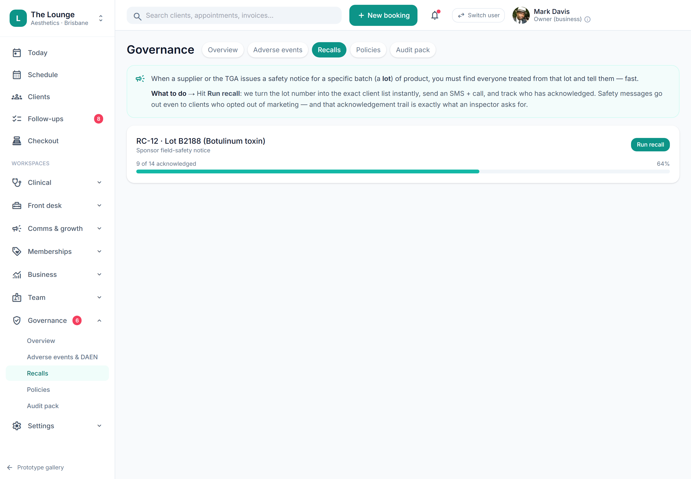

# Lot → clients recall lookup & medicine register

> **Epic:** [PRD-04 — Consult, prescribing & S4 medicines governance (the moat)](../epics/PRD-04.md)  ·  **Key:** `PRD-04/RECALL-LOOKUP`  ·  **Type:** Story  ·  **Stage:** M3  ·  **Priority:** P0  ·  **Estimate:** 5 pts  ·  **Area:** backend
>
> **Depends on:** `PRD-04/ADMIN-GATE`

## Background

As a prescriber/owner, I want to enter a lot number and instantly see every client who received it, plus export the medicine register, so that we can run a recall in minutes and evidence the register.
Given a lot, the system must instantly list every client/administration for that lot, and export an audit-ready medicine register (C8).

## How it works

Given a lot number, the system instantly lists every client/administration for that lot, and exports an audit-ready medicine register. Recall execution + acknowledgement tracking lives in the Governance hub.
This is the payoff of recording per-point lot in charting — a recall that would take days on paper takes minutes (C8).

## Requirements

- To enter a lot number and instantly see every client who received it, plus export the medicine register.
- Compliance: [C8](https://github.com/danpowell88/tlapoc/blob/main/docs/02-requirements.md#6-compliance-requirements-auqld--restated-as-acceptance-criteria)

## Acceptance Criteria

- [ ] A lot lookup returns all clients/administrations for that lot.
- [ ] The S4 register exports a complete, immutable record of administrations.
- [ ] Recall execution + acknowledgement tracking is available (full hub in PRD-08/11).
- [ ] The register is queryable by date, product, prescriber, administrator.

## UI designs / screenshots

- Prototype: Governance -> Recalls (gov-recalls.png) — enter a lot -> list of affected clients/administrations; start a recall with acknowledgement tracking.
- The medicine register is queryable by date, product, prescriber, administrator and exportable.

## Suggested data model

- **(query) LotRecall** — lot -> [Administration{client, at, units, administrator}]
  - _Built on Administration + StockItem; powers recall + register export._
- **Recall** — id, tenant_id, lot, reason, started_at, acknowledgements[]
  - _Tracks per-client acknowledgement._

## Other

- Source PRD: [PRD-04-consult-prescribing-s4.md](https://github.com/danpowell88/tlapoc/blob/main/docs/prds/PRD-04-consult-prescribing-s4.md)

## Tasks (dev pickup)

- [ ] **Data model & migrations**
  Model + migrate (EF Core; every table carries tenant_id with an RLS policy):
  - Recall — id, tenant_id, lot, reason, started_at, acknowledgements[] (Tracks per-client acknowledgement.)
  - Add the FKs/relationships above; index the columns this story filters or looks up on; make records append-only/immutable where the story requires it.
- [ ] **Backend: domain logic, rules & API endpoint(s)**
  Domain logic + the API the web/Flutter clients call; enforce every rule server-side (never trust the UI):
  - Endpoints: the commands + queries for the entities above and each action in the acceptance criteria.
  - Rule: A lot lookup returns all clients/administrations for that lot.
  - Rule: The S4 register exports a complete, immutable record of administrations.
  - Rule: Recall execution + acknowledgement tracking is available (full hub in PRD-08/11).
  - Emit domain events for read-models / notifications / follow-up jobs where relevant.
  - Publish the OpenAPI contract so the generated clients update.
  - Depends on: PRD-04/ADMIN-GATE.
- [ ] **Enforce compliance gate + audit events**
  Enforce C8 as a server-side invariant that cannot be bypassed via the API:
  - Block the action when prerequisites are missing; return a clear reason for the blocked-action banner (what's blocked / which rule / how to resolve / who can resolve).
  - Write an immutable AuditEvent for the attempt and its outcome.
  - The S4 register exports a complete, immutable record of administrations.
