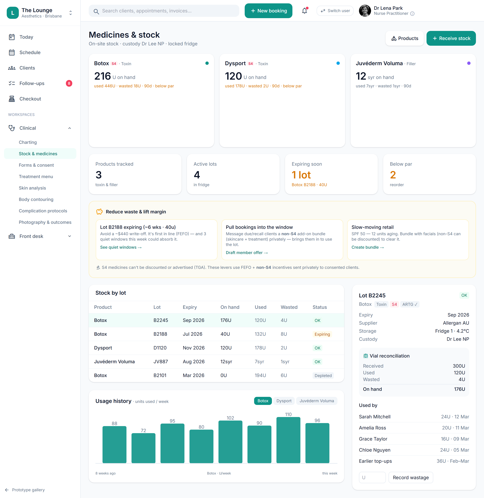

# Stock receipt, ARTG & lawful-supply provenance

> **Epic:** [PRD-04 — Consult, prescribing & S4 medicines governance (the moat)](../epics/PRD-04.md)  ·  **Key:** `PRD-04/STOCK-RECEIVE`  ·  **Type:** Story  ·  **Stage:** M3  ·  **Priority:** P0  ·  **Estimate:** 5 pts  ·  **Area:** backend
>
> **Depends on:** `PRD-04/PRODUCT-CATALOGUE`

## Background

As a prescriber/owner, I want to receive S4 stock and record its ARTG status, brand, sponsor and lawful supply source, so that we only hold lawfully-supplied, approved medicine.
S4 stock is received from a TGA-approved wholesaler with ARTG status, brand, sponsor and lawful supply source recorded; non-ARTG/unverified source is warned/blocked (C11). S4 POs require a prescriber signer.

## How it works

S4 stock is received from a TGA-approved wholesaler with ARTG status, brand, sponsor and lawful supply source recorded per lot. Receiving non-ARTG or unverified-source stock is warned/blocked per config (C11). S4 purchase orders require a prescriber signer.
Ensures the clinic only holds lawfully-supplied, approved medicine, with provenance for every lot.

## Requirements

- To receive S4 stock and record its ARTG status, brand, sponsor and lawful supply source.
- Compliance: [C11](https://github.com/danpowell88/tlapoc/blob/main/docs/02-requirements.md#6-compliance-requirements-auqld--restated-as-acceptance-criteria)

## Acceptance Criteria

- [ ] Receiving records ARTG status, brand, sponsor and supply source per lot.
- [ ] Receiving non-ARTG or unverified-source stock is warned/blocked per config.
- [ ] S4 purchase orders require a prescriber signer + TGA-approved wholesaler.
- [ ] ARTG validation supports manual entry (lookup against an ARTG dataset is an open option).

## UI designs / screenshots

- Prototype: Stock & medicines -> 'Receive stock' (stock.png) — a modal capturing lot, expiry, units received, supplier, ARTG; the lot then appears in the stock table with on-hand/expiry/temp/status.
- ARTG validation supports manual entry (dataset lookup is an open option).

## Suggested data model

- **StockItem** — id, tenant_id, product_id, lot, expiry, received_units, on_hand, supplier, artg_verified(bool), supply_source, location_id, custodian_id, status
  - _Provenance per lot (C11); on_hand decremented by administrations._
- **PurchaseOrder** — id, tenant_id, supplier, lines[], prescriber_signer_id, status
  - _S4 POs require a prescriber signer + approved wholesaler._

## Other

- Source PRD: [PRD-04-consult-prescribing-s4.md](https://github.com/danpowell88/tlapoc/blob/main/docs/prds/PRD-04-consult-prescribing-s4.md)

## Tasks (dev pickup)

- [ ] **Data model & migrations** — Entities/columns + relationships; tenant_id + RLS.
- [ ] **Backend: domain logic, rules & API endpoint(s)** — Behaviour + invariants + the OpenAPI contract the UI/clients consume.
- [ ] **Enforce compliance gate + audit events** — Server-side (C11); blocked path explains why.
