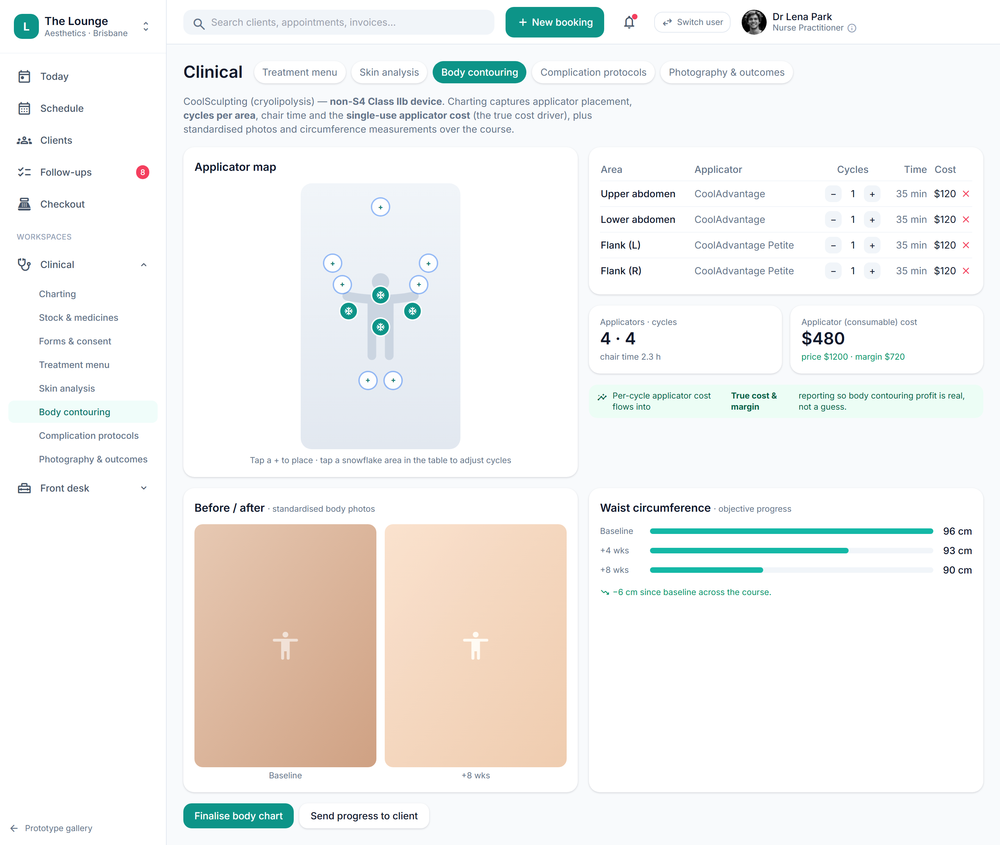

# Body contouring charting: body map & applicator/cycle capture (MVP)

> **Epic:** [PRD-05 — Clinical charting: injection mapping & before/after](../epics/PRD-05.md)  ·  **Key:** `PRD-05/BODY-CONTOURING`  ·  **Type:** Story  ·  **Stage:** M3  ·  **Priority:** P2  ·  **Estimate:** 1 pts  ·  **Area:** provider-app
>
> **Depends on:** `PRD-05/MODALITY`

## Background

As a therapist, I want to chart body-contouring treatments on a body map with per-area applicator/cycle settings, so that non-facial treatments are recorded with the same rigour.
Charting body-contouring treatments (e.g. CoolSculpting) on a body map — placing applicators on regions with per-area cycle settings, tallying cycles, chair time and the consumable cost that drives true margin. A Phase-2 modality under PRD-05 charting on the clinic-first spine; it depends on the modality placeholder (MODALITY) it extends, feeds plans (TREATMENT-PLANS) and outcomes (OUTCOMES), rides the photo rules (PHOTOS) and finalises like any record (IMMUTABILITY). It is non-S4 device-class, so there is no lot, prescription or stock deduction. The prototype's Clinical → Body contouring screen charts body treatments on a body map (bodyAdd/bodyDel/bodyCyc) with applicator/cycle settings — a distinct modality beyond the face.

## How it works

As a therapist, I want to chart body-contouring treatments on a body map with per-area applicator/cycle settings, so that non-facial treatments are recorded with the same rigour.
Body contouring (e.g. CoolSculpting / cryolipolysis) is a non-S4 Class IIb device treatment whose true cost driver is the single-use applicator. Charting it well means a body-map analogue of the injection map: placing applicators on regions, recording cycles per area, chair time and the per-cycle consumable cost, plus standardised photos and circumference measurements over the course.
The clinician taps regions on a body map to place applicators (the prototype's bodyAdd over bodyZones), each mapped to its applicator type and per-cycle cost/time (APPL), and adjusts cycles per area (bodyCyc). The chart tallies applicators - cycles - chair time and the applicator (consumable) cost, which flows into True cost & margin reporting (PRD-08) so body-contouring profit is real, not a guess.
It is a distinct modality (extends MODALITY / ADR-0025): non-S4, device-class, so no lot/prescription (Rx) and no S4 deduction - but device-gated where a licence/patch-test applies per the modality rules. Sessions feed multi-session plans (TREATMENT-PLANS) and outcomes (OUTCOMES), and standardised before/after body photos + objective measurements (e.g. waist circumference over the course) ride the PHOTOS storage rules.
Finalising the body chart locks it like any clinical record (IMMUTABILITY); progress photos + measurements can be pushed to the client app (consent-respecting).

## Requirements

- To chart body-contouring treatments on a body map with per-area applicator/cycle settings.
- Deferred (Phase 2+): placeholder, design-only for now.

## Acceptance Criteria

- [ ] A body map supports adding/removing/cycling treatment areas with per-area settings (applicator type, cycles, parameters); it tallies applicators, cycles, chair time and consumable cost.
- [ ] Consumable (applicator) cost flows into True cost & margin reporting (PRD-08).
- [ ] Sessions feed multi-session plans (TREATMENT-PLANS) and outcomes (OUTCOMES); standardised body photos + measurements ride the PHOTOS rules.
- [ ] Device-gated where a licence/patch-test applies; finalising locks the chart (IMMUTABILITY).

## UI designs / screenshots

_Prototype screen: prototype.html — Clinical → Body contouring (body map)._

- Applicator map: tap a '+' to place an applicator on a region (submental, abdomen, flank, thigh, arm, back); placed areas show a snowflake (bodyZones + bodyAdd).
- Per-area table: Area - Applicator - Cycles (-/+ via bodyCyc) - Time - Cost - remove (bodyDel); summary tiles 'Applicators - cycles' and 'Applicator (consumable) cost - price - margin'.
- Before/after standardised body photos + a waist-circumference progress chart over the course (Baseline / +4 wks / +8 wks).
- 'Finalise body chart' + 'Send progress to client' actions.
- New vs the prototype (build these): the persisted BodyChart, the cost roll-up into True cost & margin, plan/outcome linkage and the consent-respecting client push.

## Suggested data model

- **BodyChart** — id, chart_entry_id (FK), modality (e.g. cryolipolysis), areas[]{region, applicator, cycles, params}, total_cycles, consumable_cost, chair_minutes
  - _Body-map analogue of InjectionPoint; non-S4 device-class (no lot/Rx). Cost feeds True cost & margin (PRD-08)._
- **BodyMeasurement** — id, chart_entry_id / plan_id, kind (e.g. waist_circumference), value, taken_at
  - _Objective progress over the course; pairs with standardised body photos (PHOTOS)._
- **ChartEntry (referenced)** — treatment_type = body-contouring; finalised + locked like any clinical record
  - _Feeds plans (TREATMENT-PLANS) + outcomes (OUTCOMES)._

## Technical notes (high level)

- Architecture decisions: [ADR-0025](https://github.com/danpowell88/tlapoc/blob/main/docs/adr/decision-log.md)

## Other

- Source PRD: [PRD-05-clinical-charting.md](https://github.com/danpowell88/tlapoc/blob/main/docs/prds/PRD-05-clinical-charting.md)

## Tasks (dev pickup)

- [ ] **Body-contouring charting: body map + applicator/cycle capture**
  EF Core: BodyChart (areas[]{region, applicator, cycles, params}, totals, chair_minutes) linked to a ChartEntry (treatment_type=body-contouring, non-S4 device-class - no lot/Rx). tenant_id + Row-Level Security (RLS, the per-tenant database isolation). Build the body-map UI (tap regions to place applicators, -/+ cycles per area, per-area applicator/time table, summary tiles). Finalise locks the chart (IMMUTABILITY); device-gate where a licence/patch-test applies. Extends the MODALITY model (ADR-0025). The consumable-cost roll-up into True cost & margin (PRD-05/BODY-CONTOURING-COST) and the photos+measurements over the course (PRD-05/BODY-CONTOURING-PROGRESS) are follow-ups.
