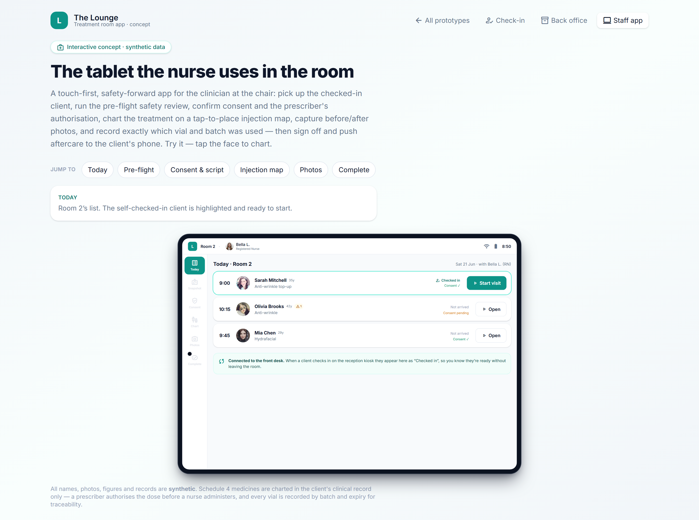

# Offline queue & sync for room-side charting

> **Epic:** [PRD-05 — Clinical charting: injection mapping & before/after](../epics/PRD-05.md)  ·  **Key:** `PRD-05/OFFLINE`  ·  **Type:** Story  ·  **Stage:** M3  ·  **Priority:** P1  ·  **Estimate:** 3 pts  ·  **Area:** provider-app
>
> **Depends on:** `SPRINT-0/SPIKE-OFFLINE`, `PRD-05/IMMUTABILITY`

## Background

As a injector, I want my notes and photos to queue locally and sync when back online if the room loses Wi-Fi, so that I never lose work mid-treatment.
Offline queue and sync for room-side charting: if a treatment room loses Wi-Fi, notes and photos queue locally (encrypted) and sync cleanly on reconnect with no loss. A reliability capability under PRD-05 charting on the clinic-first spine; the room-side surface ships later with the provider app (PRD-09). It depends on the offline spike (SPRINT-0/SPIKE-OFFLINE) and immutable finalisation (IMMUTABILITY) — finalisation is server-side, so a draft must sync before it can be finalised — and owns the sync/conflict contract. If Wi-Fi drops mid-visit, notes/photos queue locally (encrypted) and sync on reconnect with no loss; finalisation is server-side (REQ-CLIN/APP, ADR-0015).

## How it works

As an injector, I want my notes and photos to queue locally and sync when back online if the room loses Wi-Fi, so that I never lose work mid-treatment.
Treatment rooms drop Wi-Fi — thick walls, shielded fridges, dead spots. The provider app must let a clinician chart and photograph through a connectivity drop without losing a keystroke or a photo, then reconcile cleanly when the network returns. This story defines the sync model; the room-side surface is delivered with the provider app (PRD-09).
Chart edits, pending photos and draft administrations are written to an encrypted local store on the device the moment they are made (ADR-0015). The app is offline-first: it works against the local queue and treats the network as a background reconciler, not a prerequisite.
On reconnect the queue syncs with no loss. Drafts use last-write-wins (the latest edit of a field wins) — acceptable because nothing is final until finalisation, which is always server-side. Photos upload via signed URLs (PHOTOS) and their transient device cache is purged after a confirmed upload. A sync cursor tracks what has been acknowledged so a partial sync resumes rather than restarts.
A persistent sync/offline indicator shows the queued-item count and the last-sync time, so the clinician always knows whether their work is safe. Crucially, 'Finalise' is disabled until the draft has synced — combined with server-side finalisation (IMMUTABILITY) this guarantees two devices can never both finalise the same entry and that a finalised record is always the reconciled one.
Built on SPIKE-OFFLINE; primarily a provider-app capability (PRD-09) but the conflict/sync rules are owned here so the API and clients agree.

## Requirements

- My notes and photos to queue locally and sync when back online if the room loses Wi-Fi.

## Acceptance Criteria

- [ ] With connectivity dropped, notes/photos queue locally (encrypted) and sync on reconnect with no data loss.
- [ ] Drafts reconcile last-write-wins; finalisation occurs server-side and is blocked until the draft has synced.
- [ ] A persistent sync/offline indicator shows the queued-item count + last-sync time; a partial sync resumes via a cursor rather than restarting.
- [ ] The transient on-device photo cache is purged after a confirmed upload (ADR-0009/0015).
- [ ] Built on SPIKE-OFFLINE.

## UI designs / screenshots

_Prototype screen: prototype.html — Charting + Clinical (Skin analysis, Body contouring, Complication protocols, Photography & outcomes); treatment-room.html._

- treatment-room.html: the room tablet flow (Today → Pre-flight → Consent & script → Injection map → Photos → Complete) with a connectivity banner; queued drafts/photos are visibly pending and nothing is lost on reconnect.
- A persistent sync indicator (queued count + last-sync time) and a 'Finalise' control disabled until the draft has synced.
- New vs the prototype (build these): the encrypted local queue, the sync cursor + reconnect reconciliation, the last-write-wins draft merge and the post-sync photo-cache purge.

## Suggested data model

- **LocalQueue (device)** — queued chart edits + draft administrations + pending photos (encrypted at rest), op type, client/chart ref, created_at, sync_state
  - _Offline-first store; last-write-wins for drafts; cleared as items are acknowledged._
- **SyncCursor (device)** — last_acked_seq, last_sync_at
  - _Resumes a partial sync rather than restarting; drives the last-sync indicator._
- **ChartEntry / Photo (server, referenced)** — draft edits applied last-write-wins; finalisation server-side only after sync
  - _Server is the source of truth on reconnect; finalised records are immutable (ADR-0010)._

## Technical notes (high level)

- Architecture decisions: [ADR-0015](https://github.com/danpowell88/tlapoc/blob/main/docs/adr/decision-log.md), [ADR-0010](https://github.com/danpowell88/tlapoc/blob/main/docs/adr/decision-log.md)

## Other

- Source PRD: [PRD-05-clinical-charting.md](https://github.com/danpowell88/tlapoc/blob/main/docs/prds/PRD-05-clinical-charting.md)

## Tasks (dev pickup)

- [ ] **Encrypted on-device queue (provider app)**
  Flutter: an encrypted-at-rest local store holding queued chart edits, draft administrations and pending photos, written synchronously as the clinician works (offline-first). Each item carries an op type, the client/chart reference and a created_at for ordering. The app reads/writes the queue as its primary source while offline; the network is a background reconciler.
- [ ] **Sync engine: reconnect reconciliation + cursor**
  On reconnect, replay the queue against the API with idempotent ops, a sync cursor (last-acked seq) so a partial/interrupted sync resumes rather than restarts, and last-write-wins draft reconciliation (server is source of truth). Photos upload via signed URLs (PHOTOS) and their device cache is purged after a confirmed upload. Handle back-off + retries and surface failures to the user.
- [ ] **Sync/offline indicator + finalise gating (UI)**
  Persistent indicator showing connectivity, the queued-item count and the last-sync time; clear 'pending' affordances on unsynced drafts/photos. Disable 'Finalise' until the draft has synced (with server-side finalisation this guarantees no double-finalise across devices). Surface sync errors with a retry path.
- [ ] **API contract for offline-safe draft sync + finalise**
  Define and document the server side of the sync contract: idempotent draft-edit + photo-register endpoints keyed for replay, last-write-wins semantics on draft fields, a finalise endpoint that rejects unsynced/conflicting state, and the events that drive the indicator. Keep the conflict rules here so the API and Flutter client agree (ADR-0015/0010); publish OpenAPI.
