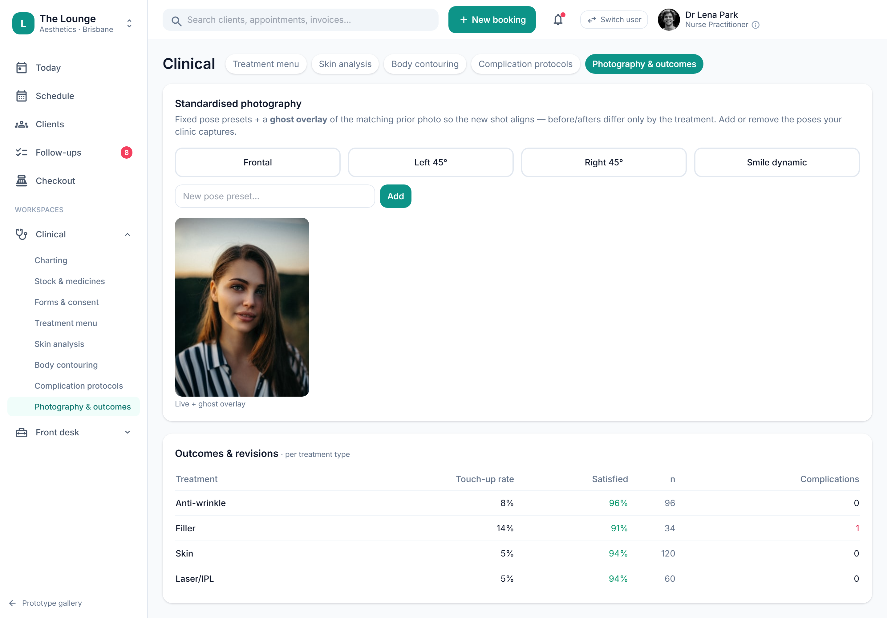

# Outcomes & revision tracking

> **Epic:** [PRD-05 — Clinical charting: injection mapping & before/after](../epics/PRD-05.md)  ·  **Key:** `PRD-05/OUTCOMES`  ·  **Type:** Story  ·  **Stage:** M3  ·  **Priority:** P2  ·  **Estimate:** 1 pts  ·  **Area:** provider-app
>
> **Depends on:** `PRD-05/PHOTOS`

## Background

As a injector / owner, I want to track treatment outcomes and any revisions/touch-ups, so that we can measure quality and feed it to reporting.
The prototype's Photography & outcomes view tracks before/after outcomes and a revision/touch-up signal that feeds reporting (REQ-CLIN-13).

## How it works

Tracks treatment outcomes and any revisions/touch-ups, linked to the original treatment, and feeds reporting (PRD-08). Respects image-use consent for any photo-based outcome.
Lets the clinic measure quality (result ratings, revision rates) over time.

## Requirements

- To track treatment outcomes and any revisions/touch-ups.
- Deferred (Phase 2+): placeholder, design-only for now.
- Compliance: [C14](https://github.com/danpowell88/tlapoc/blob/main/docs/02-requirements.md#6-compliance-requirements-auqld--restated-as-acceptance-criteria)

## Acceptance Criteria

- [ ] Outcomes are captured against treatments (e.g. result rating, before/after linkage).
- [ ] Revision/touch-up events are recorded and linked to the original treatment.
- [ ] Outcome/revision signals feed reporting (PRD-08).
- [ ] Respects image-use consent for any photo-based outcome.

## UI designs / screenshots

_Prototype screen: prototype.html — Clinical → Photography & outcomes._

- Prototype: Clinical -> Photography & outcomes (clinical-imaging.png) — before/after outcomes + a revision/touch-up signal feeding reporting.

## Suggested data model

- **Outcome** — id, chart_entry_id, client_id, rating, before_photo_id, after_photo_id, revision_of?
  - _Revision links to the original treatment; feeds reporting._

## Other

- Source PRD: [PRD-05-clinical-charting.md](https://github.com/danpowell88/tlapoc/blob/main/docs/prds/PRD-05-clinical-charting.md)

## Tasks (dev pickup)

- [ ] **Scope & design when pulled into a sprint**
  Deferred placeholder — no build in v1; confirm it still fits scope/regulatory stance, then break down.
