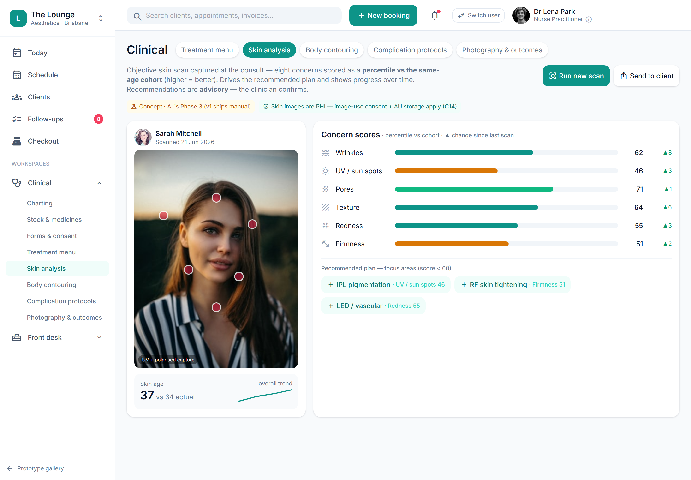

# Skin analysis & assessment (with AI scan, advisory)

> **Epic:** [PRD-05 — Clinical charting: injection mapping & before/after](../epics/PRD-05.md)  ·  **Key:** `PRD-05/SKIN-ANALYSIS`  ·  **Type:** Story  ·  **Stage:** M3  ·  **Priority:** P2  ·  **Estimate:** 1 pts  ·  **Area:** provider-app
>
> **Depends on:** `PRD-05/NOTE-TEMPLATE`

## Background

As a dermal therapist / injector, I want to record a structured skin assessment (and optionally an AI-assisted scan) and share results with the client, so that skin treatment is planned and tracked, and clients see their progress.
The prototype's Clinical → Skin analysis screen captures a structured skin assessment with zone scoring, an AI scan (simulateScan) and a push-to-client summary (pushSkinToClient). Per the no-AI-in-v1 stance, AI scoring is advisory/Phase 2; the manual assessment record can be v1.

## How it works

A structured skin assessment (concerns, zones, scores) recorded against the client, optionally with an AI-assisted scan, and a summary that can be pushed to the client app. Per the no-AI-in-v1 stance, AI auto-scoring is advisory + human-confirmed and gated to Phase 2; the manual assessment record can be v1.
Assessments feed treatment planning and outcomes.

## Requirements

- To record a structured skin assessment (and optionally an AI-assisted scan) and share results with the client.
- Deferred (Phase 2+): placeholder, design-only for now.

## Acceptance Criteria

- [ ] A structured skin assessment (concerns, zones, scores) can be recorded against the client.
- [ ] AI auto-scoring is advisory and human-confirmed, and is gated to Phase 2 (no AI in v1).
- [ ] An assessment summary can be pushed to the client app (consent-respecting).
- [ ] Assessments feed treatment planning (PRD-05/TREATMENT-PLANS) and outcomes.

## UI designs / screenshots

_Prototype screen: prototype.html — Clinical → Skin analysis (scan + push-to-client); client-app.html._

- Prototype: Clinical -> Skin analysis (clinical-skin.png) — zone scoring, a scan action (simulateScan), and a push-to-client summary (pushSkinToClient); appears in the client app.
- AI scoring shown as advisory; clinician confirms.

## Suggested data model

- **SkinAssessment** — id, tenant_id, client_id, zones[]{area, concern, score}, source(manual|ai_advisory), pushed_to_client_at
  - _Feeds plans/outcomes; AI advisory (Phase 2)._

## Technical notes (high level)

- Architecture decisions: [ADR-0020](https://github.com/danpowell88/tlapoc/blob/main/docs/adr/decision-log.md), [ADR-0025](https://github.com/danpowell88/tlapoc/blob/main/docs/adr/decision-log.md)

## Other

- Source PRD: [PRD-05-clinical-charting.md](https://github.com/danpowell88/tlapoc/blob/main/docs/prds/PRD-05-clinical-charting.md)

## Tasks (dev pickup)

- [ ] **Scope & design when pulled into a sprint**
  Deferred placeholder — no build in v1; confirm it still fits scope/regulatory stance, then break down.
