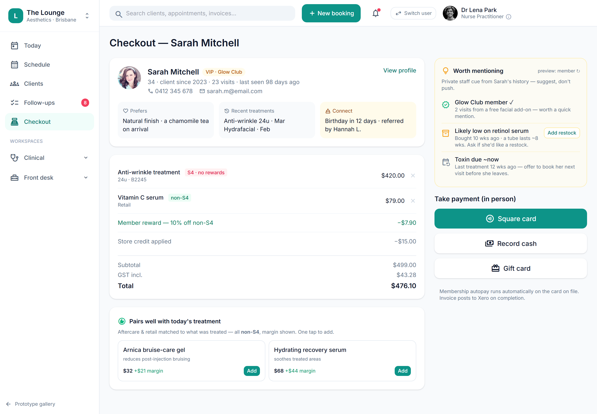

# Daily closeout & reconciliation

> **Epic:** [PRD-06 — Payments (in-person POS + autopay), memberships & non-S4 rewards](../epics/PRD-06.md)  ·  **Key:** `PRD-06/CLOSEOUT`  ·  **Type:** Story  ·  **Stage:** M4  ·  **Priority:** P1  ·  **Estimate:** 3 pts  ·  **Area:** web
>
> **Depends on:** `PRD-06/POS`

## Background

As a owner, I want a daily closeout that balances card and cash, so that the till reconciles every day.
What this is, plainly: the end-of-day till balance — count the cash, check the card total against Square, explain any difference, lock it. Where it sits: it reads the day's POS payments and is the bridge to Xero accounting (PRD-10); it follows the till in the Payments layer, on top of the booked/charted visit. End-of-day closeout (reconciliation of takings against recorded payments) balances card + cash (REQ-PAY-4).

## How it works

A Closeout summarises the day's tenders per location: card_total (reconciled to Square's batch), cash_total (counted vs recorded), and the resulting variance, with the operator who closed it. Variances are highlighted so they can be noted and explained rather than buried. The closeout reconciles to the Xero posting (PRD-10): the day's invoices/payments that posted to Xero should foot to the closeout totals.
Because it exposes daily takings, the whole closeout is behind the owner-only financial capability; Reception never sees it. The closeout also appears on the back-office tablet so the owner can run it away from the front desk.

## Requirements

- A daily closeout that balances card and cash.

## Acceptance Criteria

- [ ] Closeout summarises card and cash tenders for the day per location.
- [ ] Variances (counted vs recorded; card vs Square batch) are surfaced and can be noted.
- [ ] Closeout figures are owner-gated (not visible to Reception).
- [ ] Closeout reconciles to the Xero posting (PRD-10).

## UI designs / screenshots

_Prototype screen: prototype.html — Checkout, Memberships; client-app.html Rewards/Account._

- Prototype: Checkout -> daily closeout — card total vs cash total for the day, variance highlight, a notes/lock step ('Note locked & saved'), close-out action; owner-only figures.
- Also surfaced on the back-office tablet (backroom).

## Suggested data model

- **Closeout** — id, tenant_id, location_id, date, card_total, cash_total, counted_cash, variance, note, closed_by, closed_at
  - _Reconciles to Xero (PRD-10); owner-gated._

## Other

- Source PRD: [PRD-06-payments-memberships-rewards.md](https://github.com/danpowell88/tlapoc/blob/main/docs/prds/PRD-06-payments-memberships-rewards.md)

## Tasks (dev pickup)

- [ ] **Closeout model + day-rollup (migrations)**
  Model Closeout — the day's end-of-day reconciliation of takings against recorded payments — (tenant_id + RLS (row-level security)). One row per location per trading day.
  - card_total / cash_total aggregated from the day's Payments; counted_cash entered by the operator; variance = counted - recorded (and card vs Square (the card-payment provider) batch).
  - Capture note + closed_by/closed_at; immutable once locked.
- [ ] **Closeout API: rollup, variance, reconcile-to-Xero**
  Server-side.
  - Endpoint to open/compute the day's rollup, accept the counted-cash figure, compute + persist variance, and lock the closeout (end-of-day reconciliation of takings against recorded payments).
  - Reconcile against the Xero (the clinic's cloud accounting system) post (PRD-10): the day's posted invoices/payments should foot to closeout totals; flag a mismatch.
  - Entire surface owner-only (financial capability).
- [ ] **Closeout web UI (desk + back-office tablet)**
  Angular per the screenshot.
  - Card vs cash totals, counted-cash entry, variance highlight, note + lock ('Note locked & saved'), close action.
  - Render on the back-office tablet too.
  - Owner-only capability gate; loading/empty/error states.
