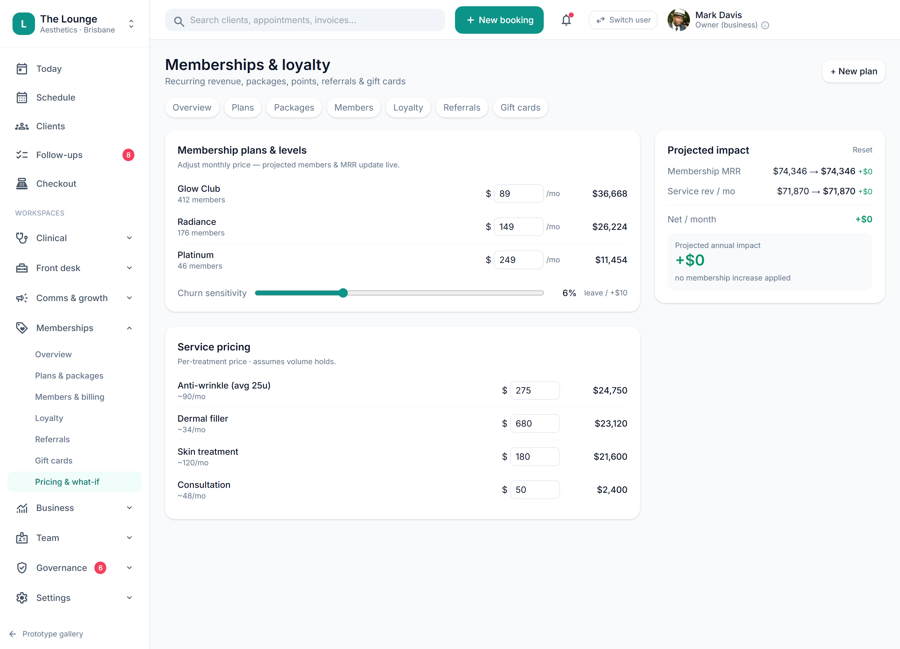

# Margin-aware reward rules

> **Epic:** [PRD-06 — Payments (in-person POS + autopay), memberships & non-S4 rewards](../epics/PRD-06.md)  ·  **Key:** `PRD-06/MARGIN-RULES`  ·  **Type:** Story  ·  **Stage:** M4  ·  **Priority:** P1  ·  **Estimate:** 3 pts  ·  **Area:** backend
>
> **Depends on:** `PRD-06/REWARDS-ENGINE`

## Background

As a owner, I want to set margin-aware reward rules with caps and eligible items and see reward-cost vs retention, so that rewards drive retention without eroding margin.
What this is, plainly: giving the owner the dials to keep loyalty profitable — a cap on what a reward is worth, a curated list of which items it applies to, and a read on cost-vs-retention. Where it sits: it extends the rewards engine and ties into the owner-only pricing surface; it sits in the Payments layer after the clinical core. Owners set value caps and eligible items; reporting shows reward-cost vs retention (REQ-MEMB-6). Reward comms respect advertising rules (C9/C23).

## How it works

RewardRule gains a value_cap (the most a reward can be worth) and an eligible_items list the owner curates toward profitable non-S4 lines. Reporting (PRD-08) surfaces reward-cost vs retention so the owner can tell whether a rule is buying loyalty or just giving margin away.
Communications guardrail: reward/incentive comms ride the PRD-07 channels but are constrained to clients who have opted in (C23) and are delivered in-context to logged-in clients — there is no public broadcast of an S4 price or incentive (C9). This reuses the marketing-consent suppression list and the same non-S4 invariant as the rewards engine. The owner-only Pricing & what-if surface is where caps/eligibility tie into projected economics.

## Requirements

- To set margin-aware reward rules with caps and eligible items and see reward-cost vs retention.
- Compliance: [C9](https://github.com/danpowell88/tlapoc/blob/main/docs/02-requirements.md#6-compliance-requirements-auqld--restated-as-acceptance-criteria), [C23](https://github.com/danpowell88/tlapoc/blob/main/docs/02-requirements.md#6-compliance-requirements-auqld--restated-as-acceptance-criteria)

## Acceptance Criteria

- [ ] Reward rules enforce a value cap and an eligible-item list (owner curates toward high-margin non-S4 items).
- [ ] Reward-cost vs retention surfaces in reporting (PRD-08).
- [ ] Reward/incentive communications go only to consented, logged-in clients — no public S4 price promotion.
- [ ] Reward-rule configuration is owner-gated.

## UI designs / screenshots

- Prototype: Memberships -> Pricing & what-if (owner-only .fin) — caps + eligible-item selection live alongside the pricing model; reward-cost vs retention surfaces in Reports (PRD-08).

## Suggested data model

- **RewardRule (extended)** — + value_cap, eligible_items(non-S4), comms_consent_required(true)
  - _Owner-gated; comms consented-only (C23); no public S4 promotion (C9)._
- **(report) RewardEconomics** — rule_id -> reward_cost, retention_delta
  - _Read-model over PRD-08; owner-gated._

## Other

- Source PRD: [PRD-06-payments-memberships-rewards.md](https://github.com/danpowell88/tlapoc/blob/main/docs/prds/PRD-06-payments-memberships-rewards.md)

## Tasks (dev pickup)

- [ ] **Reward-rule caps + eligible-item curation (migrations)**
  Extend RewardRule with value_cap and a curated eligible_items set (non-S4 — non-Schedule 4 — only; reuse the S4-block constraint).
  - Add the reward-economics read-model inputs (cost per redemption, attributed retention) for PRD-08.
  - All owner-gated.
- [ ] **Cap enforcement + reward-cost vs retention reporting API**
  Server-side.
  - Enforce value_cap at redemption (clamp/refuse beyond cap); rule config owner-only.
  - Expose reward-cost vs retention read queries to PRD-08 reporting.
  - Reward-comms send path checks marketing consent (C23) + suppression before sending and never emits a public S4 (Schedule 4 prescription-only medicine) price/incentive.
- [ ] **Enforce comms-consent + no-public-S4 invariant + audit**
  C9/C23 server-side invariants.
  - Block a reward-comms send to a non-consented/suppressed contact; block any attempt to surface an S4 (Schedule 4 prescription-only medicine) price/incentive on a public channel — clear blocked-action reason for the UI.
  - Audit blocked sends and cap clamps (ADR-0010).
