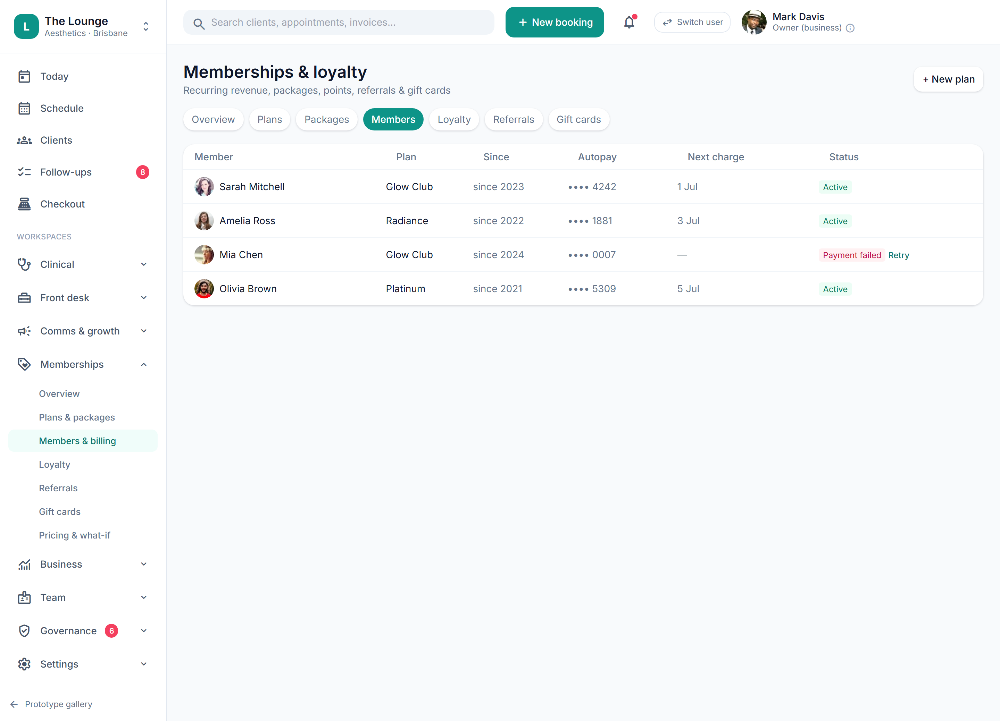

# Memberships with automatic autopay & dunning

> **Epic:** [PRD-06 — Payments (in-person POS + autopay), memberships & non-S4 rewards](../epics/PRD-06.md)  ·  **Key:** `PRD-06/MEMBERSHIP`  ·  **Type:** Story  ·  **Stage:** M4  ·  **Priority:** P0  ·  **Estimate:** 5 pts  ·  **Area:** backend
>
> **Depends on:** `PRD-06/PAYMENT-PROVIDER`

## Background

As a client, I want to join a membership and have my card auto-charged on schedule, so that I get member perks without manual payments.
What this is, plainly: clients join a monthly plan, store a card once, and the platform charges that card automatically on schedule — chasing politely if a charge fails rather than dropping the member. Where it sits: it builds on the PAYMENT-PROVIDER card-on-file token and is the clinic's recurring-revenue engine; it arrives in the Payments layer after the clinical core, and its lifecycle feeds reporting (PRD-08). Membership plans/tiers with automatic recurring billing from a tokenised card-on-file (added online/in-app or at desk) and failed-payment dunning — the scheduled retry-and-chase when a recurring payment fails — (REQ-MEMB-1/2/3).

## How it works

A MembershipPlan defines name/tier, price, billing period and benefits. A Membership ties a client to a plan with a tokenised card-on-file (a PaymentMethodToken from PAYMENT-PROVIDER), a schedule and a next_charge_at. A scheduled job charges due memberships off-session via IPaymentProvider.recurringCharge.
Dunning: a failed charge doesn't lapse the member immediately — it opens a DunningAttempt sequence — dunning being the scheduled retry-and-chase when a recurring payment fails — (retry on a back-off schedule, notify the client to update their card, and raise a follow-up Job / 'Payment failed · Retry' state) before any cancellation. The members screen shows each member's plan, the card-on-file (last4), next charge date and dunning state, with a manual Retry.
Lifecycle — join / pause / cancel / win-back — is tracked and feeds MRR (monthly recurring revenue) and churn reporting (PRD-08). Benefits and credits (e.g. member pricing, 10% off non-S4, periodic complimentary add-on) auto-apply at checkout; all money figures stay owner-gated.

## Requirements

- To join a membership and have my card auto-charged on schedule.

## Acceptance Criteria

- [ ] A membership auto-charges on schedule from a stored token (card added online/in-app or in person).
- [ ] A failed charge triggers a dunning (retry-and-chase) recovery sequence (retry + client notice + follow-up) before lapse, with a manual Retry.
- [ ] Lifecycle (join/pause/cancel/win-back) is tracked and feeds MRR (monthly recurring revenue)/churn reporting (PRD-08).
- [ ] Benefits/credits auto-apply at checkout; all money figures are owner-gated.

## UI designs / screenshots

- Prototype: Memberships -> Members & billing — member list with Plan, Since, Autopay (card last4), Next charge, Status (Active / 'Payment failed · Retry'); Plans & packages defines tiers; '+ New plan'.
- Client app: join + add/update card-on-file (Visa ···· 4242 'Used for membership autopay'); 'Glow Club renews 1 Jul · autopay is on'.

## Suggested data model

- **MembershipPlan** — id, tenant_id, name, tier, price, period, benefits[]
  - _Owner-defined tiers._
- **Membership** — id, client_id, plan_id, token_ref, schedule, status(active|paused|cancelled|dunning), next_charge_at, since
  - _Autopay via IPaymentProvider.recurringCharge; lifecycle -> MRR (monthly recurring revenue)/churn (PRD-08)._
- **DunningAttempt** — id, membership_id, attempt_no, at, result(success|failed), next_retry_at
  - _Back-off retry + client notice + Job on failed charge._

## Other

- Source PRD: [PRD-06-payments-memberships-rewards.md](https://github.com/danpowell88/tlapoc/blob/main/docs/prds/PRD-06-payments-memberships-rewards.md)

## Tasks (dev pickup)

- [ ] **Plan/Membership/Dunning model (migrations)**
  Model MembershipPlan, Membership and DunningAttempt (tenant_id + RLS (row-level security)).
  - Membership references a PaymentMethodToken (card-on-file), a schedule and next_charge_at; status includes a dunning (failed-charge retry-and-chase) state.
  - DunningAttempt records the retry sequence (attempt_no, result, next_retry_at).
  - Lifecycle transitions (join/pause/cancel/win-back) emit events for MRR (monthly recurring revenue)/churn read-models (PRD-08).
- [ ] **Autopay scheduler + dunning state machine + benefit auto-apply**
  The recurring-billing engine.
  - A scheduled job picks up memberships where next_charge_at <= now and charges off-session via IPaymentProvider.recurringCharge (idempotent (safe to repeat without double-charging) per period).
  - On failure: open a DunningAttempt sequence — back-off retries, notify the client to update the card (INotifier/PRD-07), raise a 'Payment failed' Job (Follow-ups), and only lapse after the sequence exhausts; expose a manual Retry.
  - Benefits/credits auto-apply at checkout (member pricing, 10% non-S4 (non-Schedule 4), complimentary add-on) — non-S4 only; money figures owner-gated.
  - Endpoints for join (token from online/in-app/desk), pause, cancel, win-back.
