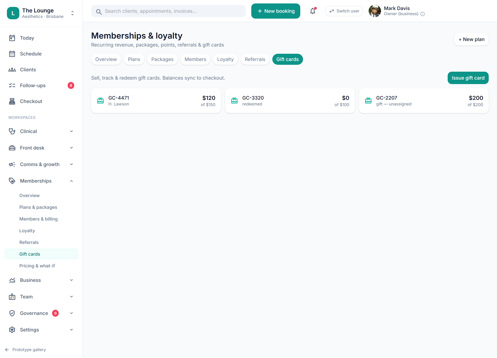

# Packages/series, gift cards & client balances

> **Epic:** [PRD-06 — Payments (in-person POS + autopay), memberships & non-S4 rewards](../epics/PRD-06.md)  ·  **Key:** `PRD-06/PACKAGES-GIFT`  ·  **Type:** Story  ·  **Stage:** M4  ·  **Priority:** P1  ·  **Estimate:** 3 pts  ·  **Area:** web
>
> **Depends on:** `PRD-06/POS`

## Background

As a front desk, I want to sell and redeem packages and gift cards and track client balances, so that clients can pre-pay and carry credit.
What this is, plainly: selling and redeeming pre-paid value — a course of treatments bought up front, or a gift card — and keeping each client's running balance straight. Where it sits: it extends the POS checkout, so it follows the till and, like the rest of Payments, sits on the booked/charted visit after the clinical core. Sell/redeem packages (visits remaining) and gift cards, track client balances/credit and AR (accounts receivable) ageing (REQ-PAY-3/5).

## How it works

A Package is a pre-paid course: total_visits and remaining, decremented each time a session is redeemed at checkout; the Client 360 shows 'visits remaining'. A GiftCard has a code, an initial value and a running balance; it can be sold (issued), tracked and partially redeemed against any future sale — the gift-card screen shows each card's balance 'of' its initial, and whether it's assigned to a client, redeemed, or unassigned. AccountBalance holds client store-credit and AR (accounts receivable) ageing for owner/manager visibility.
Redemptions appear in the daily Closeout and post to Xero like any other tender (deferred revenue on sale, recognised on redemption — the accounting treatment lives in Xero/PRD-10). Gift cards remain non-S4-neutral: a gift card buys whatever the client likes, but the rewards engine still won't earn/redeem points against an S4 (Schedule 4 prescription-only medicine) line at checkout.

## Requirements

- To sell and redeem packages and gift cards and track client balances.

## Acceptance Criteria

- [ ] A package/series can be sold and redeemed, decrementing 'visits remaining'; the count shows on the Client 360.
- [ ] A gift card can be issued, balance-tracked and partially redeemed at checkout; balances sync to checkout.
- [ ] Client store-credit and AR (accounts receivable) ageing are tracked and visible to owner/manager.
- [ ] Package/gift redemptions appear in the Closeout and post to Xero (PRD-10).

## UI designs / screenshots

_Prototype screen: prototype.html — Checkout, Memberships; client-app.html Rewards/Account._

- Prototype: Memberships -> Gift cards — 'Sell, track & redeem gift cards. Balances sync to checkout.'; 'Issue gift card' button; card tiles showing code, balance 'of' initial, and assignment (e.g. 'GC-4471 H. Lawson $120 of $150', 'GC-3320 redeemed $0 of $100', 'GC-2207 gift — unassigned $200 of $200').
- Package 'visits remaining' shows on the Client 360; sale/redeem happen in Checkout.

## Suggested data model

- **Package** — id, tenant_id, client_id, service_id, total_visits, remaining, purchased_at
  - _Decremented on redemption; 'visits remaining' on Client 360._
- **GiftCard** — id, tenant_id, code, initial, balance, status(active|redeemed|void), assigned_client_id?
  - _Sell/track/redeem; balances sync to checkout._
- **AccountBalance** — client_id, credit, ar_ageing
  - _Client store credit + AR (accounts receivable) ageing (owner/manager visibility)._

## Other

- Source PRD: [PRD-06-payments-memberships-rewards.md](https://github.com/danpowell88/tlapoc/blob/main/docs/prds/PRD-06-payments-memberships-rewards.md)

## Tasks (dev pickup)

- [ ] **Package/GiftCard/AccountBalance model (migrations)**
  Model Package, GiftCard and AccountBalance (tenant_id + RLS (row-level security)).
  - Package: total_visits/remaining decremented on redemption.
  - GiftCard: code, initial, running balance, status, optional assigned client; partial redemption supported.
  - AccountBalance: client store-credit + AR (accounts receivable) ageing buckets.
  - Deferred-revenue treatment is recognised in Xero (PRD-10), not re-implemented here.
- [ ] **Sell/redeem API: package decrement, gift balance draw-down, credit/AR**
  Server-side commands/queries.
  - Sell package / issue gift card / apply store credit; redeem a package visit (decrement remaining, guard against 0) and draw down a gift-card balance at checkout (partial allowed).
  - Redemptions write to the Closeout (the daily reconciliation of takings) and the Xero post.
  - Expose client credit + AR (accounts receivable)-ageing read queries (owner/manager gated). Gift cards stay schedule-neutral; the rewards engine still blocks S4 (Schedule 4 prescription-only medicine) earn/redeem at checkout.
- [ ] **Gift-cards web UI + Client-360 'visits remaining'**
  Angular per the screenshot.
  - Gift-cards screen: tile list (code, balance of initial, assignment status), 'Issue gift card' action, search; balances reflect checkout redemptions live.
  - Client 360: package 'visits remaining' chip and redemption history.
  - Loading/empty/error states; owner/manager gate on credit/AR (accounts receivable) figures.
