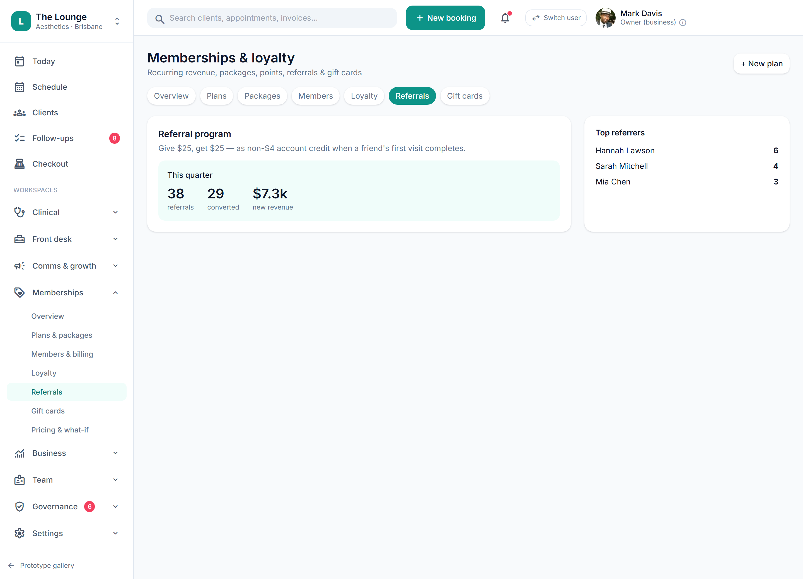

# Referrals & affiliate credit (non-S4) (placeholder)

> **Epic:** [PRD-06 — Payments (in-person POS + autopay), memberships & non-S4 rewards](../epics/PRD-06.md)  ·  **Key:** `PRD-06/REFERRALS`  ·  **Type:** Story  ·  **Stage:** M4  ·  **Priority:** P2  ·  **Estimate:** 1 pts  ·  **Area:** web

## Background

As a client / owner, I want to refer friends and earn non-S4 credit, so that word-of-mouth growth is rewarded compliantly.
The prototype's Memberships → Referrals screen shows referral/affiliate credit. Per scope, advanced loyalty/referrals are Phase 2 and referral/affiliate credit is non-S4 only (REQ-MEMB-10).

## How it works

Placeholder (Phase 2): referrals/affiliate credit, non-S4 only — reusing the rewards-engine guardrail (no S4 incentive, C9). Core membership/rewards mechanics ship first.
Captured so the rewards model stays referral-ready.

## Requirements

- To refer friends and earn non-S4 credit.
- Deferred (Phase 2+): placeholder, design-only for now.
- Compliance: [C9](https://github.com/danpowell88/tlapoc/blob/main/docs/02-requirements.md#6-compliance-requirements-auqld--restated-as-acceptance-criteria)

## Acceptance Criteria

- [ ] Placeholder — Phase 2; core membership/rewards mechanics ship first.
- [ ] Referral/affiliate credit is non-S4 only (no S4 incentive), reusing the rewards engine guardrail (C9).
- [ ] Captured so the rewards model stays referral-ready.

## UI designs / screenshots

_Prototype screen: prototype.html — Checkout, Memberships; client-app.html Rewards/Account._

- Prototype: Memberships -> Referrals (memb-referrals.png) — referral/affiliate credit concept.

## Suggested data model

- **Referral** — id, referrer_id, referee_id, credit(non-S4), status
  - _Phase 2; non-S4 credit only._

## Technical notes (high level)

- Architecture decisions: [ADR-0014](https://github.com/danpowell88/tlapoc/blob/main/docs/adr/decision-log.md)

## Other

- Source PRD: [PRD-06-payments-memberships-rewards.md](https://github.com/danpowell88/tlapoc/blob/main/docs/prds/PRD-06-payments-memberships-rewards.md)

## Tasks (dev pickup)

- [ ] **Scope & design when pulled into a sprint**
  Deferred placeholder — no build in v1; confirm it still fits scope/regulatory stance, then break down.
