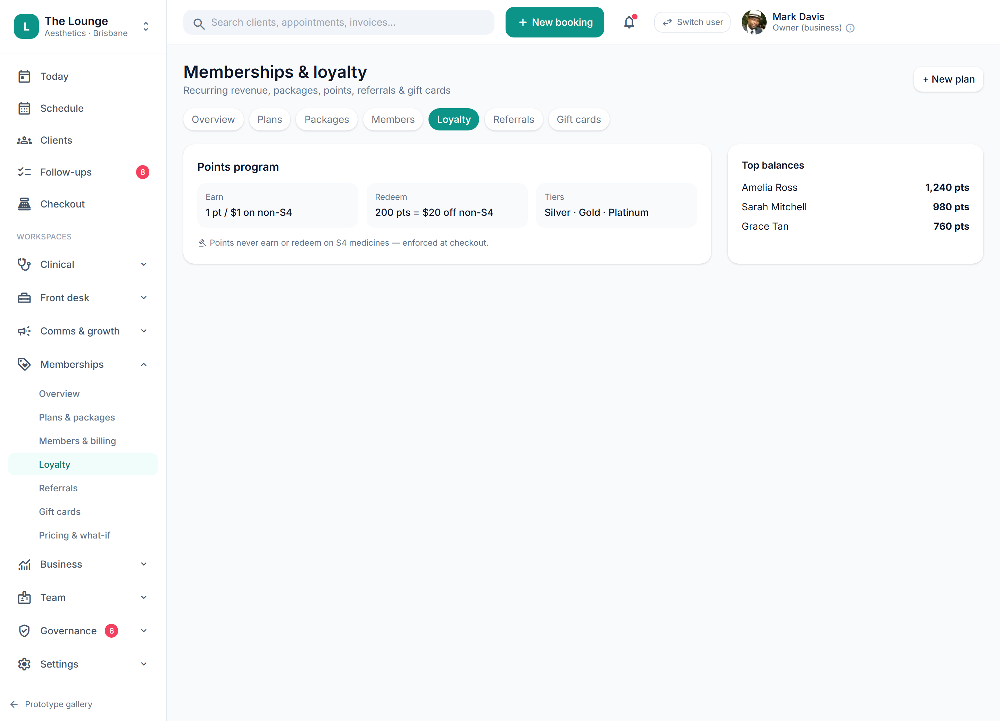

# Rewards engine — non-S4 only

> **Epic:** [PRD-06 — Payments (in-person POS + autopay), memberships & non-S4 rewards](../epics/PRD-06.md)  ·  **Key:** `PRD-06/REWARDS-ENGINE`  ·  **Type:** Story  ·  **Stage:** M4  ·  **Priority:** P0  ·  **Estimate:** 5 pts  ·  **Area:** backend
>
> **Depends on:** `PRD-04/PRODUCT-CATALOGUE`

## Background

As a client, I want to earn and redeem rewards on non-S4 items only, so that I'm rewarded without breaching S4 advertising rules.
Visit-based + membership rewards that the engine blocks from ever applying to S4 items; configuring an S4 reward is blocked (REQ-MEMB-4/5/7, C9/ADR-0014).

## How it works

Two reward bases: visit-based (milestones / every-Nth-visit) and membership/frequency perks. Earning and redemption produce a RewardLedger entry per client (earned / redeemed / balance). The catalog schedule flag (PRD-04, ADR-0014) is the single source of truth for eligibility: a RewardRule's eligible_items are constrained to non-S4, and at checkout the engine recomputes eligibility server-side against the live line's schedule — an S4 line is inert (its reward/points control is disabled with a tooltip).
The S4 block is a server-side invariant, not a UI nicety: attempting to configure a reward whose eligible items include an S4 service is rejected with a clear reason; attempting to earn/redeem/discount against an S4 line at checkout is refused. The loyalty screen states it plainly — 'Points never earn or redeem on S4 medicines — enforced at checkout.'
Defaults match the prototype: earn 1 pt / $1 on non-S4; redeem 200 pts = $20 off non-S4; tiers Silver / Gold / Platinum; top point balances are visible to staff.

## Requirements

- To earn and redeem rewards on non-S4 items only.
- Compliance: [C9](https://github.com/danpowell88/tlapoc/blob/main/docs/02-requirements.md#6-compliance-requirements-auqld--restated-as-acceptance-criteria)

## Acceptance Criteria

- [ ] Visit-based rewards (milestones / every-Nth-visit) and membership perks apply to non-S4 items, add-ons or account/gift credit.
- [ ] The engine refuses to earn, redeem or discount against any S4-flagged item (server-side invariant, re-checked at checkout).
- [ ] Attempting to configure a reward whose eligible items include an S4 item is blocked with a clear reason.
- [ ] The catalog schedule flag (PRD-04/ADR-0014) drives eligibility; earn/redeem land in the RewardLedger.

## UI designs / screenshots

- Prototype: Memberships -> Loyalty — Points program (Earn '1 pt / $1 on non-S4', Redeem '200 pts = $20 off non-S4'), Tiers 'Silver · Gold · Platinum', the rule note 'Points never earn or redeem on S4 medicines — enforced at checkout', and Top balances.
- S4 catalog items show disabled reward/discount controls with a tooltip; earn/redeem also visible on Client 360 + client-app Rewards.

## Suggested data model

- **RewardRule** — id, tenant_id, basis(milestone|nth_visit|membership), eligible_items(non-S4 only), value_cap, reward_kind(discount|addon|credit)
  - _S4 eligibility blocked at config time (C9/ADR-0014)._
- **RewardLedger** — id, client_id, earned, redeemed, balance, ref(invoice|visit)
  - _Non-S4 redemptions only; feeds Client 360 + client-app Rewards._

## Technical notes (high level)

- Architecture decisions: [ADR-0014](https://github.com/danpowell88/tlapoc/blob/main/docs/adr/decision-log.md)

## Other

- Source PRD: [PRD-06-payments-memberships-rewards.md](https://github.com/danpowell88/tlapoc/blob/main/docs/prds/PRD-06-payments-memberships-rewards.md)

## Tasks (dev pickup)

- [ ] **RewardRule/RewardLedger model + non-S4 eligibility constraint (migrations)**
  Model RewardRule and RewardLedger (tenant_id + RLS).
  - RewardRule.eligible_items reference catalog items; a DB/domain constraint forbids any S4-scheduled item being added to a rule's eligible set.
  - RewardLedger records earned/redeemed/balance per client with a ref to the originating invoice/visit.
- [ ] **Rewards engine: earn/redeem with live schedule re-check**
  Server-side earn/redeem logic.
  - Earn on completed non-S4 spend (1 pt/$1 default) and visit milestones; redeem (200 pts = $20 off non-S4) only against non-S4 lines.
  - At checkout, recompute eligibility against the live line's schedule flag — never trust a cached/UI value; an S4 line is inert.
  - Endpoints to define/list reward rules and query a client's ledger/balance.
- [ ] **Enforce the S4 reward block as a server-side invariant + audit**
  C9 invariant that cannot be bypassed via the API.
  - Reject any rule-config call whose eligible_items include an S4 item — return a clear blocked-action reason (what's blocked / which item / why) for the UI banner and disabled controls.
  - Reject any earn/redeem/discount targeting an S4 line at checkout.
  - Audit both the block events and successful non-S4 redemptions (ADR-0010 audit trail).
