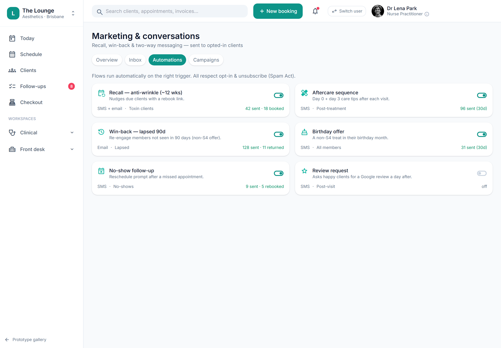

# Automation builder (triggers → timed messages)

> **Epic:** [PRD-07 — Communications, reminders & recall](../epics/PRD-07.md)  ·  **Key:** `PRD-07/AUTOMATIONS`  ·  **Type:** Story  ·  **Stage:** M4  ·  **Priority:** P2  ·  **Estimate:** 2 pts  ·  **Area:** web
>
> **Depends on:** `PRD-07/REMINDERS-CARE`

## Background

As a owner / front desk, I want to configure automations that send the right message at the right time per trigger, so that reminders, aftercare and recall run hands-off.
The prototype's Comms → Automations screen (toggleAuto) configures the reminder/aftercare/recall sequences as toggleable automations. This is the management UI over PRD-07's sequence engine.

## How it works

The management UI over the sequence engine: configure automations that map a trigger (booking, visit, interval) to a timed sequence of messages, each enable/disable-able and editable per treatment type. Marketing automations respect opt-in/unsubscribe; transactional ones always send.
Drives the same engine as REMINDERS-CARE and RECALL.

## Requirements

- To configure automations that send the right message at the right time per trigger.
- Compliance: [C23](https://github.com/danpowell88/tlapoc/blob/main/docs/02-requirements.md#6-compliance-requirements-auqld--restated-as-acceptance-criteria)

## Acceptance Criteria

- [ ] Automations map a trigger (booking, visit, interval) to a timed sequence of messages.
- [ ] Each automation can be enabled/disabled and edited per treatment type.
- [ ] Marketing automations respect opt-in/unsubscribe (C23); transactional ones always send.
- [ ] Drives the same sequence engine as PRD-07/REMINDERS-CARE and PRD-07/RECALL.

## UI designs / screenshots

_Prototype screen: prototype.html — Comms & growth (Inbox/Automations/Campaigns), Growth (Leads/Reviews), Follow-ups, Settings → Public booking page; booking-widget.html._

- Prototype: Comms -> Automations (marketing-auto.png) — a list of automations with trigger -> timed steps, on/off toggles (toggleAuto), per-treatment editing.

## Suggested data model

- **Automation** — id, tenant_id, trigger, treatment_type, sequence_id, enabled(bool)
  - _UI over Sequence; respects consent for marketing._

## Technical notes (high level)

- Stack: Angular web (admin/front-desk/public)

## Other

- Source PRD: [PRD-07-comms-reminders-recall.md](https://github.com/danpowell88/tlapoc/blob/main/docs/prds/PRD-07-comms-reminders-recall.md)

## Tasks (dev pickup)

- [ ] **Data model & migrations** — Entities/columns + relationships; tenant_id + RLS.
- [ ] **Backend: domain logic, rules & API endpoint(s)** — Behaviour + invariants + the OpenAPI contract the UI/clients consume.
- [ ] **Web UI** — prototype.html — Comms & growth (Inbox/Automations/Campaigns), Growth (Leads/Reviews), Follow-ups, Settings → Public booking page; booking-widget.html.
