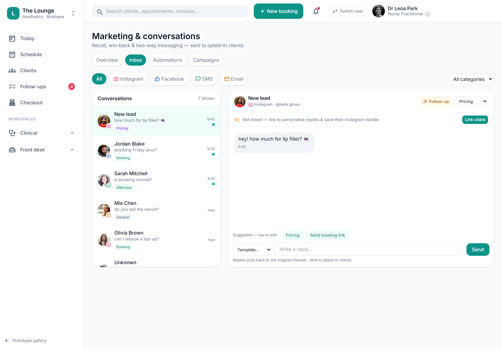

# Public booking page: Settings config screen + live preview

> **Epic:** [PRD-07 — Communications, reminders & recall](../epics/PRD-07.md)  ·  **Key:** `PRD-07/BOOKING-PAGE-SETTINGS`  ·  **Type:** Story  ·  **Stage:** M4  ·  **Priority:** P2  ·  **Estimate:** 2 pts  ·  **Area:** —
>
> **Depends on:** `PRD-07/BOOKING-PAGE`

## Background

As a owner, I want a Settings screen with a live preview to configure my public booking page, so that I can set the policy and see exactly how services will appear publicly.
Plainly: the owner's Settings screen for the public booking page — toggles for generic names / withheld S4 prices / no S4 imagery and SEO metadata, with a live preview showing how S4 vs non-S4 services will appear. Where it fits: a follow-up to the public booking page core (PRD-07/BOOKING-PAGE), which holds the config model, the schedule-driven render and the no-public-S4 invariant; this adds the configuration surface owners use to set the policy. It is client-facing/outward configuration so it arrives late in the clinic-first build. Owner/admin gated; the no-public-S4 invariant still lives server-side in the core.

## How it works

A Settings -> Public booking page panel exposes the policy toggles (generic_names / withhold_s4_prices / no_s4_imagery) and SEO (search engine optimisation) metadata fields, plus a live Preview showing how S4 vs non-S4 services render — e.g. 'Cosmetic consultation $50 · 30 min', 'Anti-wrinkle treatment — Pricing discussed at consult', 'Skin treatment from $180'.
This is the configuration surface over the public booking page core (PRD-07/BOOKING-PAGE); it edits the PublicBookingConfig the core renders from. The settings screen states the policy plainly: 'Service names stay generic, S4 prices withheld and no S4 imagery — set by clinic policy when configuring the page & its SEO metadata.' Owner/admin gated; the no-public-S4 invariant remains a server-side guarantee in the core, so a UI change can't leak an S4 (Schedule 4 prescription-only medicine) name/price.

## Requirements

- A Settings screen with a live preview to configure my public booking page.

## Acceptance Criteria

- [ ] A Settings -> Public booking page panel exposes the policy toggles (generic names / withhold S4 prices / no S4 imagery) and SEO (search engine optimisation) metadata fields.
- [ ] A live Preview shows how S4 vs non-S4 services render (price withheld for S4-flagged services).
- [ ] Owner/admin gated; loading/empty/error states handled.
- [ ] The no-public-S4 server-side invariant (PRD-07/BOOKING-PAGE) still holds regardless of what the UI shows.

## UI designs / screenshots

- Prototype: Settings -> Public booking page — 'Public booking widget · Service names stay generic, S4 prices withheld and no S4 imagery — set by clinic policy when configuring the page & its SEO metadata'; a live Preview (e.g. 'Cosmetic consultation $50 · 30 min', 'Anti-wrinkle treatment — Pricing discussed at consult', 'Skin treatment from $180', 'Book a consultation').

## Suggested data model

- **PublicBookingConfig (edits PRD-07/BOOKING-PAGE)** — generic_names, withhold_s4_prices, no_s4_imagery, seo_metadata
  - _Settings screen edits the existing config; no new entity; the render + invariant live in the core._

## Other

- Source PRD: [PRD-07-comms-reminders-recall.md](https://github.com/danpowell88/tlapoc/blob/main/docs/prds/PRD-07-comms-reminders-recall.md)

## Tasks (dev pickup)

- [ ] **Settings -> Public booking page web UI + live preview**
  Behaviour: a Public-booking-widget panel with the policy toggles (generic names / withhold S4 — Schedule 4 prescription-only medicine — prices / no S4 imagery) and SEO (search engine optimisation) metadata fields, plus a live Preview showing how S4 vs non-S4 services render (price withheld for S4). Requirements: edits the PublicBookingConfig the core (PRD-07/BOOKING-PAGE) renders; owner/admin gated; loading/empty/error states; the no-public-S4 invariant remains server-side in the core.
