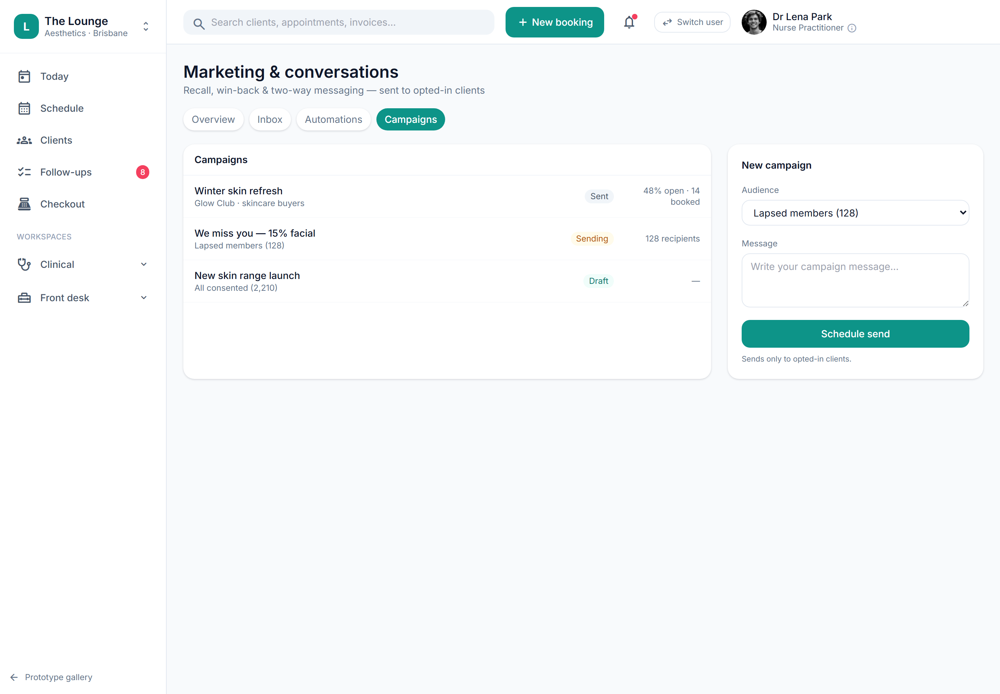

# Campaigns (external-tool handoff) (placeholder)

> **Epic:** [PRD-07 — Communications, reminders & recall](../epics/PRD-07.md)  ·  **Key:** `PRD-07/CAMPAIGNS`  ·  **Type:** Story  ·  **Stage:** M4  ·  **Priority:** P2  ·  **Estimate:** 1 pts  ·  **Area:** integration

## Background

As a owner, I want campaign capability, so that I can run promotions.
The prototype shows a Comms -> Campaigns screen, but advertising/campaign tooling was withdrawn from scope (ADR-0034 withdrawn). Email campaigns and social belong in the clinic's external tools (Mailchimp, Meta Business Suite).  Tracked as a placeholder to reconcile the prototype against the scope cut.

## How it works

Placeholder. The advertising linter, newsletter builder and social scheduler are all out of scope — advertising compliance (C9) is clinic-owned in its external tools. The platform may, where appropriate, expose a consented audience segment for export to those tools (consent + suppression honoured, C23). If a campaign capability were ever built in-app, it would have to honour TGA/AHPRA advertising rules and the no-public-S4-pricing rule (C9).

## Requirements

- Campaign capability.
- Deferred (Phase 2+): placeholder, design-only for now.
- Compliance: [C9](https://github.com/danpowell88/tlapoc/blob/main/docs/02-requirements.md#6-compliance-requirements-auqld--restated-as-acceptance-criteria), [C23](https://github.com/danpowell88/tlapoc/blob/main/docs/02-requirements.md#6-compliance-requirements-auqld--restated-as-acceptance-criteria)

## Acceptance Criteria

- [ ] Placeholder — advertising/campaign content is produced in external tools, not the platform.
- [ ] The platform may expose consented audience segments for export where appropriate (C23).
- [ ] If ever built in-app, it must honour TGA/AHPRA advertising rules and the no-public-S4-pricing rule (C9).

## UI designs / screenshots

- Prototype: Comms -> Campaigns exists as a concept; real campaigns run in external tools (Mailchimp, Meta Business Suite).

## Suggested data model

- **AudienceSegment (export)** — tenant_id, filter, consented clients matching
  - _Export to external tools only; no in-app advertising engine (ADR-0034 withdrawn)._

## Technical notes (high level)

- Architecture decisions: [ADR-0034](https://github.com/danpowell88/tlapoc/blob/main/docs/adr/decision-log.md)

## Other

- Source PRD: [PRD-07-comms-reminders-recall.md](https://github.com/danpowell88/tlapoc/blob/main/docs/prds/PRD-07-comms-reminders-recall.md)

## Tasks (dev pickup)

- [ ] **Scope & design when pulled into a sprint**
  Deferred placeholder — no build in v1; advertising tooling is withdrawn (ADR-0034). If revisited: the only in-scope capability is a consented audience-segment export (consent + suppression honoured, C23) to the clinic's external tools (Mailchimp, Meta Business Suite). Any in-app campaign would have to honour TGA (Therapeutic Goods Administration)/AHPRA (Australian Health Practitioner Regulation Agency) advertising rules and the no-public-S4-pricing rule (C9). Confirm scope/regulatory stance before any breakdown.
