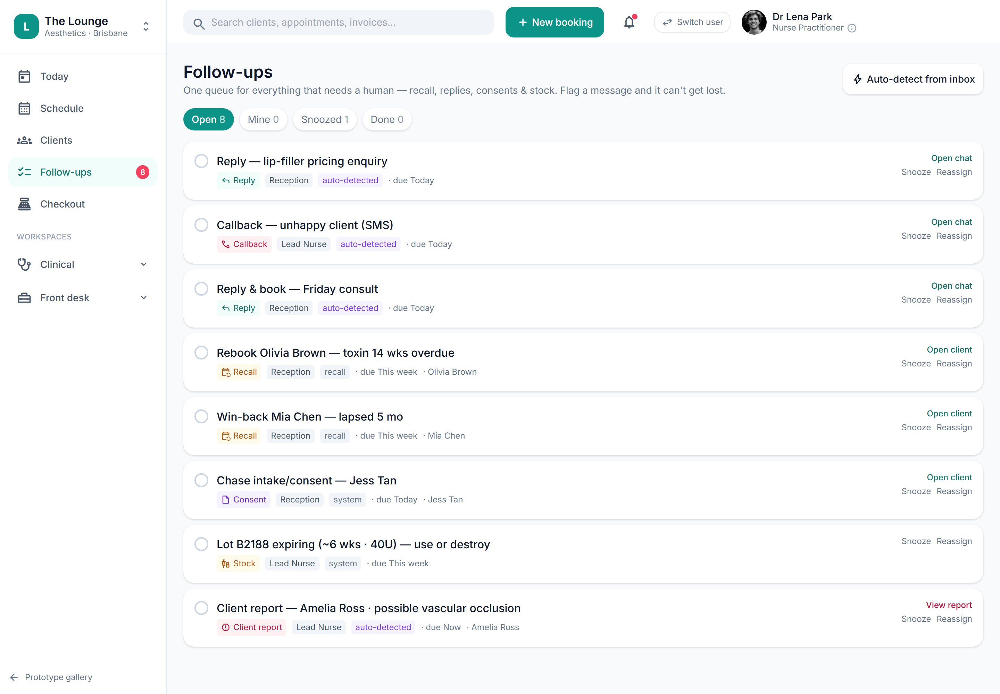

# Unified follow-up / job queue

> **Epic:** [PRD-07 — Communications, reminders & recall](../epics/PRD-07.md)  ·  **Key:** `PRD-07/FOLLOWUPS`  ·  **Type:** Story  ·  **Stage:** M4  ·  **Priority:** P2  ·  **Estimate:** 2 pts  ·  **Area:** web
>
> **Depends on:** `PRD-07/CHANNELS`

## Background

As a staff member, I want one follow-up queue that merges recalls, needs-attention items and flagged messages, so that nothing falls through the cracks.
Scattered recall / needs-attention / unanswered-comms items merge into one queue; staff can flag any message; inbound comms auto-categorise into jobs (rules/keyword, no AI) (REQ-NOTIF-7, ADR-0023).

## How it works

A unified follow-up / job queue: scattered recall, needs-attention and unanswered-comms items merge into one queue; staff can flag any message so it isn't lost; inbound comms auto-categorise into jobs by rules/keyword (no AI). A no-show (PRD-02) and negative reviews raise jobs here.
The single 'what needs doing' list across the clinic (ADR-0023).

## Requirements

- One follow-up queue that merges recalls, needs-attention items and flagged messages.

## Acceptance Criteria

- [ ] Recall, needs-attention and unanswered-comms items merge into a single queue.
- [ ] Any message can be flagged so it isn't lost.
- [ ] Inbound comms auto-categorise into jobs by rules/keyword (no AI).
- [ ] A no-show (PRD-02) and negative reviews raise jobs into this queue.

## UI designs / screenshots

_Prototype screen: prototype.html — Comms & growth (Inbox/Automations/Campaigns), Growth (Leads/Reviews), Follow-ups, Settings → Public booking page; booking-widget.html._

- Prototype: Follow-ups (followups.png) — a job list with type, client link, assignee, status; actions: open, done, snooze, reopen, reassign, callback; a count badge in the nav.
- Jobs created from recalls, no-shows, flagged messages, reviews, AE.

## Suggested data model

- **Job** — id, tenant_id, type(recall|callback|review|ae|attention|message), client_id?, source_ref, assignee_id, status(open|snoozed|done), due_at
  - _Merged queue; auto-categorised by rules/keyword._

## Technical notes (high level)

- Stack: Angular web (admin/front-desk/public)
- Architecture decisions: [ADR-0023](https://github.com/danpowell88/tlapoc/blob/main/docs/adr/decision-log.md)

## Other

- Source PRD: [PRD-07-comms-reminders-recall.md](https://github.com/danpowell88/tlapoc/blob/main/docs/prds/PRD-07-comms-reminders-recall.md)

## Tasks (dev pickup)

- [ ] **Data model & migrations** — Entities/columns + relationships; tenant_id + RLS.
- [ ] **Backend: domain logic, rules & API endpoint(s)** — Behaviour + invariants + the OpenAPI contract the UI/clients consume.
- [ ] **Web UI** — prototype.html — Comms & growth (Inbox/Automations/Campaigns), Growth (Leads/Reviews), Follow-ups, Settings → Public booking page; booking-widget.html.
