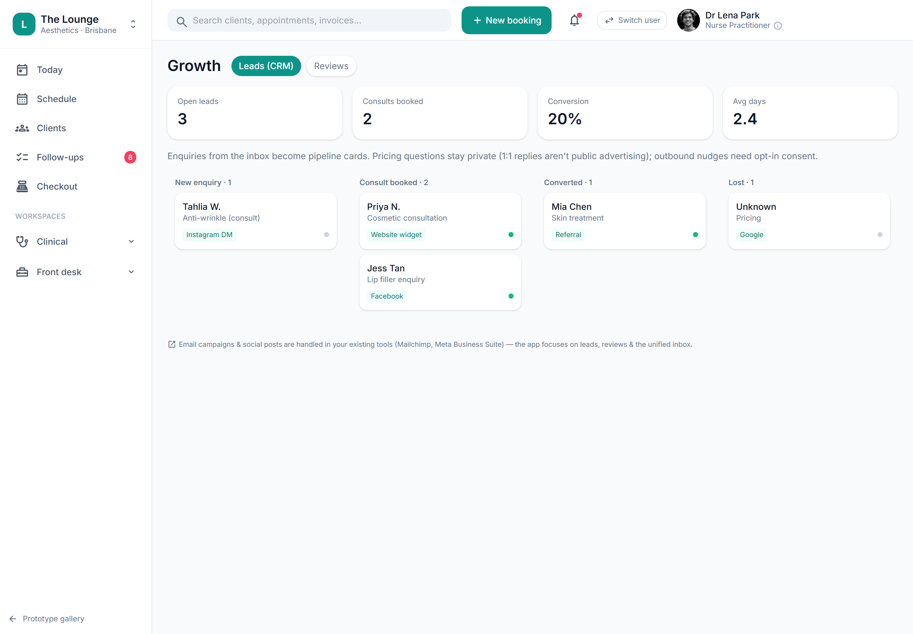

# Lead / prospect CRM

> **Epic:** [PRD-07 — Communications, reminders & recall](../epics/PRD-07.md)  ·  **Key:** `PRD-07/LEADS-CRM`  ·  **Type:** Story  ·  **Stage:** M4  ·  **Priority:** P2  ·  **Estimate:** 1 pts  ·  **Area:** web
>
> **Depends on:** `PRD-07/FOLLOWUPS`

## Background

As a front desk / owner, I want to track leads/prospects through to booking, so that enquiries don't get lost and convert better.
The prototype's Growth → Leads (CRM) screen tracks enquiries who haven't booked yet, over the inbox (ADR-0033).

## How it works

A lead/prospect CRM (Phase 2) over the inbox: track enquiries who haven't booked yet, with source, status and next action; convert to a client/booking preserving history. Lead follow-ups surface in the Follow-ups queue; marketing to leads respects Spam-Act consent.
Stops enquiries getting lost and improves conversion (ADR-0033).

## Requirements

- To track leads/prospects through to booking.
- Deferred (Phase 2+): placeholder, design-only for now.
- Compliance: [C23](https://github.com/danpowell88/tlapoc/blob/main/docs/02-requirements.md#6-compliance-requirements-auqld--restated-as-acceptance-criteria)

## Acceptance Criteria

- [ ] Leads are captured with source, status and next action.
- [ ] A lead can convert to a client/booking, preserving history.
- [ ] Lead follow-ups surface in the Follow-ups queue.
- [ ] Marketing to leads respects Spam-Act consent (C23).

## UI designs / screenshots

_Prototype screen: prototype.html — Comms & growth (Inbox/Automations/Campaigns), Growth (Leads/Reviews), Follow-ups, Settings → Public booking page; booking-widget.html._

- Prototype: Growth -> Leads (CRM) (growth-leads.png) — lead list with source/status/next-action; convert-to-client/booking action.

## Suggested data model

- **Lead** — id, tenant_id, name, contact, source, status(new|nurturing|won|lost), next_action, converted_client_id?
  - _Convert preserves history; consent for marketing (C23)._

## Technical notes (high level)

- Architecture decisions: [ADR-0033](https://github.com/danpowell88/tlapoc/blob/main/docs/adr/decision-log.md)

## Other

- Source PRD: [PRD-07-comms-reminders-recall.md](https://github.com/danpowell88/tlapoc/blob/main/docs/prds/PRD-07-comms-reminders-recall.md)

## Tasks (dev pickup)

- [ ] **Scope & design when pulled into a sprint**
  Deferred placeholder — no build in v1; confirm it still fits scope/regulatory stance, then break down.
