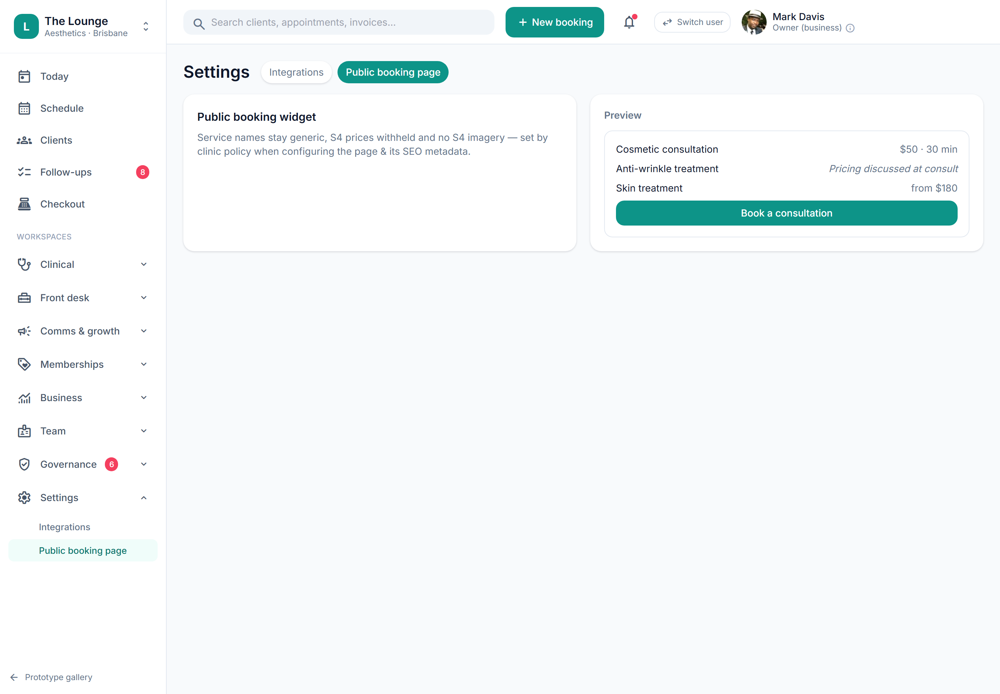

# Marketing consent & functional unsubscribe (Spam Act)

> **Epic:** [PRD-07 — Communications, reminders & recall](../epics/PRD-07.md)  ·  **Key:** `PRD-07/MARKETING-CONSENT`  ·  **Type:** Story  ·  **Stage:** M4  ·  **Priority:** P1  ·  **Estimate:** 3 pts  ·  **Area:** backend
>
> **Depends on:** `PRD-07/CHANNELS`

## Background

As a client, I want to only receive marketing I opted into, with a working unsubscribe on every message, so that my consent is respected per the Spam Act.
Under the Spam Act, a commercial electronic message needs the recipient's consent, must identify the sender, and must carry a functional unsubscribe that takes effect promptly. This story is the consent + suppression spine for all marketing: opt-in per channel, an unsubscribe in every marketing message, and immediate suppression on withdrawal — honoured across SMS/email/push and by PRD-06's reward comms. Transactional reminders/aftercare are exempt and always send.  Opt-in for commercial electronic messages, sender identification and a functional unsubscribe that suppresses immediately on withdrawal (REQ-NOTIF-5, C23).

## How it works

MarketingConsent records opt-in per client per channel. A SuppressionList holds withdrawn/unsubscribed contacts tenant-wide. Before any marketing send, the caller checks consent AND that the contact isn't suppressed; a non-consented or suppressed recipient is dropped. Every marketing message includes sender identification and a working unsubscribe (STOP for SMS, an unsubscribe link for email); acting on it writes to the suppression list immediately, so the next marketing send is suppressed.
The line between transactional and marketing is enforced here: reminders, confirmations and aftercare (transactional) are exempt — they always send and carry no unsubscribe-gating — while recall nudges, win-back, birthday offers and reward/incentive comms (PRD-06) are marketing and must pass the consent + suppression gate. Staff see consent state on the Client 360; the client toggles opt-in in the app/profile. The suppression list is the shared safety net all consented sends honour.

## Requirements

- To only receive marketing I opted into, with a working unsubscribe on every message.
- Compliance: [C23](https://github.com/danpowell88/tlapoc/blob/main/docs/02-requirements.md#6-compliance-requirements-auqld--restated-as-acceptance-criteria)

## Acceptance Criteria

- [ ] Marketing sends only to opted-in clients and always include sender identification + a working unsubscribe.
- [ ] Unsubscribing (STOP / link) suppresses future marketing immediately.
- [ ] The suppression list is honoured across all channels and by PRD-06 reward/incentive comms.
- [ ] Transactional reminders/aftercare are exempt and always send.

## UI designs / screenshots

- Client app/profile: marketing opt-in toggle (per channel); unsubscribe in every marketing message; staff see consent state on the Client 360.
- Admin: suppression list.

## Suggested data model

- **MarketingConsent** — id, client_id, channel(sms|email|push), opted_in(bool), updated_at
  - _Required for marketing (C23); per channel._
- **SuppressionList** — id, tenant_id, contact, reason(unsubscribe|bounce|complaint), at
  - _Honoured across all marketing/reward comms; immediate on withdrawal._

## Other

- Source PRD: [PRD-07-comms-reminders-recall.md](https://github.com/danpowell88/tlapoc/blob/main/docs/prds/PRD-07-comms-reminders-recall.md)

## Tasks (dev pickup)

- [ ] **MarketingConsent + SuppressionList model (migrations)**
  Model MarketingConsent (per client per channel) + SuppressionList (tenant-wide contacts) — tenant_id + RLS (row-level security).
  - Consent carries opted_in + updated_at; suppression carries contact + reason + at.
  - These are the shared gate every marketing caller (incl. PRD-06 reward comms) consults.
- [ ] **Consent gate + functional unsubscribe + sender-ID**
  Server-side.
  - A send-gate helper: marketing send proceeds only if opted_in AND contact not suppressed; transactional sends bypass the gate.
  - Inject sender identification + unsubscribe (STOP keyword handler for SMS (text message); unsubscribe link/endpoint for email) into every marketing message.
  - Acting on unsubscribe writes to SuppressionList immediately; subsequent marketing sends are suppressed. Endpoints: get/set consent, list/append suppression.
- [ ] **Enforce consent/suppression as a server-side invariant + audit**
  C23 invariant that cannot be bypassed via the API.
  - Block any marketing send to a non-consented/suppressed contact at the send boundary — return a clear suppressed reason (not a silent drop) for logs/UI.
  - Ensure PRD-06 reward comms route through the same gate.
  - Audit suppressed sends and consent changes (ADR-0010).
