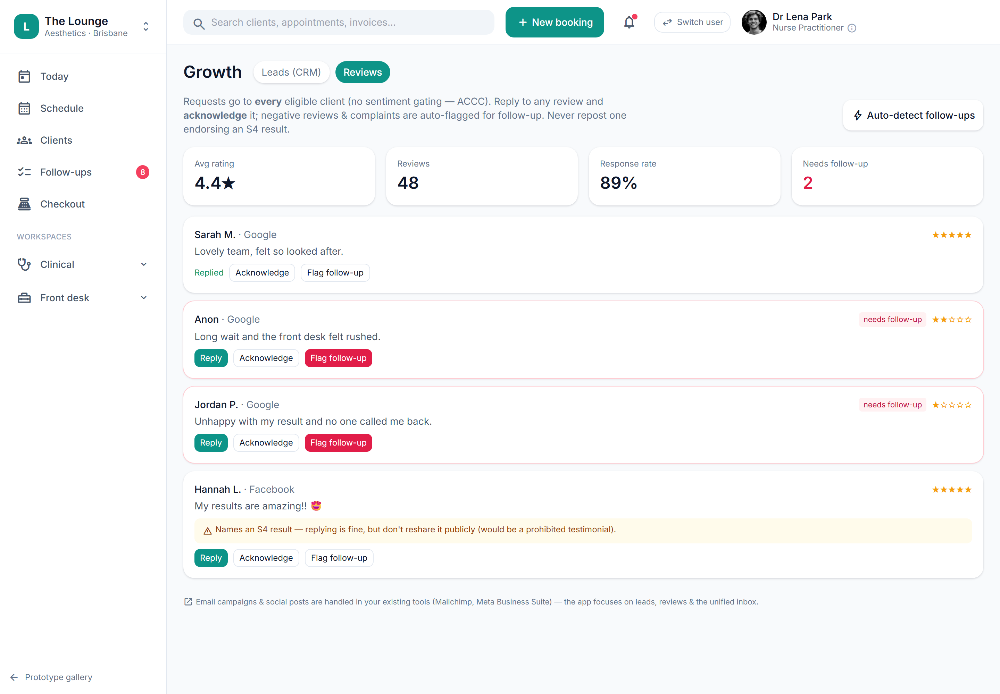

# Reviews & reputation (request, acknowledge, flag, auto-follow-up)

> **Epic:** [PRD-07 — Communications, reminders & recall](../epics/PRD-07.md)  ·  **Key:** `PRD-07/REVIEWS`  ·  **Type:** Story  ·  **Stage:** M4  ·  **Priority:** P2  ·  **Estimate:** 1 pts  ·  **Area:** web
>
> **Depends on:** `PRD-07/FOLLOWUPS`

## Background

As a owner, I want to request reviews and manage replies, with negative ones auto-raising follow-ups, so that reputation is managed and problems are caught early.
The prototype's Growth → Reviews screen (scanReviews/reviewReply/reviewFlag/reviewAck) requests reviews, replies/acknowledges, and auto-raises follow-up jobs for negative reviews (≤3★) — with a staff caution against resharing an S4-endorsing review as a prohibited testimonial.

## How it works

Reviews & reputation (Phase 2): request reviews from consented clients, reply/acknowledge, and auto-raise follow-up jobs for negative reviews (<=3 stars) and complaint matches. A staff caution warns against resharing an S4-endorsing review as a prohibited testimonial (C9). No sentiment-gating of who is asked (request-all).
Manages reputation and catches problems early.

## Requirements

- To request reviews and manage replies, with negative ones auto-raising follow-ups.
- Deferred (Phase 2+): placeholder, design-only for now.
- Compliance: [C9](https://github.com/danpowell88/tlapoc/blob/main/docs/02-requirements.md#6-compliance-requirements-auqld--restated-as-acceptance-criteria), [C23](https://github.com/danpowell88/tlapoc/blob/main/docs/02-requirements.md#6-compliance-requirements-auqld--restated-as-acceptance-criteria)

## Acceptance Criteria

- [ ] Review requests sent to consented clients; replies/acknowledge supported.
- [ ] Negative reviews (≤3★) and complaint matches auto-raise review jobs into the Follow-ups queue.
- [ ] A caution warns against resharing an S4-endorsing review as a testimonial (C9).
- [ ] No sentiment-gating of who is asked (request-all).

## UI designs / screenshots

_Prototype screen: prototype.html — Comms & growth (Inbox/Automations/Campaigns), Growth (Leads/Reviews), Follow-ups, Settings → Public booking page; booking-widget.html._

- Prototype: Growth -> Reviews (growth-reviews.png) — request/scan reviews, reply/acknowledge/flag (scanReviews/reviewReply/reviewFlag/reviewAck); negative ones raise jobs into Follow-ups with the testimonial caution.

## Suggested data model

- **Review** — id, tenant_id, client_id?, source, rating, body, status(new|acknowledged|replied|flagged), at
  - _<=3 stars -> Job; testimonial caution (C9)._

## Technical notes (high level)

- Stack: Angular web (admin/front-desk/public)
- Architecture decisions: [ADR-0032](https://github.com/danpowell88/tlapoc/blob/main/docs/adr/decision-log.md)

## Other

- Source PRD: [PRD-07-comms-reminders-recall.md](https://github.com/danpowell88/tlapoc/blob/main/docs/prds/PRD-07-comms-reminders-recall.md)

## Tasks (dev pickup)

- [ ] **Scope & design when pulled into a sprint** — Deferred placeholder — no build yet.
- [ ] **Confirm it still fits scope / regulatory stance**
