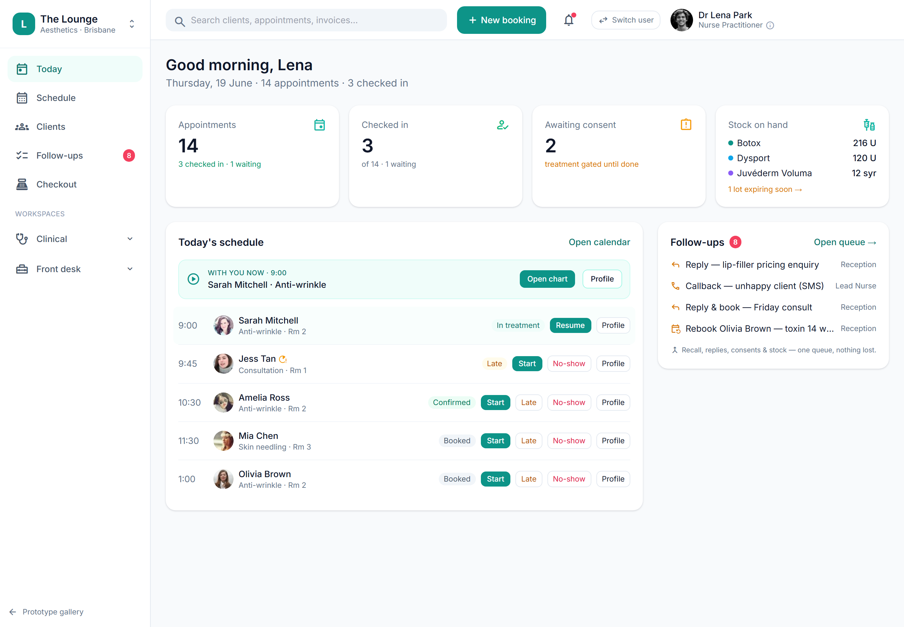

# Owner 'needs attention' exceptions digest

> **Epic:** [PRD-08 — Reporting & compliance dashboards (Governance hub)](../epics/PRD-08.md)  ·  **Key:** `PRD-08/ATTENTION-DIGEST`  ·  **Type:** Story  ·  **Stage:** M5  ·  **Priority:** P2  ·  **Estimate:** 2 pts  ·  **Area:** web
>
> **Depends on:** `PRD-08/COMPLIANCE-DASH`

## Background

As a owner, I want a single 'needs attention' digest of exceptions across the clinic, so that I can act on what matters without hunting.
An owner digest of exceptions across the platform (REQ-RPT-5).

## How it works

A single owner 'needs attention' digest aggregating exceptions across the clinic — expiries, discrepancies, data-quality findings, failed payments, overdue follow-ups — each linking to its source. Respects role/financial gating.
The at-a-glance 'what needs me' view for the owner.

## Requirements

- A single 'needs attention' digest of exceptions across the clinic.

## Acceptance Criteria

- [ ] Digest aggregates expiries, discrepancies, data-quality findings, failed payments and overdue follow-ups.
- [ ] Each item links to its source for action.
- [ ] Digest respects role/financial gating.
- [ ] Available as an at-a-glance owner view.

## UI designs / screenshots

_Prototype screen: prototype.html — Reports, Governance (Overview/AE & DAEN/Policies/Audit pack)._

- Prototype: Today (dashboard.png) surfaces the owner exceptions digest; each item deep-links to its source screen.

## Suggested data model

- **(read) AttentionDigest** — aggregates CredentialAlert + Excursion + Stocktake discrepancy + DataQualityFinding + DunningAttempt + overdue Job
  - _Role/financial-gated._

## Other

- Source PRD: [PRD-08-reporting-compliance.md](https://github.com/danpowell88/tlapoc/blob/main/docs/prds/PRD-08-reporting-compliance.md)

## Tasks (dev pickup)

- [ ] **Read-model / projection** — Materialised view fed by domain events.
- [ ] **Web UI** — prototype.html — Reports, Governance (Overview/AE & DAEN/Policies/Audit pack).
