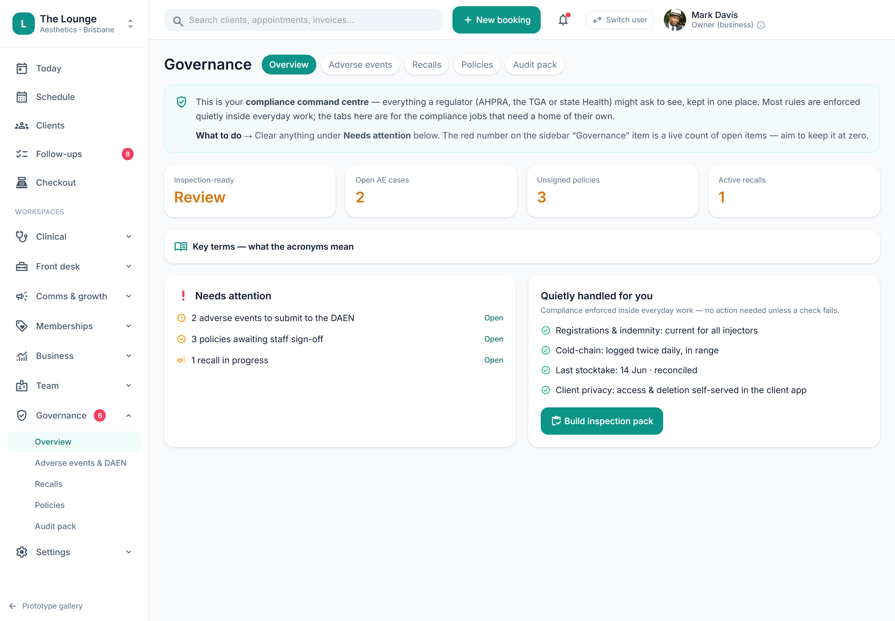

# Compliance dashboards & register exports

> **Epic:** [PRD-08 — Reporting & compliance dashboards (Governance hub)](../epics/PRD-08.md)  ·  **Key:** `PRD-08/COMPLIANCE-DASH`  ·  **Type:** Story  ·  **Stage:** M5  ·  **Priority:** P1  ·  **Estimate:** 3 pts  ·  **Area:** web
>
> **Depends on:** `PRD-08/READ-MODELS`, `PRD-04/RECALL-LOOKUP`

## Background

As a compliance officer, I want compliance dashboards and exports covering consent, consult-before-script, the S4 register, recalls, expiry and the breach/complaints registers, so that I can evidence compliance and act on gaps.
Consent coverage, consult-before-script adherence (C1), S4 register export (C8), lot→clients recall, cooling-off adherence (C6), registration-expiry watch (C19), records-retention-due (C18), S4 stock discrepancies (C17), breach (C22) & complaints (C24) registers (REQ-RPT-3).

## How it works

Compliance dashboards + register exports: consent coverage, consult-before-script adherence (shows 100% by construction; exceptions impossible to create), the S4 register export, lot->clients recall, cooling-off adherence, registration-expiry watch, records-retention-due, S4 stock discrepancies, and the breach + complaints registers.
Turns the moat's data into audit-ready evidence (the Governance hub overview).

## Requirements

- Compliance dashboards and exports covering consent, consult-before-script, the S4 register, recalls, expiry and the breach/complaints registers.
- Compliance: [C1](https://github.com/danpowell88/tlapoc/blob/main/docs/02-requirements.md#6-compliance-requirements-auqld--restated-as-acceptance-criteria), [C8](https://github.com/danpowell88/tlapoc/blob/main/docs/02-requirements.md#6-compliance-requirements-auqld--restated-as-acceptance-criteria), [C18](https://github.com/danpowell88/tlapoc/blob/main/docs/02-requirements.md#6-compliance-requirements-auqld--restated-as-acceptance-criteria), [C19](https://github.com/danpowell88/tlapoc/blob/main/docs/02-requirements.md#6-compliance-requirements-auqld--restated-as-acceptance-criteria), [C22](https://github.com/danpowell88/tlapoc/blob/main/docs/02-requirements.md#6-compliance-requirements-auqld--restated-as-acceptance-criteria), [C24](https://github.com/danpowell88/tlapoc/blob/main/docs/02-requirements.md#6-compliance-requirements-auqld--restated-as-acceptance-criteria)

## Acceptance Criteria

- [ ] Consult-before-script adherence shows 100% by construction; any exception is flagged.
- [ ] The S4 register exports a complete immutable record; a lot lookup returns all affected clients.
- [ ] Registration-expiry watch and records-due-for-destruction lists render with their basis.
- [ ] Breach and complaints registers are viewable/exportable.

## UI designs / screenshots

_Prototype screen: prototype.html — Reports, Governance (Overview/AE & DAEN/Policies/Audit pack)._

- Prototype: Governance -> Overview (gov-overview.png) — compliance metrics + register links; exports for the S4 register, lot-recall and the breach/complaints registers.
- Registration-expiry watch + records-due lists with their basis.

## Suggested data model

- **ComplianceMetric** — key(consent_coverage|consult_adherence|cooling_off|reg_expiry|retention_due|stock_discrepancy), value, exceptions[]
  - _From read-models + AuditEvent._
- **RegisterExport** — type(s4_register|lot_recall|breach|complaints), generated_at, ref
  - _Exportable evidence (C8/C22/C24)._

## Technical notes (high level)

- Stack: Angular web (admin/front-desk/public)

## Other

- Source PRD: [PRD-08-reporting-compliance.md](https://github.com/danpowell88/tlapoc/blob/main/docs/prds/PRD-08-reporting-compliance.md)

## Tasks (dev pickup)

- [ ] **Enforce compliance gate + audit events** — Server-side (C1, C8, C18, C19, C22, C24); blocked path explains why.
- [ ] **Web UI** — prototype.html — Reports, Governance (Overview/AE & DAEN/Policies/Audit pack).
- [ ] **Tests (unit + integration)** — Cover acceptance criteria, incl. any gate/invariant.
