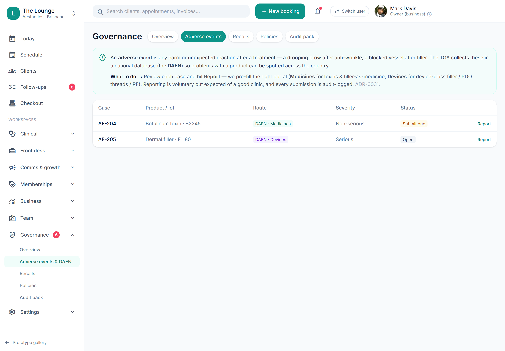

# Adverse-event / DAEN prefilled submission

> **Epic:** [PRD-08 — Reporting & compliance dashboards (Governance hub)](../epics/PRD-08.md)  ·  **Key:** `PRD-08/DAEN`  ·  **Type:** Story  ·  **Stage:** M5  ·  **Priority:** P1  ·  **Estimate:** 3 pts  ·  **Area:** web
>
> **Depends on:** `PRD-05/ADVERSE-EVENT`

## Background

As a prescriber, I want to generate a prefilled DAEN adverse-event report targeting the correct database, so that reporting an adverse event is fast and correct.
This story makes adverse-event reporting fast and correct: it takes a complication recorded in the clinical record and produces a prefilled report for the right TGA (Therapeutic Goods Administration) database, plus runs product recalls with an acknowledgement trail. It sits in the Reporting/Governance layer (step 6 of the clinic-first build): it consumes the adverse-event record from Charting (PRD-05 ADVERSE-EVENT), so it depends on that, and feeds the open-adverse-event count on the Governance Overview. This is clinical-governance work, not financial — no money figures appear. Classify seriousness, route medicine vs device, produce a prefilled DAEN (Database of Adverse Event Notifications) export/submission and flag mandatory cases (C12, ADR-0031).

## How it works

Turns an adverse-event record (from PRD-05 ADVERSE-EVENT) into a prefilled TGA report. The hub classifies seriousness and routes to the correct database by the product's modality classification (ADR-0025/0031): a toxin/medicine event routes to DAEN-medicines; a device-class filler (PDO threads, RF, dermal filler treated as device for AE) routes to DAEN-medical devices. The system prefills the report from the AE + administration + product data, then opens the official portal and records submission status + reference back on the audit trail — there is no direct TGA API in v1 (ADR-0031); v1 is prefill + mark-submitted, with electronic submit as a clean upgrade path.
Reporting is voluntary but strongly encouraged for injectors in most cosmetic settings; the hub flags the defined mandatory cases (unapproved goods supplied under authority; serious device events at hospital/day-hospital facilities from 21 Mar 2026 under ASDER) rather than asserting the obligation universally — most room-based clinics fall outside the mandatory device rule. Recall execution and acknowledgement tracking also live in the hub: a lot safety notice turns into a client recall campaign with an acknowledgement trail (9 of 14 acknowledged …) that is exactly the evidence an inspector asks for.
Each case shows route, product/lot, severity and status (Submit due / Open / Submitted). Submitting marks the case Submitted, stamps a reported date and writes an AuditEvent. This is clinical-governance work, not financial — no money figures appear.

## Requirements

- To generate a prefilled DAEN adverse-event report targeting the correct database.
- Compliance: [C12](https://github.com/danpowell88/tlapoc/blob/main/docs/02-requirements.md#6-compliance-requirements-auqld--restated-as-acceptance-criteria)

## Acceptance Criteria

- [ ] An adverse event produces a prefilled DAEN report with seriousness set, routed to the correct database (medicine vs device) by product modality.
- [ ] Mandatory-reporting cases are flagged (unapproved-goods-under-authority; serious device events at hospital/day-hospital facilities from 21 Mar 2026) without asserting the obligation universally.
- [ ] Submission is prefill + portal hand-off + mark-submitted (no direct API in v1); status + reference recorded on the audit trail.
- [ ] Recall execution + acknowledgement tracking lives in the hub (lot → client recall campaign with an acknowledgement trail).
- [ ] Each case shows route, product/lot, severity and status; submitting stamps a reported date and audit event.

## UI designs / screenshots

_Prototype screen: prototype.html — Reports, Governance (Overview/AE & DAEN/Policies/Audit pack)._

- Prototype: Governance → Adverse events & DAEN (gov-ae.png). Intro explains DAEN + 'we pre-fill the right portal (Medicines for toxins/filler-as-medicine, Devices for device-class filler/PDO/RF)'.
- AE table: Case (AE-204), Product / lot (Botulinum toxin · B2245), Route (DAEN · Medicines / DAEN · Devices, colour-coded), Severity (Non-serious / Serious), Status (Submit due / Open), Report action.
- Open a case → DAEN modal (openDaen): prefilled summary (Route, Product/lot, Severity, description) + 'Voluntary but strongly encouraged. The report is prefilled for the <portal> portal.' + Submit/export.
- Submit (submitDaen): status → Submitted, reported date stamped, toast 'DAEN report marked submitted · audit-logged'; Overview AE count updates.
- Recalls tab (gov-recalls.png): recall card with lot, sponsor field-safety notice, acknowledgement progress (9 of 14 acknowledged · 64%), 'Run recall' (runRecall) → SMS+call + acknowledgement tracking.

## Suggested data model

- **DaenReport** — id, adverse_event_id, target(medicine|device), seriousness(serious|non_serious), mandatory(bool), mandatory_basis?, prefilled(json), portal_ref?, status(submit_due|open|submitted), reported_at
  - _Derived from AdverseEvent (PRD-05) + administration/product; prefill + portal hand-off (ADR-0031), no direct API in v1._
- **RecallCampaign** — id, lot_ref, source(sponsor_notice|tga|internal), affected_clients[], notified_at, channel(sms|call), status
  - _Built from the lot→clients lookup; execution lives in the hub._
- **RecallAcknowledgement** — id, recall_campaign_id, client_id, acknowledged_at, channel
  - _The acknowledgement trail an inspector asks for._

## Technical notes (high level)

- Architecture decisions: [ADR-0031](https://github.com/danpowell88/tlapoc/blob/main/docs/adr/decision-log.md)

## Other

- Source PRD: [PRD-08-reporting-compliance.md](https://github.com/danpowell88/tlapoc/blob/main/docs/prds/PRD-08-reporting-compliance.md)

## Tasks (dev pickup)

- [ ] **AE → DAEN classification, route (medicine vs device) & prefill**
  Behaviour: from an AdverseEvent (PRD-05) build a DaenReport — set seriousness, route to medicine vs device by the product's modality/regClass (ADR-0025; toxin/filler-as-medicine → DAEN Medicines, device-class filler/PDO threads/RF → DAEN Devices), and prefill the report fields from the AE + administration + product/lot data. Requirements: routing is derived from the product, not chosen by hand; prefill is server-side; status machine submit_due/open → submitted; no direct TGA (Therapeutic Goods Administration) API in v1 (ADR-0031) — prefill + portal hand-off only.
- [ ] **Mandatory-reporting flag (voluntary by default, basis recorded)**
  Behaviour: flag the defined mandatory cases — unapproved-goods-supplied-under-authority, and serious device events at hospital/day-hospital facilities from 21 Mar 2026 (ASDER) — while defaulting to voluntary-but-encouraged otherwise. Requirements: when a case is mandatory the mandatory_basis is recorded and shown; the obligation is never asserted universally (most room-based clinics fall outside the device rule); the voluntary-encouraged note appears for the rest.
- [ ] **AE list UI (gov-ae) + prefilled DAEN modal + mark-submitted**
  Behaviour: build the AE table (Case, Product/lot, Route as a colour-coded chip, Severity, Status, Report action) and the prefilled DAEN (Database of Adverse Event Notifications) modal — route/product/lot/severity summary, the 'voluntary but strongly encouraged · prefilled for the <portal> portal' note, and Submit/export. Requirements: submitting marks the case Submitted, stamps a reported date and writes an AuditEvent; the toast reads 'DAEN report marked submitted · audit-logged'; the Overview AE count decrements on submit.
- [ ] **Recall execution UI (gov-recalls) + acknowledgement tracking**
  Behaviour: build the recalls tab — a recall card per lot (lot, sponsor field-safety notice, an acknowledgement progress bar e.g. '9 of 14 acknowledged · 64%') and a 'Run recall' action. Requirements: Run recall turns the lot safety notice into a RecallCampaign over the affected-clients set (lot→clients lookup), dispatches SMS + call via the notifier (PRD-07) and creates a follow-up job to chase the remaining clients; track per-client RecallAcknowledgement to build the inspector-ready acknowledgement trail; recall/safety messaging overrides marketing opt-out.
- [ ] **Append-only audit on all DAEN & recall actions**
  Behaviour: every DAEN and recall action is append-only audited (ADR-0010) — generating the prefill, marking submitted (with portal reference + reported date), launching a recall, and each per-client acknowledgement. Requirements: capability-gate to the compliance concern; these audit entries are exactly what surface in the inspection pack (INSPECTION-PACK) and the Governance Overview counts; no money figures.
