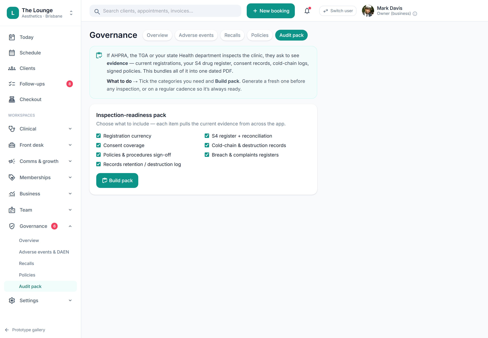

# Inspection-readiness pack & governance hub

> **Epic:** [PRD-08 — Reporting & compliance dashboards (Governance hub)](../epics/PRD-08.md)  ·  **Key:** `PRD-08/INSPECTION-PACK`  ·  **Type:** Story  ·  **Stage:** M5  ·  **Priority:** P2  ·  **Estimate:** 2 pts  ·  **Area:** web
>
> **Depends on:** `PRD-08/COMPLIANCE-DASH`

## Background

As a owner, I want a one-click pack that assembles the evidence an inspector would ask for, so that we're always inspection-ready.
A one-click inspection-readiness pack and the cross-case Governance hub (policies sign-off, waste manifests/IPC, DSAR + breach drill) (REQ-RPT-7, ADR-0030, REQ-SEC-8/9).

## How it works

A one-click inspection-readiness pack assembling the evidence an inspector asks for (consent coverage, S4 register, registration/insurance status, IPC/waste logs, registers) and the cross-case Governance hub: policies sign-off, DSAR (APP 12/13) and a breach drill. Pack generation is audited (REQ-RPT-7, ADR-0030).
Makes the clinic always inspection-ready.

## Requirements

- A one-click pack that assembles the evidence an inspector would ask for.
- Compliance: [C10](https://github.com/danpowell88/tlapoc/blob/main/docs/02-requirements.md#6-compliance-requirements-auqld--restated-as-acceptance-criteria)

## Acceptance Criteria

- [ ] The pack assembles consent coverage, the S4 register, registration/insurance status, IPC/waste logs and registers.
- [ ] Policies & procedures sign-off is tracked in the hub.
- [ ] DSAR (APP 12/13) and a breach drill are runnable from the hub.
- [ ] Pack generation is audited.

## UI designs / screenshots

_Prototype screen: prototype.html — Reports, Governance (Overview/AE & DAEN/Policies/Audit pack)._

- Prototype: Governance -> Audit pack (gov-audit.png) — buildAuditPack assembles the evidence bundle; the hub links policies sign-off, DSAR and breach drill.

## Suggested data model

- **InspectionPack** — id, tenant_id, generated_at, contents, actor_id
  - _Audited; one-click bundle._

## Technical notes (high level)

- Stack: Angular web (admin/front-desk/public)
- Architecture decisions: [ADR-0030](https://github.com/danpowell88/tlapoc/blob/main/docs/adr/decision-log.md)

## Other

- Source PRD: [PRD-08-reporting-compliance.md](https://github.com/danpowell88/tlapoc/blob/main/docs/prds/PRD-08-reporting-compliance.md)

## Tasks (dev pickup)

- [ ] **Enforce compliance gate + audit events** — Server-side (C10); blocked path explains why.
- [ ] **Web UI** — prototype.html — Reports, Governance (Overview/AE & DAEN/Policies/Audit pack).
- [ ] **Tests (unit + integration)** — Cover acceptance criteria, incl. any gate/invariant.
