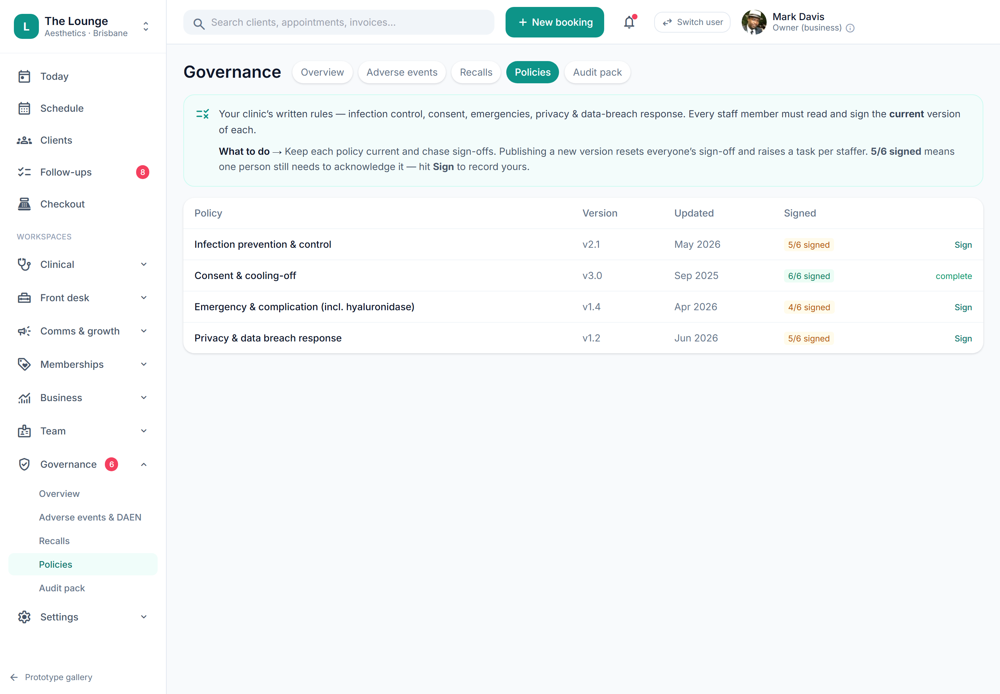

# Policies & procedures sign-off

> **Epic:** [PRD-08 — Reporting & compliance dashboards (Governance hub)](../epics/PRD-08.md)  ·  **Key:** `PRD-08/POLICIES`  ·  **Type:** Story  ·  **Stage:** M5  ·  **Priority:** P1  ·  **Estimate:** 3 pts  ·  **Area:** web
>
> **Depends on:** `PRD-08/INSPECTION-PACK`

## Background

As a owner / compliance officer, I want to publish policies and track staff sign-off, so that I can evidence that the team has read current procedures.
The prototype's Governance → Policies screen (signPolicy) tracks staff acknowledgement/sign-off of clinic policies and procedures, part of the Governance hub.

## How it works

Policies & procedures sign-off: the clinic's written rules — infection prevention & control, consent & cooling-off, emergency & complication (incl. hyaluronidase), privacy & data-breach response — published to the relevant roles, with per-staff acknowledgement tracked so the clinic can evidence that the team has read the current procedures. Part of the Governance hub (ADR-0030); the data is sign-off evidence for the inspection pack.
Policies are versioned. Publishing a new version resets everyone's sign-off for that policy and raises a sign-off task per relevant staff member (a Job, ADR-0023) — so a changed policy requires re-acknowledgement and outstanding sign-offs surface rather than silently going stale. Each policy shows its version, last-updated date and a signed count (e.g. 5/6 signed); 6/6 reads 'complete'. Sign-off (signPolicy) records the staff member against that policy version with a timestamp and is append-only audited.
The Overview 'Unsigned policies' tile is a live count of policies not fully signed, and policy sign-off status is one of the inspection-pack categories (INSPECTION-PACK). Governance/compliance work, no money figures.

## Requirements

- To publish policies and track staff sign-off.
- Compliance: [C10](https://github.com/danpowell88/tlapoc/blob/main/docs/02-requirements.md#6-compliance-requirements-auqld--restated-as-acceptance-criteria), [C20](https://github.com/danpowell88/tlapoc/blob/main/docs/02-requirements.md#6-compliance-requirements-auqld--restated-as-acceptance-criteria)

## Acceptance Criteria

- [ ] Policies are versioned and published to the relevant roles.
- [ ] Staff sign-off is recorded per policy version with a timestamp; outstanding sign-offs surface (signed count, e.g. 5/6).
- [ ] Publishing a new version resets sign-off and raises a re-acknowledgement task per relevant staff member.
- [ ] Sign-off status is included in the inspection-readiness pack and the Overview 'Unsigned policies' count; all sign-offs audited.

## UI designs / screenshots

_Prototype screen: prototype.html — Reports, Governance (Overview/AE & DAEN/Policies/Audit pack)._

- Prototype: Governance → Policies (gov-policies.png). Intro: 'Every staff member must read and sign the current version … 5/6 signed means one person still needs to acknowledge it — hit Sign'.
- Policy table: Policy (Infection prevention & control / Consent & cooling-off / Emergency & complication incl. hyaluronidase / Privacy & data breach response), Version (v2.1, v3.0…), Updated (date), Signed (5/6 signed, 6/6 complete), action (Sign / complete).
- Sign (signPolicy) increments the signed count + toast 'Acknowledged <version> — <policy>'; Overview 'Unsigned policies' count updates.
- Publishing a new version resets sign-off and raises a per-staff task.

## Suggested data model

- **Policy** — id, tenant_id, name, version, body, roles[], updated_at
  - _Versioned; new version requires re-acknowledgement._
- **PolicySignoff** — id, policy_id, policy_version, staff_id, signed_at
  - _Per version + staff; append-only audited; feeds inspection pack + Overview count._

## Technical notes (high level)

- Architecture decisions: [ADR-0030](https://github.com/danpowell88/tlapoc/blob/main/docs/adr/decision-log.md)

## Other

- Source PRD: [PRD-08-reporting-compliance.md](https://github.com/danpowell88/tlapoc/blob/main/docs/prds/PRD-08-reporting-compliance.md)

## Tasks (dev pickup)

- [ ] **Data model & migrations: Policy + PolicySignoff**
  Add Policy (versioned, body, target roles, updated_at) and PolicySignoff (per policy_version + staff_id + signed_at). Migrations + RLS/tenancy. Publishing a new version is a new Policy version row that supersedes the prior and invalidates prior sign-offs for the unsigned-count computation.
- [ ] **Backend: versioning, publish-resets-signoff, outstanding tracking**
  Implement publish (new version) → reset sign-off for that policy and raise a re-acknowledgement Job per relevant staff member (ADR-0023). Compute the signed-count (e.g. 5/6) and the unsigned-policies count for the Overview tile. signPolicy records the acting staff against the current version with a timestamp. Capability-gate to the compliance concern.
- [ ] **Enforce audit on sign-off**
  Every sign-off and every policy publish is append-only audited (ADR-0010) — the audit trail is the evidence the inspection pack (INSPECTION-PACK) and an inspector rely on. Surface sign-off status into the inspection-pack 'Policies & procedures sign-off' category.
- [ ] **Web UI: policies list + sign-off**
  Build gov-policies: the policy table (Policy/Version/Updated/Signed/action), Sign action (increments signed count, toast 'Acknowledged <version> — <policy>', complete state at full count), and the per-staff outstanding view. Update the Overview 'Unsigned policies' count on action. Governance area; no money figures.
