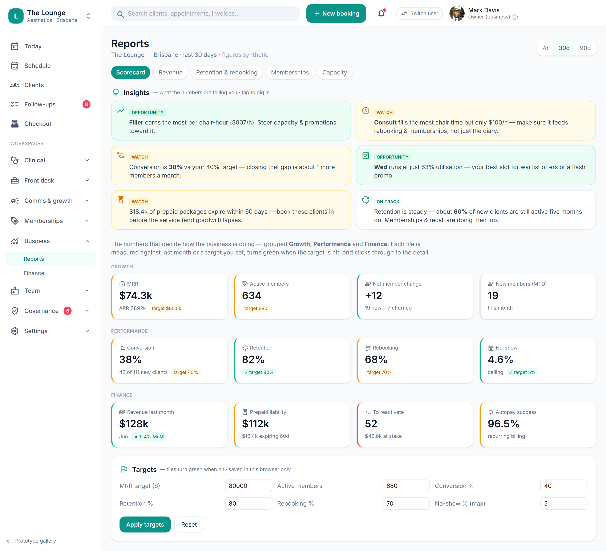

# Practitioner scorecard

> **Epic:** [PRD-08 — Reporting & compliance dashboards (Governance hub)](../epics/PRD-08.md)  ·  **Key:** `PRD-08/SCORECARD`  ·  **Type:** Story  ·  **Stage:** M5  ·  **Priority:** P2  ·  **Estimate:** 2 pts  ·  **Area:** web
>
> **Depends on:** `PRD-08/BUSINESS-DASH`

## Background

As a owner, I want a per-practitioner scorecard, so that I can coach the team and see who drives retention.
The prototype's Reports → Scorecard view shows per-practitioner performance (revenue, retention, rebooking, utilisation, outcomes).

## How it works

A per-practitioner scorecard: revenue, retention/rebooking, utilisation and outcome/revision signals — date-filterable, drilling into the underlying clients/appointments. Financial figures owner-gated.
Lets the owner coach the team and see who drives retention.

## Requirements

- A per-practitioner scorecard.

## Acceptance Criteria

- [ ] Scorecard shows per-practitioner revenue, retention/rebooking, utilisation and outcome/revision signals.
- [ ] Date-filterable; financial figures are owner-gated.
- [ ] Drills into the underlying clients/appointments.
- [ ] Reads from the reporting read-models (PRD-08/READ-MODELS).

## UI designs / screenshots

_Prototype screen: prototype.html — Reports, Governance (Overview/AE & DAEN/Policies/Audit pack)._

- Prototype: Reports -> Scorecard (reports.png, goRep('scorecard')) — per-practitioner metrics with drill-down.

## Suggested data model

- **(read) PractitionerScorecard** — practitioner_id, revenue, retention, rebooking, utilisation, outcomes by date
  - _From read-models; owner-gated._

## Technical notes (high level)

- Stack: Angular web (admin/front-desk/public)

## Other

- Source PRD: [PRD-08-reporting-compliance.md](https://github.com/danpowell88/tlapoc/blob/main/docs/prds/PRD-08-reporting-compliance.md)

## Tasks (dev pickup)

- [ ] **Web UI** — prototype.html — Reports, Governance (Overview/AE & DAEN/Policies/Audit pack).
- [ ] **Tests (unit + integration)** — Cover acceptance criteria, incl. any gate/invariant.
