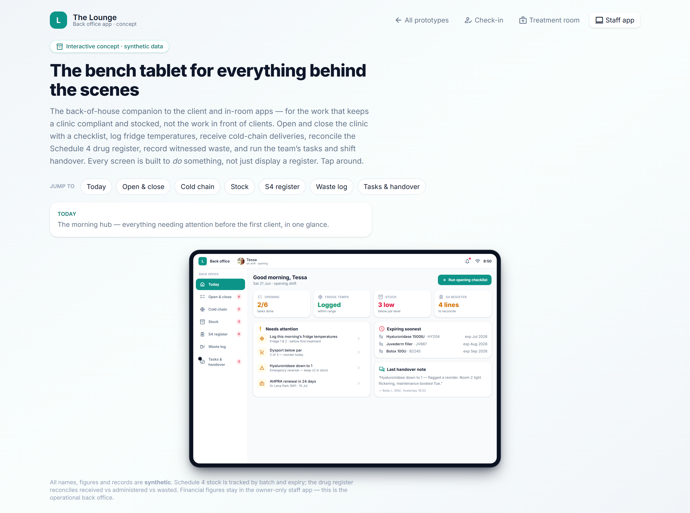

# Back-office / bench tablet surface

> **Epic:** [PRD-09 — Apps (Flutter): client & provider](../epics/PRD-09.md)  ·  **Key:** `PRD-09/BACKOFFICE-TABLET`  ·  **Type:** Story  ·  **Stage:** M5  ·  **Priority:** P2  ·  **Estimate:** 2 pts  ·  **Area:** web
>
> **Depends on:** `PRD-11/OPENCLOSE`, `PRD-07/FOLLOWUPS`

## Background

As a clinic staff, I want a bench-tablet view of the day's operational jobs, so that behind-the-scenes work (logs, stock, handover) is quick at the bench.
The prototype's backroom surface is a bench tablet for behind-the-scenes work: open/close, cold-chain, stock on hand, S4 drug register, waste/disposal log, tasks and shift handover — a focused operations view.

## How it works

A bench tablet for behind-the-scenes work: open/close checklist, cold-chain log, stock on hand, S4 drug register, waste/disposal log, tasks and shift handover — each panel reusing the underlying modules (PRD-04 medicines, PRD-11 operations, PRD-07 jobs). Role/financial gating applies; actions audited.
A focused operations view for the back room.

## Requirements

- A bench-tablet view of the day's operational jobs.
- Compliance: [C8](https://github.com/danpowell88/tlapoc/blob/main/docs/02-requirements.md#6-compliance-requirements-auqld--restated-as-acceptance-criteria), [C20](https://github.com/danpowell88/tlapoc/blob/main/docs/02-requirements.md#6-compliance-requirements-auqld--restated-as-acceptance-criteria)

## Acceptance Criteria

- [ ] Surfaces open/close checklist, cold-chain log, stock on hand, S4 register, waste log, tasks and shift handover.
- [ ] Each panel reuses the underlying modules (PRD-04 medicines, PRD-11 operations, PRD-07 jobs).
- [ ] Role/financial gating applies; actions are audited.
- [ ] Usable on a shared device with appropriate session handling.

## UI designs / screenshots

_Prototype screen: backroom.html._

- Prototype: back-office tablet (backroom.png) — 'Good morning', Open & close, Cold chain, Stock on hand, Schedule 4 drug register, Waste & disposal log, Tasks, Shift handover.
- Shared-device session handling.

## Suggested data model

- **(reuses)** — OpenCloseChecklist/TempLog/StockItem/StockLedger/StockDestruction/Job/ShiftHandover
  - _Aggregates operations + medicines + jobs._

## Other

- Source PRD: [PRD-09-apps-client-provider.md](https://github.com/danpowell88/tlapoc/blob/main/docs/prds/PRD-09-apps-client-provider.md)

## Tasks (dev pickup)

- [ ] **Web UI**
  Build on the Angular web app: the backroom per the UI spec. Wire to the API with loading/empty/error states; capability-gate controls; responsive; show the blocked-action banner / gate chips where gated; respect owner-only .fin gating for money figures.
  Key elements (from the prototype):
  - Prototype: back-office tablet (backroom.png) — 'Good morning', Open & close, Cold chain, Stock on hand, Schedule 4 drug register, Waste & disposal log, Tasks, Shift handover.
  - Shared-device session handling.
