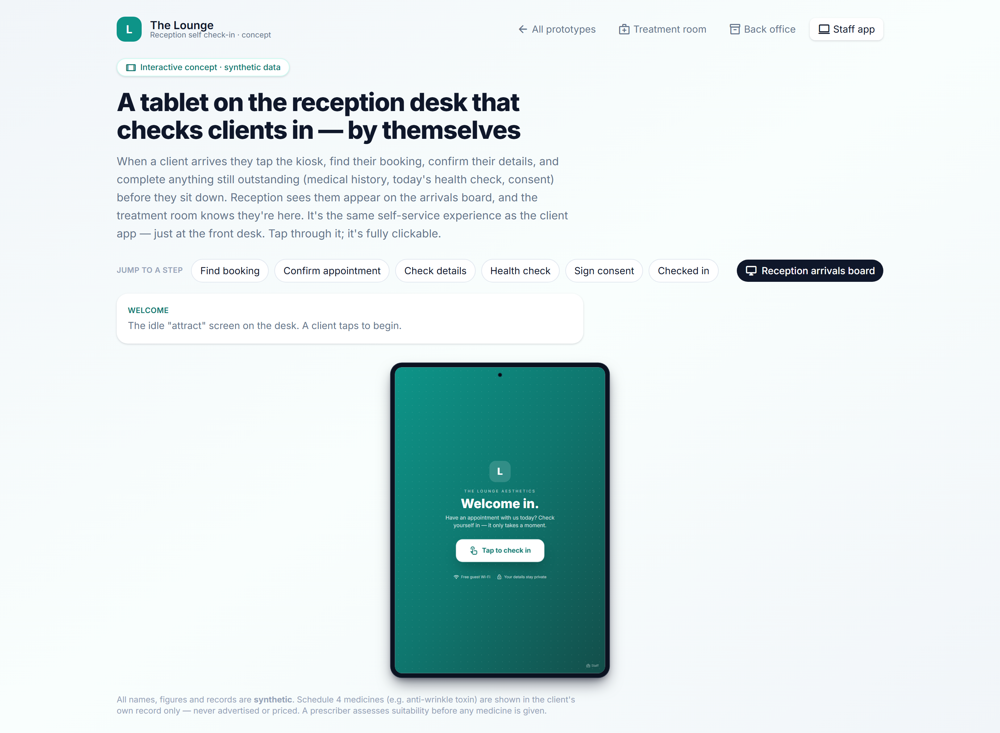

# Reception self-check-in surface (tablet)

> **Epic:** [PRD-09 — Apps (Flutter): client & provider](../epics/PRD-09.md)  ·  **Key:** `PRD-09/CHECKIN-KIOSK`  ·  **Type:** Story  ·  **Stage:** M5  ·  **Priority:** P2  ·  **Estimate:** 2 pts  ·  **Area:** web
>
> **Depends on:** `PRD-02/LIFECYCLE`, `PRD-03/GATING`

## Background

As a client arriving for a visit, I want to check myself in on the reception tablet, so that the team knows I've arrived and I complete anything outstanding.
The prototype's checkin surface is a reception-desk tablet where clients check themselves in (confirm details, complete any outstanding intake/consent), updating the Today board.

## How it works

A reception-desk tablet where clients self-check-in: verify identity/appointment and complete any outstanding intake/consent, updating the visit lifecycle / Today board (PRD-02). The surface is locked-down (no access to other clients' data) and times out between clients.
Speeds arrivals and captures missing pre-visit items.

## Requirements

- To check myself in on the reception tablet.
- Compliance: [C10](https://github.com/danpowell88/tlapoc/blob/main/docs/02-requirements.md#6-compliance-requirements-auqld--restated-as-acceptance-criteria)

## Acceptance Criteria

- [ ] A client can self-check-in (verify identity/appointment) on a shared tablet surface.
- [ ] Outstanding intake/consent is prompted and completable at check-in.
- [ ] Check-in updates the visit lifecycle/Today board (PRD-02).
- [ ] The surface is locked-down (no access to other clients' data) and times out between clients.

## UI designs / screenshots

_Prototype screen: checkin.html._

- Prototype: check-in tablet (checkin.png) — 'Welcome in' self-check-in; verify appointment, complete outstanding intake/consent; returns to a neutral state between clients.

## Suggested data model

- **(reuses)** — Appointment.status -> checked_in (PRD-02); IntakeResponse/ConsentSignature (PRD-03)
  - _Kiosk session is single-client + auto-timeout._

## Technical notes (high level)

- Stack: Angular web (admin/front-desk/public)

## Other

- Source PRD: [PRD-09-apps-client-provider.md](https://github.com/danpowell88/tlapoc/blob/main/docs/prds/PRD-09-apps-client-provider.md)

## Tasks (dev pickup)

- [ ] **Web UI** — checkin.html.
