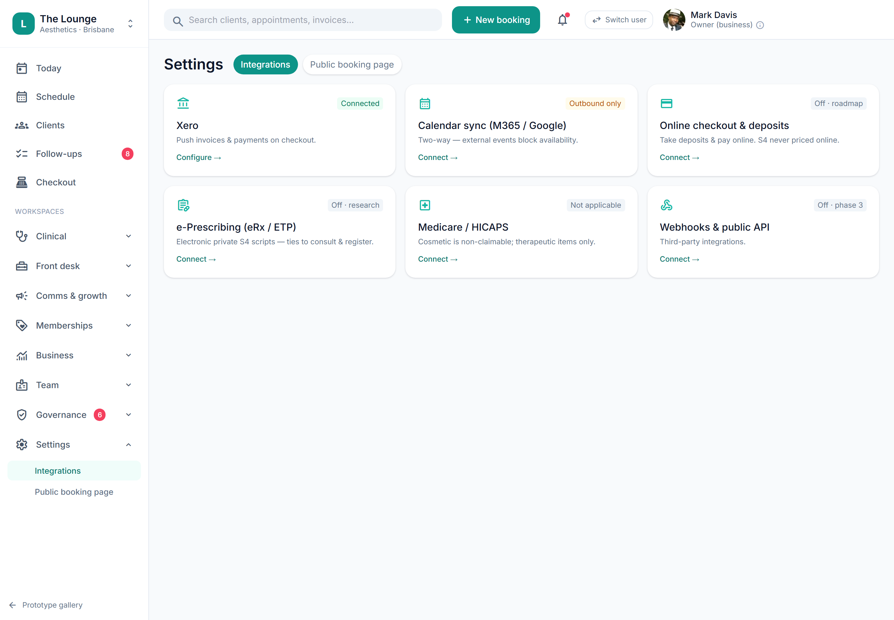

# Online checkout, e-prescribing, webhooks/API (placeholder)

> **Epic:** [PRD-10 — Integrations: Xero & calendar](../epics/PRD-10.md)  ·  **Key:** `PRD-10/INTEGRATIONS-LATER`  ·  **Type:** Story  ·  **Stage:** M4  ·  **Priority:** P2  ·  **Estimate:** 1 pts  ·  **Area:** integration

## Background

As a owner, I want future integrations: online checkout/deposits, e-prescribing and a public API, so that the platform extends as we scale.
Online checkout & deposits (S4 never priced/sold online), e-prescribing (eRx/ETP, 🔬), public API/webhooks (Phase 3) and Medicare/HICAPS (non-applicable to cosmetic). Placeholder (REQ-INT-2a/4/5/6/7, ADR-0035/0036).

## How it works

Placeholder (Phase 2/3): online checkout & deposits (S4 never priced/sold online), e-prescribing (eRx/ETP, needs validation), public API/webhooks (Phase 3), and Medicare/HICAPS (recorded as non-applicable to cosmetic). Each sits behind its existing port (IPaymentProvider, IPrescribingProvider).
Captured so the architecture stays extension-ready (ADR-0035/0036).

## Requirements

- Future integrations: online checkout/deposits, e-prescribing and a public API.
- Deferred (Phase 2+): placeholder, design-only for now.

## Acceptance Criteria

- [ ] Placeholder — Phase 2/3; each behind its existing port (IPaymentProvider, IPrescribingProvider).
- [ ] S4 is never priced or sold online (invariant carried forward).
- [ ] Medicare/HICAPS recorded as non-applicable to cosmetic.
- [ ] e-prescribing flagged for feasibility validation.

## UI designs / screenshots

- Prototype: Settings -> Integrations (settings-integrations.png) shows these as concept cards (mostly disabled).

## Suggested data model

- **(future)** — OnlineOrder / EPrescription / Webhook / ApiKey
  - _Behind existing ports; S4 never online._

## Technical notes (high level)

- Stack: Ports-and-adapters integration
- Architecture decisions: [ADR-0035](https://github.com/danpowell88/tlapoc/blob/main/docs/adr/decision-log.md), [ADR-0036](https://github.com/danpowell88/tlapoc/blob/main/docs/adr/decision-log.md)

## Other

- Source PRD: [PRD-10-integrations.md](https://github.com/danpowell88/tlapoc/blob/main/docs/prds/PRD-10-integrations.md)

## Tasks (dev pickup)

- [ ] **Scope & design when pulled into a sprint** — Deferred placeholder — no build yet.
- [ ] **Confirm it still fits scope / regulatory stance**
