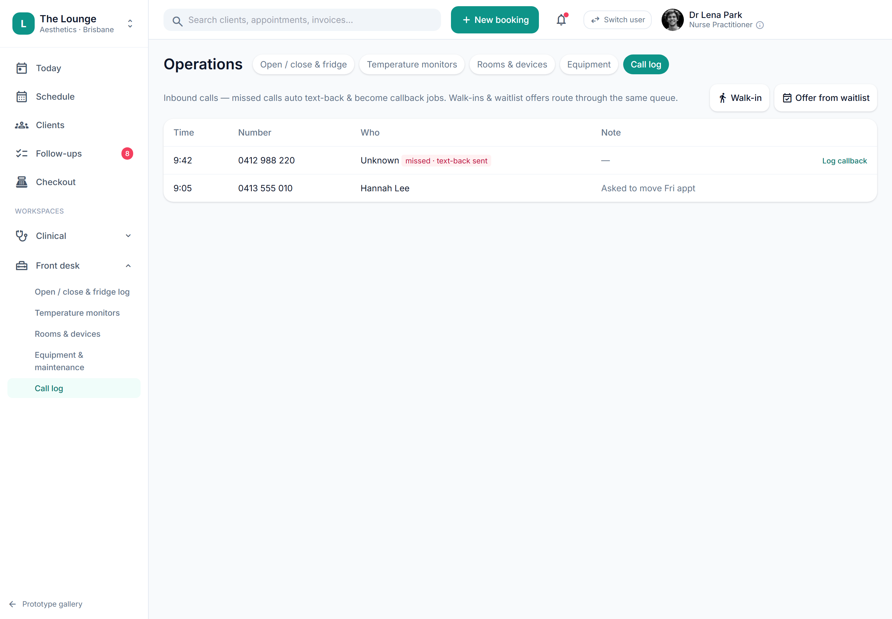

# Call / phone log (basic)

> **Epic:** [PRD-11 — Facility, infection-control, emergency & complaints](../epics/PRD-11.md)  ·  **Key:** `PRD-11/CALL-LOG`  ·  **Type:** Story  ·  **Stage:** M6  ·  **Priority:** P2  ·  **Estimate:** 2 pts  ·  **Area:** web
>
> **Depends on:** `PRD-07/FOLLOWUPS`

## Background

As a front desk, I want to log inbound/outbound phone calls against a client, so that phone interactions aren't lost.
Plainly: log inbound/outbound phone calls against a client so phone interactions aren't lost. Where it fits: part of the operational backbone (Facility/Ops) around the clinical core; this basic slice is the CallLog entity + the log-a-call UI, with the callback/comms-history bridge and the shared follow-up queue added as follow-ups (which route into the shared queue, PRD-07). The phone is still a primary clinic channel.

## How it works

Log inbound/outbound phone calls against a client (direction, number, summary, outcome): model CallLog and provide a call-log UI (Time · Number · Who · Note) to record a call against a client. Tenant-scoped and audited.
Raising a follow-up callback + showing the call in the client's comms history (CALL-FOLLOWUP) and routing walk-ins/waitlist offers through the same queue (CALL-QUEUE) are added by the follow-ups. Captures phone interactions so nothing is lost (the phone is still a primary clinic channel).

## Requirements

- To log inbound/outbound phone calls against a client.
- Compliance: [C10](https://github.com/danpowell88/tlapoc/blob/main/docs/02-requirements.md#6-compliance-requirements-auqld--restated-as-acceptance-criteria)

## Acceptance Criteria

- [ ] Calls can be logged (direction, client link, number, summary, outcome).
- [ ] The call-log UI (Time · Number · Who · Note) records a call against a client.
- [ ] Logs are tenant-scoped and audited.
- [ ] The callback/comms-history bridge and the shared follow-up queue are added by the follow-ups (CALL-FOLLOWUP, CALL-QUEUE).

## UI designs / screenshots

_Prototype screen: prototype.html — Front desk/Operations (Open/close & fridge log, Temperature monitors, Rooms & devices, Equipment, Call log); backroom.html._

- Prototype: Operations → Call log (ops-phone) — Time · Number · Who · Note; log a call against a client.
- Callback/comms-history + shared queue are the follow-ups (CALL-FOLLOWUP, CALL-QUEUE).

## Suggested data model

- **CallLog** — id, tenant_id, client_id?, direction(in|out), number, summary, outcome, at, actor_id
  - _Logged + audited; callback/comms-history + shared queue in the follow-ups._

## Other

- Source PRD: [PRD-11-facility-complaints.md](https://github.com/danpowell88/tlapoc/blob/main/docs/prds/PRD-11-facility-complaints.md)

## Tasks (dev pickup)

- [ ] **CallLog entity + log a call**
  Behaviour: log inbound/outbound phone calls against a client. Requirements: model CallLog (tenant_id, client_id?, direction[in|out], number, summary, outcome, at, actor_id) under RLS (row-level security, the database-level tenant isolation), audited; call-log UI (Time · Number · Who · Note) to record a call against a client.
