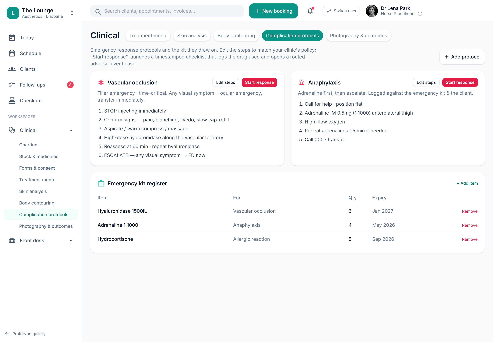

# Emergency kit & continuity-of-care

> **Epic:** [PRD-11 — Facility, infection-control, emergency & complaints](../epics/PRD-11.md)  ·  **Key:** `PRD-11/EMERGENCY-KIT`  ·  **Type:** Story  ·  **Stage:** M6  ·  **Priority:** P2  ·  **Estimate:** 2 pts  ·  **Area:** web

## Background

As a owner, I want to track the emergency kit with expiry alerts and record a continuity-of-care contact, so that we're prepared for complications and cover when a prescriber is unavailable.
Plainly: track the emergency drugs and kit (for filler vascular occlusion and anaphylaxis) with expiry alerts, and record a backup contact for when the prescriber is unavailable. Where it fits: part of the operational backbone (Facility/Ops) around the clinical core; it sits beside the complication-response flow (PRD-05). Track the emergency kit (hyaluronidase, anaphylaxis) with expiry alerts and record a continuity-of-care contact (REQ-FAC-3, C20).

## How it works

Track the emergency kit (hyaluronidase for filler vascular occlusion, adrenaline 1:1000 for anaphylaxis, hydrocortisone, etc.) with what each item is for, quantity and expiry, raising expiry alerts before lapse (add/remove via saveKit/newKit/removeKit). Surfaced from Clinical → Complication protocols so the kit sits beside the time-critical response steps; 'Start response' launches a timestamped checklist that logs the drug used and routes an adverse event (ties to PRD-05).
A continuity-of-care contact (name, role, phone) is recorded and visible when the treating practitioner/prescriber is unavailable. Ensures the clinic is prepared for complications (C20).

## Requirements

- To track the emergency kit with expiry alerts and record a continuity-of-care contact.
- Compliance: [C20](https://github.com/danpowell88/tlapoc/blob/main/docs/02-requirements.md#6-compliance-requirements-auqld--restated-as-acceptance-criteria)

## Acceptance Criteria

- [ ] Emergency-kit items (incl. hyaluronidase, anaphylaxis) raise expiry alerts before lapse.
- [ ] A continuity-of-care contact is recorded and visible when the treating practitioner/prescriber is unavailable.
- [ ] Emergency/complication protocol links are surfaced.
- [ ] Ties into the complication-response flow (PRD-05).

## UI designs / screenshots

_Prototype screen: prototype.html — Front desk/Operations (Open/close & fridge log, Temperature monitors, Rooms & devices, Equipment, Call log); backroom.html._

- Prototype: Clinical → Complication protocols (clinical-safety) — Emergency kit register (Item · For · Qty · Expiry; Add item / Remove via saveKit/newKit/removeKit).
- Protocol cards (Vascular occlusion, Anaphylaxis) with numbered steps + 'Start response'; continuity-of-care contact surfaced when the prescriber is unavailable.

## Suggested data model

- **EmergencyKitItem** — id, tenant_id, location_id, name(hyaluronidase|adrenaline|hydrocortisone|...), for, expiry, quantity
  - _Expiry alerts; linked from complication protocols._
- **ContinuityContact** — id, tenant_id, name, role, phone
  - _Surfaced when the prescriber is unavailable._

## Other

- Source PRD: [PRD-11-facility-complaints.md](https://github.com/danpowell88/tlapoc/blob/main/docs/prds/PRD-11-facility-complaints.md)

## Tasks (dev pickup)

- [ ] **EmergencyKitItem register + add/remove**
  Behaviour: track the emergency drugs/kit (hyaluronidase for filler vascular occlusion, adrenaline 1:1000 for anaphylaxis, hydrocortisone, etc.) with what each is for, quantity and expiry. Requirements: model EmergencyKitItem (tenant_id, location_id, name, for, expiry, quantity); register UI (Item · For · Qty · Expiry) with add/remove (prototype saveKit/newKit/removeKit); this is the source of truth for what's available during a complication response.
- [ ] **Emergency-kit expiry alerts (scheduled)**
  Behaviour: flag a lapsing kit item before it expires. Requirements: schedule expiry alerts (configurable lead-time) via the jobs scheduler so a time-critical item (e.g. adrenaline) is never found expired during an emergency.
- [ ] **Surface kit from complication protocols + 'Start response' link**
  Behaviour: show the kit register beside the time-critical protocol cards and let staff launch a response. Requirements: surface the kit on Clinical → Complication protocols next to the Vascular-occlusion / Anaphylaxis cards; 'Start response' opens a timestamped checklist (PRD-05 complication response) that records the kit item used and routes an adverse event (an unwanted medical occurrence after a treatment) — the breach/complication pathway stays intact.
- [ ] **ContinuityContact record + visibility**
  Behaviour: record a backup contact for when the prescriber is unavailable. Requirements: model ContinuityContact (name, role, phone) and surface it when the treating practitioner/prescriber is unavailable, satisfying the AHPRA (Australian Health Practitioner Regulation Agency) continuity-of-care obligation (C20).
