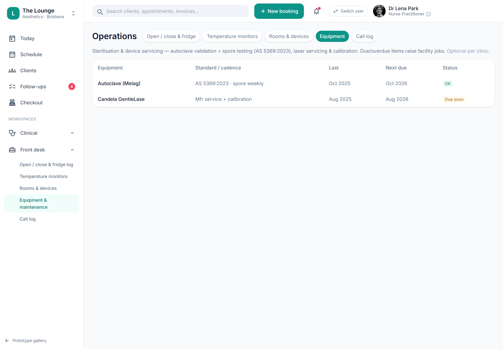

# Fuller facility workflows (placeholder)

> **Epic:** [PRD-11 — Facility, infection-control, emergency & complaints](../epics/PRD-11.md)  ·  **Key:** `PRD-11/FAC-WORKFLOWS`  ·  **Type:** Story  ·  **Stage:** M6  ·  **Priority:** P2  ·  **Estimate:** 1 pts  ·  **Area:** web

## Background

As a owner, I want fuller facility workflows: checklists, maintenance registers and incident case management, so that operations and safety are fully systematised.
Open/close checklist, sterilisation & equipment maintenance register (autoclave validation, spore testing, laser service), deep incident & mandatory-reporting case management — Phase 2 (REQ-FAC-4..10). Placeholder.

## How it works

Placeholder (Phase 2): fuller facility workflows — deep incident & mandatory-reporting case management beyond the registers (the open/close, equipment, IPC and complication-response pieces are now their own v1 stories). The facility model already anticipates them (ADR-0026/0030).
Captured so operations can be fully systematised later.

## Requirements

- Fuller facility workflows: checklists, maintenance registers and incident case management.
- Deferred (Phase 2+): placeholder, design-only for now.

## Acceptance Criteria

- [ ] Placeholder — v1 is lightweight registers; these workflows are Phase 2.
- [ ] Captured so the facility model anticipates them.

## UI designs / screenshots

prototype.html — Front desk/Operations (Open/close & fridge log, Temperature monitors, Rooms & devices, Equipment, Call log); backroom.html.

## Suggested data model

- **IncidentCase** — id, tenant_id, type, mandatory_reportable(bool), steps[], status
  - _Phase 2 case management._

## Technical notes (high level)

- Architecture decisions: [ADR-0026](https://github.com/danpowell88/tlapoc/blob/main/docs/adr/decision-log.md), [ADR-0030](https://github.com/danpowell88/tlapoc/blob/main/docs/adr/decision-log.md)

## Other

- Source PRD: [PRD-11-facility-complaints.md](https://github.com/danpowell88/tlapoc/blob/main/docs/prds/PRD-11-facility-complaints.md)

## Tasks (dev pickup)

- [ ] **Scope & design when pulled into a sprint**
  Deferred placeholder — no build in v1; confirm it still fits scope/regulatory stance, then break down.
