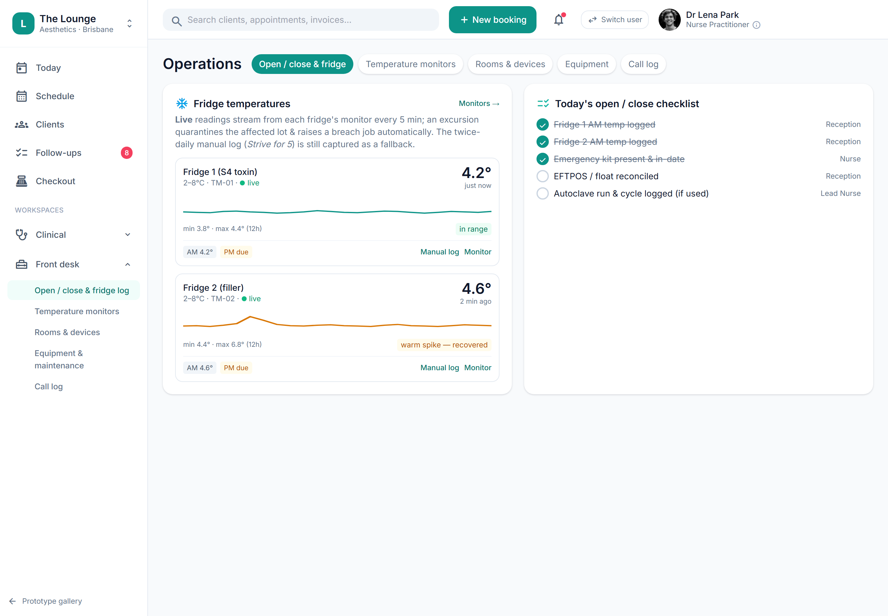

# Emergency kit: complication protocols + 'Start response'

> **Epic:** [PRD-11 — Facility, infection-control, emergency & complaints](../epics/PRD-11.md)  ·  **Key:** `PRD-11/KIT-PROTOCOLS`  ·  **Type:** Story  ·  **Stage:** M6  ·  **Priority:** P2  ·  **Estimate:** 2 pts  ·  **Area:** —
>
> **Depends on:** `PRD-11/EMERGENCY-KIT`, `PRD-05/ADVERSE-EVENT`

## Background

As a clinician, I want the kit beside the complication protocols with a 'Start response' action, so that I can act fast and the response is logged when a complication occurs.
Plainly: show the emergency kit beside the time-critical complication protocol cards (vascular occlusion, anaphylaxis) and let staff launch a timestamped response that logs the drug used and routes an adverse event (an unwanted medical occurrence after a treatment). Where it fits: a follow-up to the emergency kit register (PRD-11/EMERGENCY-KIT) that adds the clinical surface; 'Start response' opens the complication-response flow (PRD-05), keeping the breach/complication pathway intact.

## How it works

Show the kit register beside the time-critical protocol cards and let staff launch a response: surface the kit on Clinical → Complication protocols next to the Vascular-occlusion / Anaphylaxis cards (numbered steps). 'Start response' opens a timestamped checklist (PRD-05 complication response) that records the kit item used and routes an adverse event (an unwanted medical occurrence after a treatment).
The breach/complication pathway stays intact. This composes the kit register (PRD-11/EMERGENCY-KIT) into the clinical safety surface; the kit remains the source of truth for what's available.

## Requirements

- The kit beside the complication protocols with a 'Start response' action.

## Acceptance Criteria

- [ ] The kit register surfaces on Clinical → Complication protocols next to the Vascular-occlusion / Anaphylaxis cards.
- [ ] 'Start response' opens a timestamped checklist (PRD-05 complication response).
- [ ] The response records the kit item used and routes an adverse event.
- [ ] The breach/complication pathway stays intact.

## UI designs / screenshots

- Prototype: Clinical → Complication protocols (clinical-safety) — protocol cards (Vascular occlusion, Anaphylaxis) with numbered steps + 'Start response', kit register alongside.
- 'Start response' opens a timestamped checklist that logs the kit item used and routes an adverse event.

## Suggested data model

- **(reuses) EmergencyKitItem + ComplicationResponse** — PRD-11/EMERGENCY-KIT kit alongside the PRD-05 complication-response checklist
  - _Extends EMERGENCY-KIT; 'Start response' logs the kit item used + routes an adverse event._

## Other

- Source PRD: [PRD-11-facility-complaints.md](https://github.com/danpowell88/tlapoc/blob/main/docs/prds/PRD-11-facility-complaints.md)

## Tasks (dev pickup)

- [ ] **Surface kit from complication protocols + 'Start response' link**
  Behaviour: show the kit register beside the time-critical protocol cards and let staff launch a response. Requirements: surface the kit on Clinical → Complication protocols next to the Vascular-occlusion / Anaphylaxis cards; 'Start response' opens a timestamped checklist (PRD-05 complication response) that records the kit item used and routes an adverse event (an unwanted medical occurrence after a treatment) — the breach/complication pathway stays intact.
