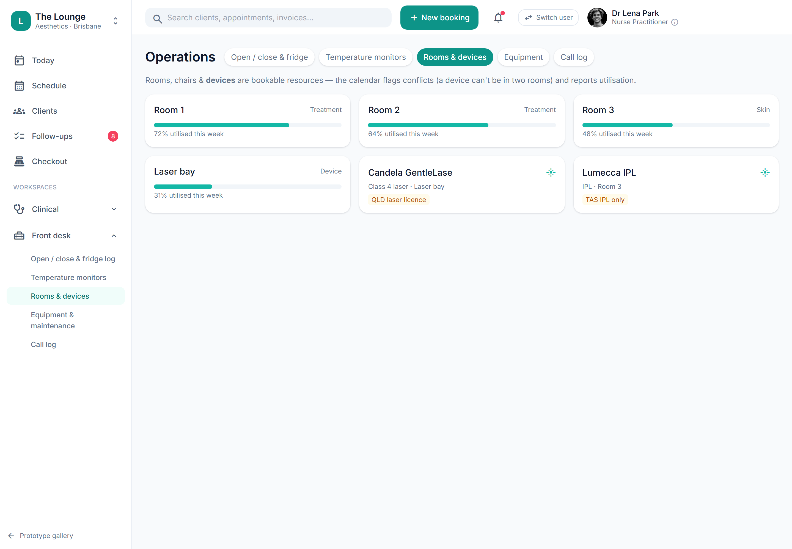

# Rooms & devices register

> **Epic:** [PRD-11 — Facility, infection-control, emergency & complaints](../epics/PRD-11.md)  ·  **Key:** `PRD-11/ROOMS-DEVICES`  ·  **Type:** Story  ·  **Stage:** M6  ·  **Priority:** P2  ·  **Estimate:** 2 pts  ·  **Area:** web
>
> **Depends on:** `PRD-02/CALENDAR`

## Background

As a manager, I want to manage the clinic's rooms, chairs and devices as bookable resources, so that scheduling reflects real capacity and avoids conflicts.
The prototype's Operations → Rooms & devices manages the bookable rooms/chairs/devices that the calendar schedules against (resource conflict-flagging in PRD-02).

## How it works

Manage the clinic's rooms, chairs and devices as bookable resources the calendar schedules against (conflict-flagging in PRD-02). Out-of-service status removes a resource from availability; device records link to equipment maintenance.
Keeps scheduling honest about real capacity.

## Requirements

- To manage the clinic's rooms, chairs and devices as bookable resources.

## Acceptance Criteria

- [ ] Rooms/chairs/devices can be created/edited with attributes (type, location, status).
- [ ] Resources are available to the calendar for booking + conflict-flagging (PRD-02/WALKINS).
- [ ] Out-of-service status removes a resource from availability.
- [ ] Device records link to equipment maintenance (PRD-11/EQUIPMENT).

## UI designs / screenshots

_Prototype screen: prototype.html — Front desk/Operations (Open/close & fridge log, Temperature monitors, Rooms & devices, Equipment, Call log); backroom.html._

- Prototype: Operations -> Rooms & devices (ops-resources.png) — create/edit rooms/chairs/devices (type, location, status); out-of-service toggles availability.

## Suggested data model

- **Resource** — (shared with PRD-02) id, type(room|chair|device), name, location_id, status
  - _Out-of-service removes from availability; device links to Equipment._

## Technical notes (high level)

- Architecture decisions: [ADR-0026](https://github.com/danpowell88/tlapoc/blob/main/docs/adr/decision-log.md)

## Other

- Source PRD: [PRD-11-facility-complaints.md](https://github.com/danpowell88/tlapoc/blob/main/docs/prds/PRD-11-facility-complaints.md)

## Tasks (dev pickup)

- [ ] **Data model & migrations** — Entities/columns + relationships; tenant_id + RLS.
- [ ] **Backend: domain logic, rules & API endpoint(s)** — Behaviour + invariants + the OpenAPI contract the UI/clients consume.
- [ ] **Web UI** — prototype.html — Front desk/Operations (Open/close & fridge log, Temperature monitors, Rooms & devices, Equipment, Call log); backroom.html.
