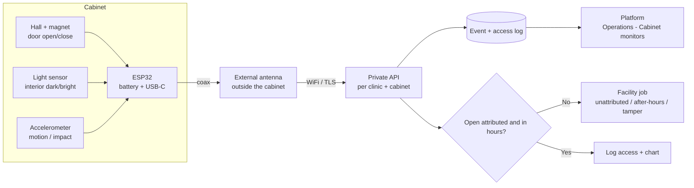
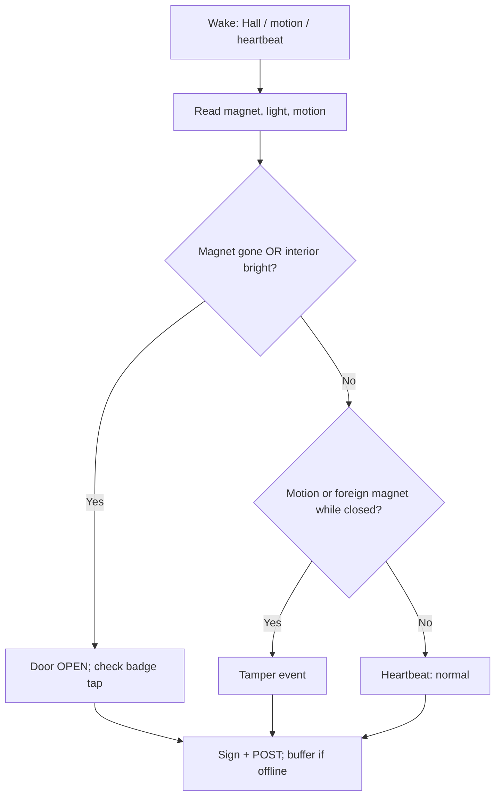
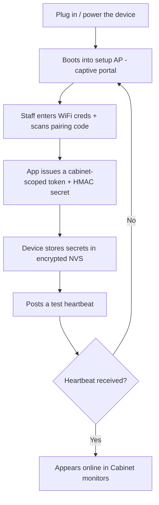

# S4 cabinet access & tamper monitor — ESP32 hardware & setup

> Reference design for the clinic's own wireless **controlled-stock cabinet monitor**. One small ESP32 device
> sits **inside** each locked S4 cabinet and watches the door (open/close), the cabinet interior (light) and
> physical disturbance (motion), then **POSTs every access + tamper event to this clinic's private API over
> WiFi**, scoped and authenticated **per clinic + per cabinet**. Because a steel lock box blocks 2.4 GHz, the
> radio uses an **external antenna** routed out of the cabinet while the board, sensors and battery stay
> **sealed inside**. The platform stores the event series, charts it (Operations → Cabinet monitors), keeps a
> **who/when access log**, and **auto-raises a facility job** on an unattributed open, an after-hours open, a
> door left ajar, or any tamper signal — turning the paper "who had the keys" trust model into a logged,
> alarmed audit trail.
>
> This is a build-it-yourself spec. It is **not a certified security system or alarm**, and it does **not
> replace the physical lock or the S4 medicine register**. Treat it as a **monitoring aid** that satisfies the
> *"restrict + log access"* half of `REQ-MED-8` / `C15` and makes **silent defeat detectable** — its single
> strongest property.

## 1. How it fits together



The device **reports raw signals; the server decides policy** — the same split the fridge monitor uses. A door
open is not "good" or "bad" on the device; the platform decides, using business hours, the staff badge tap and
the tamper signals, whether it is a normal logged access or a job for the Lead Nurse.

## 2. What the device looks like

The finished unit (model **CM-01**) is a small sealed box mounted **inside** the cabinet, high on a side wall.
Unlike the fridge monitor — where the electronics stay *outside* and only a probe goes in — here we deliberately
seal everything **inside** the locked box, because the cabinet's own lock is the device's physical security.
Only the thin antenna coax leaves the cabinet.

<div class="fig">
<svg viewBox="0 0 640 340" xmlns="http://www.w3.org/2000/svg" role="img" aria-label="Concept rendering of the CM-01 cabinet monitor: a small sealed box with a status LED and a U.FL external-antenna lead">
<defs>
<linearGradient id="cmled" x1="0" y1="0" x2="1" y2="1"><stop offset="0" stop-color="#86efac"/><stop offset="1" stop-color="#16a34a"/></linearGradient>
</defs>
<ellipse cx="330" cy="300" rx="150" ry="22" fill="#0f172a" opacity="0.07"/>
<polygon points="210,150 270,112 470,112 410,150" fill="#f1f5f9" stroke="#94a3b8" stroke-width="1.4"/>
<polygon points="210,150 410,150 410,270 210,270" fill="#dbe3ec" stroke="#94a3b8" stroke-width="1.4"/>
<polygon points="410,150 470,112 470,232 410,270" fill="#c4cdd9" stroke="#94a3b8" stroke-width="1.4"/>
<circle cx="250" cy="240" r="7" fill="url(#cmled)" stroke="#15803d" stroke-width="0.8"/>
<circle cx="250" cy="240" r="12" fill="#22c55e" opacity="0.18"/>
<text x="250" y="262" font-family="Inter, sans-serif" font-size="8" fill="#475569" text-anchor="middle">status</text>
<text x="300" y="205" font-family="Inter, sans-serif" font-size="13" font-weight="700" fill="#475569">TLA · CM-01</text>
<rect x="440" y="120" width="12" height="9" rx="2" fill="#1f2937"/>
<path d="M448,124 C500,90 540,80 560,60" fill="none" stroke="#111827" stroke-width="3" stroke-linecap="round"/>
<rect x="552" y="36" width="9" height="30" rx="4" fill="#0e7468"/>
<text x="556" y="30" font-family="Inter, sans-serif" font-size="9" fill="#0f766e" text-anchor="middle">2.4 GHz antenna</text>
<path d="M566,44 q14,-4 20,8" fill="none" stroke="#0d9488" stroke-width="2.2"/>
<path d="M572,36 q20,-6 28,12" fill="none" stroke="#0d9488" stroke-width="2.2" opacity="0.6"/>
<rect x="206" y="200" width="6" height="12" rx="2" fill="#1f2937"/>
<text x="150" y="208" font-family="Inter, sans-serif" font-size="9" fill="#64748b">USB-C 5V + 18650 backup (inside)</text>
<text x="40" y="60" font-family="Inter, sans-serif" font-size="13" font-weight="700" fill="#0f172a">CM-01 cabinet access &amp; tamper monitor</text>
<text x="40" y="78" font-family="Inter, sans-serif" font-size="11" fill="#64748b">sealed box · sensors + battery inside · only the antenna leaves the cabinet</text>
</svg>
<p class="cap"><b>Figure 2.1</b> — Concept rendering. The whole unit — board, sensors and battery — is sealed and mounted <i>inside</i> the locked cabinet; only the thin antenna coax leaves it.</p>
</div>

## 3. Sensing strategy — defence in depth

A single reed switch is the obvious way to sense a door, and the obvious thing to defeat: hold a magnet over
the reed and it reports "closed" forever while you open the door. So CM-01 uses **three independent senses**
that a single trick can't fool together, and lets the server **catch them disagreeing**.

| Sense | Part | What it catches | Why it's hard to spoof |
|---|---|---|---|
| **Door magnet** | Hall-effect sensor + neodymium magnet on the door | Open/close; wakes the MCU instantly at ~µA | Reads field *strength*, so a **foreign magnet** held over it looks wrong, not "closed" → `tamper_mask` |
| **Interior light** | BH1750 / VEML7700 (or LDR) | Any door open floods the dark interior with light | Completely **independent of magnets** — the headline anti-spoof signal |
| **Motion / impact** | LIS3DH accelerometer (motion-wake INT) | The door swing, the box being lifted/carried, drilling/impact | Catches "remove or attack the whole cabinet", which magnets and light never see |



The powerful case is **disagreement**: if the Hall sensor still says *closed* but the light sensor sees the
interior go *bright*, someone has masked the magnet — the device sends `sensor_disagreement` and the server
treats it as a high-severity tamper, not a normal access.

## 4. Working inside a metal cabinet (the RF problem)

Most lock boxes are steel, which is a **Faraday cage** for 2.4 GHz — an ESP32 with a PCB antenna sealed inside
will get little or no signal out. Three ways to solve it, best first:

1. **External antenna (recommended).** Use an ESP32 module with a **U.FL/IPEX connector** (the *"-U"* variants,
   e.g. **ESP32-C3-WROOM-02U** or **ESP32-WROOM-32U**) and run a **U.FL→RP-SMA pigtail** to a small 2.4 GHz
   antenna mounted *outside* the cabinet. Only the thin coax leaves the box — through the **door gap / gasket**,
   an existing cable knockout, or a small sealed gland. The electronics (the thing worth protecting and
   tamper-detecting) stay locked inside; the antenna is just a passive radiator.
2. **Sub-GHz bridge (for fully welded / gasketless boxes).** If no coax can escape, pair the ESP32 with a
   **LoRa / 433 MHz radio** (e.g. RFM69 / SX127x). Lower frequencies leak through seams far better than 2.4 GHz;
   a tiny mains-powered **base station outside** receives and bridges the events to WiFi / the API. More parts,
   but it survives a box that 2.4 GHz simply can't.
3. **Split node (last resort).** Sensors on a battery node inside, a short wired tether out to a radio unit
   outside. Avoid if you can — the **tether through the gasket is itself a tamper surface** (it can be cut).

<div class="fig">
<svg viewBox="0 0 680 380" xmlns="http://www.w3.org/2000/svg" role="img" aria-label="Cross-section of a steel cabinet with the CM-01 sealed inside, a door magnet aligned to the Hall sensor, light and motion sensors, and an external antenna passing through the door gap up to a WiFi uplink to the private API">
<defs>
<pattern id="steel" width="8" height="8" patternUnits="userSpaceOnUse" patternTransform="rotate(45)">
<rect width="8" height="8" fill="#cbd5e1"/><line x1="0" y1="0" x2="0" y2="8" stroke="#b3bdca" stroke-width="2"/>
</pattern>
</defs>
<rect x="60" y="60" width="260" height="290" rx="6" fill="url(#steel)" stroke="#64748b" stroke-width="3"/>
<rect x="74" y="74" width="232" height="262" rx="4" fill="#eef2f6"/>
<text x="86" y="92" font-family="Inter, sans-serif" font-size="10" fill="#64748b">Locked steel cabinet — blocks 2.4 GHz</text>
<line x1="300" y1="74" x2="300" y2="336" stroke="#94a3b8" stroke-width="2" stroke-dasharray="4 3"/>
<circle cx="294" cy="210" r="6" fill="#9aa6b2" stroke="#64748b"/>
<rect x="120" y="100" width="84" height="40" rx="6" fill="#f1f5f9" stroke="#475569" stroke-width="1.6"/>
<circle cx="194" cy="110" r="4" fill="#22c55e"/>
<text x="160" y="125" font-family="Inter, sans-serif" font-size="9" font-weight="700" fill="#475569" text-anchor="middle">CM-01</text>
<text x="162" y="158" font-family="Inter, sans-serif" font-size="8" fill="#64748b" text-anchor="middle">board + battery sealed inside</text>
<rect x="286" y="116" width="10" height="16" rx="2" fill="#ef4444"/>
<text x="291" y="148" font-family="Inter, sans-serif" font-size="8" fill="#475569" text-anchor="middle">magnet</text>
<line x1="204" y1="124" x2="286" y2="124" stroke="#64748b" stroke-width="1" stroke-dasharray="2 2"/>
<text x="245" y="118" font-family="Inter, sans-serif" font-size="8" fill="#475569" text-anchor="middle">Hall</text>
<circle cx="150" cy="200" r="6" fill="#fde68a" stroke="#d97706"/>
<text x="150" y="222" font-family="Inter, sans-serif" font-size="8" fill="#475569" text-anchor="middle">light</text>
<rect x="184" y="194" width="12" height="12" rx="2" fill="#a5b4fc" stroke="#6366f1"/>
<text x="190" y="222" font-family="Inter, sans-serif" font-size="8" fill="#475569" text-anchor="middle">motion</text>
<g fill="#a5f3fc" stroke="#0891b2"><rect x="110" y="270" width="14" height="40" rx="3"/><rect x="132" y="270" width="14" height="40" rx="3"/><rect x="154" y="270" width="14" height="40" rx="3"/></g>
<text x="210" y="296" font-family="Inter, sans-serif" font-size="9" fill="#64748b">S4 stock</text>
<path d="M172,100 C182,70 244,66 330,66" fill="none" stroke="#111827" stroke-width="3" stroke-linecap="round"/>
<text x="252" y="58" font-family="Inter, sans-serif" font-size="8" fill="#64748b" text-anchor="middle">coax through door gap / gland</text>
<rect x="330" y="50" width="12" height="34" rx="5" fill="#0e7468"/>
<text x="336" y="44" font-family="Inter, sans-serif" font-size="9" fill="#0f766e" text-anchor="middle">external antenna</text>
<path d="M346,60 q22,-6 30,10" fill="none" stroke="#0d9488" stroke-width="2.4"/>
<path d="M352,50 q34,-10 46,16" fill="none" stroke="#0d9488" stroke-width="2.4" opacity="0.6"/>
<path d="M360,42 q46,-12 62,20" fill="none" stroke="#0d9488" stroke-width="2.4" opacity="0.4"/>
<text x="436" y="58" font-family="Inter, sans-serif" font-size="10" fill="#0d9488">WiFi / TLS</text>
<rect x="430" y="150" width="160" height="60" rx="12" fill="#f0fdfa" stroke="#0d9488" stroke-width="2"/>
<text x="510" y="174" font-family="Inter, sans-serif" font-size="12" font-weight="700" fill="#0f766e" text-anchor="middle">Private API</text>
<text x="510" y="192" font-family="Inter, sans-serif" font-size="10" fill="#0f766e" text-anchor="middle">per clinic + cabinet</text>
<path d="M400,80 C440,120 450,130 470,150" fill="none" stroke="#0d9488" stroke-width="2" stroke-dasharray="5 4"/>
<rect x="430" y="232" width="160" height="64" rx="12" fill="#fff" stroke="#cbd5e1" stroke-width="1.6"/>
<text x="510" y="256" font-family="Inter, sans-serif" font-size="11" font-weight="700" fill="#0f172a" text-anchor="middle">Cabinet monitors</text>
<text x="510" y="274" font-family="Inter, sans-serif" font-size="9" fill="#64748b" text-anchor="middle">access log + tamper jobs</text>
<path d="M510,210 L510,230" stroke="#cbd5e1" stroke-width="2"/>
</svg>
<p class="cap"><b>Figure 4.1</b> — In-situ install. Electronics sealed inside the steel cabinet; because the metal shields 2.4 GHz, an external antenna pokes out through the door gap (or a sealed gland) and the device streams every door/tamper event over WiFi/TLS to the private per-cabinet endpoint.</p>
</div>

## 5. Tamper resistance & threat model

This is a DIY device, so be honest about the goal: not to be unbeatable, but to **raise the effort, force the
attacker to leave evidence, and guarantee that any successful attack still produces an alert.** The decisive
property is the last one.

> **There is no silent failure.** Every way to stop the device reporting — cutting power, jamming or shielding
> the radio, removing it, or destroying it — results in the **absence of its heartbeat**, which the server
> treats as an alarm. You can break the device; you cannot make it go quiet without the platform noticing.

| Attack | What catches it | Residual risk |
|---|---|---|
| Magnet held over the sensor to fake "closed" | Hall reads field *strength* (foreign field → `tamper_mask`); light sensor sees the door open regardless | Needs a perfectly matched field **and** to work in the dark — and motion still fires |
| Cut mains power | 18650 backup keeps it alive; `power_lost` event is sent immediately | — |
| Pull the battery too / smash the unit | Heartbeat stops → server alarms on silence within ~2 intervals | Bounded delay = the heartbeat interval |
| Jam WiFi / wrap the antenna in foil | Events buffer offline and replay later; the missed heartbeat alarms now | Same bounded delay; cannot be silent |
| Unplug and carry off the whole cabinet | Accelerometer fires `tamper_motion`; then silence alarms | — |
| Re-flash or clone the device to forge a "normal" stream | Per-device **HMAC key** (NVS / ATECC608A) + **monotonic seq**; server rejects unsigned events and detects a seq reset/gap | Needs secure-boot / flash-encryption defeated first |
| Open the device case to reach the board | NC **lid tamper switch** fires `tamper_lid`; security screws + void label show evidence | — |

Physical hardening that's realistic for DIY: seal everything **inside the locked cabinet**; **security screws**
(pin-Torx / tri-wing); a **tamper-evident void label** across the case seam and over the antenna lead;
optionally **pot the board in epoxy** to resist probing; and enable the ESP32's **Secure Boot + Flash
Encryption** (optionally an **ATECC608A** secure element) so the key and firmware can't be lifted from flash.

## 6. Bill of materials (per monitor)

| Part | Suggested | Notes |
|---|---|---|
| MCU (external-antenna) | **ESP32-C3-WROOM-02U** or **ESP32-WROOM-32U** (U.FL) | The **-U** variant exposes a U.FL connector — essential inside metal. PCB-antenna boards will not get a signal out of a steel box. |
| Antenna | 2.4 GHz external antenna + **U.FL→RP-SMA pigtail** | Mounts outside the cabinet; only the thin coax passes through the door gap / gland. |
| Door sensor | **Hall-effect** sensor (DRV5032 latch or linear AH49E) + small **neodymium magnet** on the door | Reads field state/strength → wakes on open **and** flags a foreign masking magnet. A bare reed is the cheap, easily-spoofed fallback. |
| Light sensor | **BH1750** or VEML7700 (I²C), or an LDR + divider | Dark↔bright is independent of magnets — the key anti-spoof signal. |
| Motion / tamper | **LIS3DH** 3-axis accelerometer (I²C, motion-wake INT) | Door swing, box moved/carried, drilling/impact. Wakes the MCU at ~µA. |
| Enclosure tamper switch | NC micro/limit switch under the lid | Fires if the *device's own* case is opened. |
| Power | **USB-C 5 V** mains + **18650 Li-ion + TP4056** (or LiPo + protection) | Battery is **mandatory** — a tamper monitor must outlive a pulled plug; mains loss is itself reported. |
| Brown-out reservoir | 1 large electrolytic / supercap on 3V3 | Last-gasp energy to send the `power_lost` event. |
| Battery sense | 2× resistor divider → ADC pin | Drives the low-battery job. |
| Identity (optional) | **PN532 NFC** reader by the door, or a keypad | Attributes an open to a staff badge tap; an open with no tap = unattributed. |
| Secure element (optional) | **ATECC608A** | Holds the per-device key for HMAC/mTLS so it can't be read from flash. |
| Status LED | single LED | Health at a glance; keep inside or behind a pinhole. |
| Offline buffer | internal flash / NVS (or microSD) | Stores events when WiFi/API is down; replays **in order** on reconnect. |
| Enclosure | small ABS box + **security screws** + tamper-evident void label | Board + battery sealed; mounts to the inner cabinet wall. |

## 7. Wiring & schematic

| Signal | Device | ESP32-C3 pin |
|---|---|---|
| Hall out | DRV5032 OUT | GPIO 2 (wake-capable, pull-up) |
| Reed (optional 2nd door sense) | reed → GND | GPIO 3 (wake, internal pull-up) |
| IMU INT1 | LIS3DH INT1 | GPIO 1 (motion wake) |
| I²C SDA | LIS3DH + BH1750 | GPIO 8 |
| I²C SCL | LIS3DH + BH1750 | GPIO 9 |
| Lid tamper | NC switch → GND | GPIO 10 (pull-up) |
| Battery sense | divider mid-point | GPIO 0 (ADC) |
| Status LED | LED + resistor | GPIO 4 |
| Antenna | — | U.FL connector |

> Use **wake-capable GPIOs** for the door, motion and lid lines so the MCU can light-sleep and wake the instant
> the cabinet is touched; the I²C sensors are read on each wake and on the heartbeat.

<div class="fig">
<svg viewBox="0 0 680 430" xmlns="http://www.w3.org/2000/svg" role="img" aria-label="Wiring schematic: ESP32-C3 with U.FL external antenna connected to a Hall door sensor, LIS3DH accelerometer and BH1750 light sensor over I2C, an enclosure lid tamper switch, and a TP4056 18650 battery backup">
<rect x="40" y="150" width="170" height="170" rx="10" fill="#0e7468" stroke="#0b5d54" stroke-width="2"/>
<text x="125" y="178" font-family="Inter, sans-serif" font-size="13" font-weight="700" fill="#ecfeff" text-anchor="middle">ESP32-C3</text>
<text x="125" y="194" font-family="Inter, sans-serif" font-size="10" fill="#99f6e4" text-anchor="middle">WROOM-02U · U.FL</text>
<rect x="52" y="206" width="28" height="14" rx="3" fill="#0b1220"/><text x="66" y="217" font-family="Inter, sans-serif" font-size="8" fill="#fff" text-anchor="middle">USB-C</text>
<g font-family="JetBrains Mono, monospace" font-size="10" fill="#ecfeff" text-anchor="end">
<circle cx="210" cy="180" r="4" fill="#fca5a5"/><text x="202" y="184">3V3</text>
<circle cx="210" cy="200" r="4" fill="#cbd5e1"/><text x="202" y="204">GND</text>
<circle cx="210" cy="220" r="4" fill="#fbbf24"/><text x="202" y="224">GPIO2 Hall</text>
<circle cx="210" cy="240" r="4" fill="#a5b4fc"/><text x="202" y="244">GPIO1 INT</text>
<circle cx="210" cy="260" r="4" fill="#7dd3fc"/><text x="202" y="264">GPIO8 SDA</text>
<circle cx="210" cy="280" r="4" fill="#93c5fd"/><text x="202" y="284">GPIO9 SCL</text>
<circle cx="210" cy="300" r="4" fill="#f9a8d4"/><text x="202" y="304">GPIO10 tamp</text>
</g>
<circle cx="40" cy="150" r="5" fill="#1f2937"/>
<path d="M40,150 C10,120 18,90 40,70" fill="none" stroke="#111827" stroke-width="2.5"/>
<rect x="34" y="46" width="9" height="26" rx="4" fill="#0e7468"/>
<text x="22" y="40" font-family="Inter, sans-serif" font-size="9" fill="#0f766e">ext. antenna</text>
<rect x="300" y="158" width="130" height="56" rx="8" fill="#1f2937" stroke="#0b1220"/>
<text x="365" y="182" fill="#f1f5f9" font-family="Inter, sans-serif" font-size="11" font-weight="700" text-anchor="middle">Hall sensor</text>
<text x="365" y="198" fill="#94a3b8" font-family="Inter, sans-serif" font-size="9" text-anchor="middle">DRV5032 + door magnet</text>
<rect x="300" y="226" width="130" height="48" rx="8" fill="#111827" stroke="#0b1220"/>
<text x="365" y="246" fill="#f1f5f9" font-family="Inter, sans-serif" font-size="11" font-weight="700" text-anchor="middle">LIS3DH</text>
<text x="365" y="262" fill="#94a3b8" font-family="Inter, sans-serif" font-size="9" text-anchor="middle">accel · INT1</text>
<rect x="300" y="286" width="130" height="48" rx="8" fill="#111827" stroke="#0b1220"/>
<text x="365" y="306" fill="#f1f5f9" font-family="Inter, sans-serif" font-size="11" font-weight="700" text-anchor="middle">BH1750</text>
<text x="365" y="322" fill="#94a3b8" font-family="Inter, sans-serif" font-size="9" text-anchor="middle">light · I2C</text>
<rect x="300" y="350" width="130" height="44" rx="8" fill="#fff" stroke="#cbd5e1"/>
<text x="365" y="376" fill="#475569" font-family="Inter, sans-serif" font-size="10" font-weight="700" text-anchor="middle">lid tamper (NC)</text>
<rect x="478" y="158" width="160" height="92" rx="10" fill="#f8fafc" stroke="#64748b" stroke-width="1.6"/>
<text x="558" y="180" fill="#0f172a" font-family="Inter, sans-serif" font-size="11" font-weight="700" text-anchor="middle">TP4056 + 18650</text>
<text x="558" y="198" fill="#64748b" font-family="Inter, sans-serif" font-size="9" text-anchor="middle">battery backup</text>
<rect x="494" y="210" width="128" height="26" rx="6" fill="#dbe3ec" stroke="#94a3b8"/>
<text x="558" y="228" fill="#475569" font-family="Inter, sans-serif" font-size="9" text-anchor="middle">Li-ion 18650</text>
<path d="M214,220 H300" stroke="#f59e0b" stroke-width="2.5" fill="none"/>
<path d="M214,240 H280 V250 H300" stroke="#6366f1" stroke-width="2.5" fill="none"/>
<path d="M214,260 H264 V256 H300" stroke="#0ea5e9" stroke-width="2.5" fill="none"/>
<path d="M214,280 H252 V310 H300" stroke="#0ea5e9" stroke-width="2.5" fill="none" opacity="0.55"/>
<path d="M214,300 H276 V372 H300" stroke="#ec4899" stroke-width="2.5" fill="none"/>
<path d="M214,180 H478" stroke="#ef4444" stroke-width="2.5" fill="none" opacity="0.4"/>
<path d="M214,200 H466 V204 H478" stroke="#64748b" stroke-width="2.5" fill="none" opacity="0.4"/>
<g font-family="Inter, sans-serif" font-size="10" transform="translate(48,360)">
<rect x="0" y="0" width="12" height="6" fill="#f59e0b"/><text x="16" y="6" fill="#475569">Hall</text>
<rect x="56" y="0" width="12" height="6" fill="#6366f1"/><text x="72" y="6" fill="#475569">motion INT</text>
<rect x="150" y="0" width="12" height="6" fill="#0ea5e9"/><text x="166" y="6" fill="#475569">I2C</text>
<rect x="196" y="0" width="12" height="6" fill="#ec4899"/><text x="212" y="6" fill="#475569">tamper</text>
</g>
</svg>
<p class="cap"><b>Figure 7.1</b> — Connection schematic. Door (Hall), motion (LIS3DH INT), light (BH1750) and the enclosure tamper switch each drive a wake-capable GPIO; the LIS3DH and BH1750 share I²C. Mains charges the 18650 through a TP4056 so the unit rides through a pulled plug. The external antenna connects at the module's U.FL pad.</p>
</div>

## 8. Enclosure & mounting

A two-part **screw ABS box** with **security screws**, sized to hold the board *and* an 18650 alongside. It
mounts to the **inside** wall of the cabinet (VHB tape or screws), high and to the hinge side so the door magnet
passes the Hall sensor as it closes. The light sensor faces the interior; the antenna coax exits a small grommet
toward the door gap. A normally-closed **lid tamper switch** sits under the lid.

<div class="fig">
<svg viewBox="0 0 680 320" xmlns="http://www.w3.org/2000/svg" role="img" aria-label="Dimensioned engineering drawing: top view 66 by 46 mm and side view 66 by 34 mm with a U.FL pass-through, USB-C, lid tamper switch and back-wall mount">
<g transform="translate(40,40)">
<text x="0" y="-12" font-family="Inter, sans-serif" font-size="12" font-weight="700" fill="#0f172a">Top view</text>
<rect x="0" y="0" width="220" height="150" rx="8" fill="#f8fafc" stroke="#334155" stroke-width="2"/>
<rect x="14" y="14" width="192" height="122" rx="4" fill="none" stroke="#cbd5e1" stroke-width="1" stroke-dasharray="4 3"/>
<circle cx="44" cy="112" r="6" fill="#22c55e"/><text x="44" y="132" font-family="Inter, sans-serif" font-size="8" fill="#475569" text-anchor="middle">LED</text>
<rect x="-10" y="60" width="12" height="20" rx="2" fill="#1f2937"/><text x="-26" y="74" font-family="Inter, sans-serif" font-size="8" fill="#475569" text-anchor="end">U.FL</text>
<rect x="218" y="64" width="12" height="22" rx="2" fill="#1f2937"/><text x="252" y="78" font-family="Inter, sans-serif" font-size="8" fill="#475569">USB-C</text>
<line x1="0" y1="172" x2="220" y2="172" stroke="#0d9488" stroke-width="1"/><line x1="0" y1="166" x2="0" y2="178" stroke="#0d9488"/><line x1="220" y1="166" x2="220" y2="178" stroke="#0d9488"/><text x="110" y="186" font-family="JetBrains Mono, monospace" font-size="11" fill="#0d9488" text-anchor="middle">66 mm</text>
<line x1="-18" y1="0" x2="-18" y2="150" stroke="#0d9488" stroke-width="1"/><line x1="-24" y1="0" x2="-12" y2="0" stroke="#0d9488"/><line x1="-24" y1="150" x2="-12" y2="150" stroke="#0d9488"/><text x="-22" y="78" font-family="JetBrains Mono, monospace" font-size="11" fill="#0d9488" text-anchor="middle" transform="rotate(-90 -22 78)">46 mm</text>
</g>
<g transform="translate(380,40)">
<text x="0" y="-12" font-family="Inter, sans-serif" font-size="12" font-weight="700" fill="#0f172a">Side view</text>
<rect x="0" y="0" width="220" height="96" rx="6" fill="#f1f5f9" stroke="#334155" stroke-width="2"/>
<line x1="0" y1="24" x2="220" y2="24" stroke="#94a3b8" stroke-width="1.5"/><text x="228" y="16" font-family="Inter, sans-serif" font-size="8" fill="#475569">lid</text>
<rect x="100" y="18" width="10" height="8" rx="1" fill="#ec4899"/><text x="105" y="12" font-family="Inter, sans-serif" font-size="8" fill="#475569" text-anchor="middle">tamper sw</text>
<rect x="40" y="96" width="60" height="8" rx="2" fill="#cbd5e1" stroke="#64748b"/><rect x="120" y="96" width="60" height="8" rx="2" fill="#cbd5e1" stroke="#64748b"/><text x="110" y="120" font-family="Inter, sans-serif" font-size="8" fill="#475569" text-anchor="middle">VHB / screw mount to inner wall</text>
<line x1="240" y1="0" x2="240" y2="96" stroke="#0d9488" stroke-width="1"/><line x1="234" y1="0" x2="246" y2="0" stroke="#0d9488"/><line x1="234" y1="96" x2="246" y2="96" stroke="#0d9488"/><text x="244" y="48" font-family="JetBrains Mono, monospace" font-size="11" fill="#0d9488" transform="rotate(-90 244 48)" text-anchor="middle">34 mm</text>
</g>
</svg>
<p class="cap"><b>Figure 8.1</b> — Dimensioned drawing. Outer envelope <b>66 × 46 × 34 mm</b> (room for an 18650 beside the board), U.FL antenna pass-through and USB-C on opposing walls, a normally-closed lid tamper switch, and a flat back for VHB/screw mounting inside the cabinet.</p>
</div>

<div class="fig">
<svg viewBox="0 0 460 380" xmlns="http://www.w3.org/2000/svg" role="img" aria-label="Exploded assembly: lid with tamper switch, gasket, ESP32 PCB with sensors, the 18650 battery, and the base shell with security screws">
<g stroke="#94a3b8" stroke-width="1.4">
<rect x="150" y="20" width="160" height="38" rx="8" fill="#e7ecf2"/>
<rect x="222" y="24" width="10" height="8" rx="1" fill="#ec4899" stroke="none"/>
<rect x="150" y="86" width="160" height="10" rx="5" fill="#fca5a5"/>
<rect x="160" y="124" width="140" height="22" rx="4" fill="#0e7468"/>
<rect x="150" y="176" width="160" height="20" rx="4" fill="#dbe3ec"/>
<rect x="150" y="214" width="160" height="92" rx="10" fill="#f4f6f9"/>
</g>
<g font-family="Inter, sans-serif" font-size="11" fill="#334155">
<line x1="310" y1="38" x2="372" y2="38" stroke="#cbd5e1"/><text x="378" y="42">Lid + tamper switch</text>
<line x1="310" y1="91" x2="372" y2="91" stroke="#cbd5e1"/><text x="378" y="95">Gasket (IP54)</text>
<line x1="300" y1="135" x2="372" y2="135" stroke="#cbd5e1"/><text x="378" y="139">ESP32-C3 + sensors</text>
<line x1="310" y1="186" x2="372" y2="186" stroke="#cbd5e1"/><text x="378" y="190">18650 + TP4056</text>
<line x1="310" y1="260" x2="372" y2="260" stroke="#cbd5e1"/><text x="378" y="256">Base + security screws</text>
</g>
<line x1="230" y1="58" x2="230" y2="84" stroke="#0d9488" stroke-width="1" stroke-dasharray="3 3"/>
<line x1="230" y1="96" x2="230" y2="122" stroke="#0d9488" stroke-width="1" stroke-dasharray="3 3"/>
<line x1="230" y1="146" x2="230" y2="174" stroke="#0d9488" stroke-width="1" stroke-dasharray="3 3"/>
<line x1="230" y1="196" x2="230" y2="212" stroke="#0d9488" stroke-width="1" stroke-dasharray="3 3"/>
<text x="150" y="340" font-family="Inter, sans-serif" font-size="11" font-weight="700" fill="#0f172a">Exploded assembly</text>
</svg>
<p class="cap"><b>Figure 8.2</b> — Exploded assembly. The lid carries the normally-closed tamper switch; opening the case breaks it and fires a <code>tamper_lid</code> event. Security screws and a void label over the seam make entry evident.</p>
</div>

### CAD / print notes

- **Format:** parametric model in FreeCAD/Fusion; ship `STEP` + `STL` + `3MF`.
- **Print settings:** ABS or ASA, 0.2 mm layers, 3 perimeters, 20–30 % infill; 0.2 mm lid-lip clearance.
- **Security:** pin-Torx / tri-wing inserts (not the print's screw bosses for the lid); a tamper-evident void
  label across the lid seam and over the antenna grommet; optionally pot the board in epoxy.
- **Mounting:** flat back with two M3 ears or industrial VHB; place hinge-side, high, magnet aligned to Hall.

## 9. Power & sleep

A tamper monitor that dies with the mains is useless, so battery backup is **required**, not optional.

- **Mains:** USB-C 5 V always-on; charges the 18650 through the TP4056.
- **Backup:** a single **18650** carries the unit for weeks if it spends most of its life asleep.
- **Sleep model:** the MCU **light-sleeps** with the Hall, motion (LIS3DH INT) and lid lines armed as **GPIO
  wake** sources, plus an **RTC timer** wake for the heartbeat. It wakes only on a real event or the heartbeat,
  reads all sensors, posts, and sleeps again — so it is *instant* on a door open yet sips power.
- **Brown-out last-gasp:** a reservoir cap holds 3V3 long enough to send `power_lost` even if mains **and**
  battery are removed together.

## 10. Firmware

**Stack:** Arduino-ESP32 (or ESP-IDF). Libraries: `WiFi`/`WiFiClientSecure`, `HTTPClient`, `ArduinoJson`,
`Wire`, `SparkFunLIS3DH`, `BH1750`, `Preferences` (NVS), `mbedtls/md.h` (HMAC), `time.h` (NTP), `esp_sleep`, and
`WiFiManager` for first-run provisioning. Optionally `ArduinoOTA`/`Update` for OTA.

**Loop, in plain terms:**
1. On boot, connect WiFi (captive-portal provisioning if no creds), sync time via NTP, load **token + HMAC key +
   last seq** from encrypted NVS.
2. Find out **why it woke** (door/motion/lid GPIO, or the heartbeat timer).
3. Read **all** sensors (door, light, motion, lid, battery) so the server can fuse and decide.
4. Build the event, **increment seq**, **HMAC-sign** the body and **POST over TLS**. On failure, append to the
   NVS buffer and replay **in order** next time.
5. Re-arm the wake sources + heartbeat timer and **sleep**.

### Sample sketch (abridged)

```cpp
#include <WiFiClientSecure.h>
#include <HTTPClient.h>
#include <ArduinoJson.h>
#include <Wire.h>
#include <Preferences.h>     // NVS: token, HMAC key, seq, offline buffer
#include <mbedtls/md.h>      // HMAC-SHA256 event signing
#include <time.h>
#include <esp_sleep.h>

const char* API_URL = "https://api.clinicplatform.au/v1/clinics/the-lounge/cabinets/c1/events";
const int PIN_HALL = 2, PIN_IMU = 1, PIN_TAMP = 10, PIN_LED = 4;
const uint32_t HEARTBEAT_S = 15 * 60;            // dead-man heartbeat

Preferences nvs;

uint32_t nextSeq() { uint32_t s = nvs.getUInt("seq", 0) + 1; nvs.putUInt("seq", s); return s; }

void signEvent(const String& body, char* outHex) {  // HMAC-SHA256(body, per-device key)
  uint8_t key[32]; size_t klen = nvs.getBytes("hmac", key, sizeof(key));
  uint8_t mac[32]; mbedtls_md_context_t c; mbedtls_md_init(&c);
  mbedtls_md_setup(&c, mbedtls_md_info_from_type(MBEDTLS_MD_SHA256), 1);
  mbedtls_md_hmac_starts(&c, key, klen);
  mbedtls_md_hmac_update(&c, (const uint8_t*)body.c_str(), body.length());
  mbedtls_md_hmac_finish(&c, mac); mbedtls_md_free(&c);
  for (int i = 0; i < 32; i++) sprintf(outHex + i * 2, "%02x", mac[i]);
}

bool postEvent(const char* type) {
  bool magnet  = digitalRead(PIN_HALL) == LOW;     // LOW = magnet present = closed
  bool lidOpen = digitalRead(PIN_TAMP) == HIGH;
  float lux = readLux();                            // BH1750
  StaticJsonDocument<384> doc;
  doc["device_id"] = "CM-01";
  doc["event"]     = type;
  doc["seq"]       = nextSeq();
  time_t now = time(nullptr); char ts[25];
  strftime(ts, sizeof(ts), "%Y-%m-%dT%H:%M:%SZ", gmtime(&now));
  doc["ts"] = ts;
  JsonObject s = doc.createNestedObject("sensors");
  s["door"] = magnet ? "closed" : "open"; s["lux"] = lux; s["lid"] = lidOpen ? "open" : "closed";
  doc["battery"] = readBatteryPct(); doc["rssi"] = WiFi.RSSI(); doc["fw"] = "v1.2.0";
  String body; serializeJson(doc, body);
  char sig[65]; signEvent(body, sig);

  WiFiClientSecure client; client.setInsecure();   // prod: pin the CA cert
  HTTPClient http; http.begin(client, API_URL);
  http.addHeader("Content-Type", "application/json");
  http.addHeader("Authorization", String("Bearer ") + nvs.getString("token"));
  http.addHeader("X-Signature", sig);
  http.addHeader("Idempotency-Key", String("CM-01-") + doc["seq"].as<uint32_t>());
  int code = http.POST(body); http.end();
  return code >= 200 && code < 300;                 // else: append body to NVS buffer, replay in order
}

void setup() {
  pinMode(PIN_HALL, INPUT_PULLUP); pinMode(PIN_TAMP, INPUT_PULLUP);
  nvs.begin("cm01", false); Wire.begin(8, 9);
  connectWifi();                                    // + NTP, captive-portal on first boot

  esp_sleep_wakeup_cause_t cause = esp_sleep_get_wakeup_cause();
  postEvent(cause == ESP_SLEEP_WAKEUP_GPIO ? classifyWake() : "heartbeat");

  // arm door/motion/lid + the dead-man heartbeat, then sleep
  esp_deep_sleep_enable_gpio_wakeup(BIT(PIN_HALL) | BIT(PIN_IMU) | BIT(PIN_TAMP), ESP_GPIO_WAKEUP_GPIO_HIGH);
  esp_sleep_enable_timer_wakeup((uint64_t)HEARTBEAT_S * 1000000ULL);
  esp_deep_sleep_start();
}

void loop() {}   // never reached — event-driven; sleeps between events
```

> The abridged sketch omits **WiFiManager provisioning**, the **NVS offline buffer + ordered replay**,
> **CA-pinning**, the **watchdog**, **OTA**, the **brown-out last-gasp**, and the full **debounce/sensor-fusion**
> — all required for a production unit.

## 11. API contract (private, per clinic + cabinet)

**Endpoint** — cabinet id is in the path so the token can be scoped to exactly one cabinet:

```
POST https://api.clinicplatform.au/v1/clinics/{clinicSlug}/cabinets/{cabinetId}/events
Authorization: Bearer <device-token>      # clinic + cabinet scoped, rotatable
Content-Type: application/json
X-Signature: <hex HMAC-SHA256 of the body, per-device key>
Idempotency-Key: <device-id>-<seq>        # dedupes retries; seq is monotonic
```

**Body:**

```json
{
  "device_id": "CM-01",
  "event": "open",
  "seq": 4821,
  "ts": "2026-06-20T23:05:00Z",
  "sensors": { "door": "open", "lux": 180.0, "lid": "closed", "motion_g": 0.04 },
  "badge_id": "stf_4f2a",
  "battery": 86,
  "rssi": -61,
  "fw": "v1.2.0"
}
```

`event` is one of: `open` · `close` · `heartbeat` · `tamper_motion` · `tamper_mask` · `tamper_lid` ·
`sensor_disagreement` · `power_lost` · `power_restored` · `battery_low`.

**Response `202 Accepted`:**

```json
{ "stored": true, "seq_ok": true, "gap_detected": false, "attributed": true,
  "alert": null, "server_ts": "2026-06-20T23:05:01Z", "cmd": null }
```

The **device reports raw; the server decides policy.** It raises a facility job when an `open` is **unattributed**
(no recent badge tap), **after-hours**, **prolonged** (no `close` follows), when any **tamper** event arrives,
or when the **seq resets/gaps** or a **heartbeat is missed**. `cmd` lets the server ask the device to re-arm or
send an immediate heartbeat. Example call:

```bash
curl -X POST "https://api.clinicplatform.au/v1/clinics/the-lounge/cabinets/c1/events" \
  -H "Authorization: Bearer dvc_live_x9f..." \
  -H "Content-Type: application/json" \
  -H "X-Signature: 9b1c…" \
  -H "Idempotency-Key: CM-01-4821" \
  -d '{"device_id":"CM-01","event":"open","seq":4821,"ts":"2026-06-20T23:05:00Z","sensors":{"door":"open","lux":180,"lid":"closed"},"battery":86,"rssi":-61,"fw":"v1.2.0"}'
```

## 12. Security & provisioning

- **Per-device bearer token + HMAC key**, scoped to one clinic + one cabinet, issued from the app when you pair
  the device; **rotatable/revocable** without reflashing.
- **Signed events:** every payload is HMAC-signed (or use mTLS / an **ATECC608A** secure element); the server
  rejects unsigned or mis-signed events, so a "normal" stream can't be forged from outside.
- **Monotonic seq:** the server detects **gaps** (a suppressed event) and **resets** (a cloned/reflashed device
  starting at 0) — both treated as tamper.
- **TLS only**, with the API's CA/cert **pinned** in production (not `setInsecure()`).
- **No secrets in source/git:** WiFi creds + token + key are entered once via captive portal and stored in
  **encrypted NVS**; enable **Secure Boot + Flash Encryption** so they can't be lifted from the chip.
- Treat events as **operational/custody data, not patient data** — but keep the endpoint inside the same
  AU-resident, audited platform.



## 13. Reliability & anti-silencing

- **Heartbeat / dead-man:** the device posts a heartbeat every ~15 min. The server treats **no heartbeat for >2
  intervals as an alarm** — so jamming, foil-wrapping, unplugging, smashing or removing the device all surface
  as a "cabinet monitor offline" job. **Silence is itself an alert.**
- **Offline buffer:** when WiFi/API is unreachable, events append to NVS and **replay in order** on reconnect,
  so an outage doesn't lose the access trail; the seq lets the server reorder and spot gaps.
- **Time:** NTP-synced; events carry **UTC ISO-8601** and the server owns local-time display.
- **Mains-loss alarm:** `power_lost` / `power_restored` events flag a unit running on backup before it dies.
- **Battery-low alarm:** a `battery_low` event raises a facility job to recharge/replace before it goes dark.
- **OTA + watchdog:** firmware version is reported each post for one-click fleet OTA; the watchdog resets a hung
  WiFi/HTTP stack.

## 14. What the app does with it

- **Operations → Cabinet monitors:** fleet view — online/offline, **door state**, battery, signal, firmware,
  last open and last badge, with a per-cabinet event sparkline and a device-detail page.
- **Access log:** the per-cabinet **who/when/duration** feed — the audit trail behind every controlled-stock
  access, the evidence for `REQ-MED-8` / `C15` ("restrict + **log access**").
- **Policy jobs (to the Lead Nurse / NP):** unattributed open, after-hours open, **door left ajar** (no close),
  tamper (motion/mask/lid), `sensor_disagreement`, monitor **offline / heartbeat-gap / seq-gap**, low battery,
  mains loss — all on the same **facility job** pathway the fridge monitor uses.
- **Owner oversight:** a cabinet-access summary sits alongside stocktake/discrepancy so an unexplained open near
  a count variance is easy to spot — feeding the loss/theft workflow (`REQ-MED-10`).

## Related

- App areas: [Front desk & operations overview](../overviews/01-front-desk-operations.md) · [Stock & medicines overview](../overviews/03-stock-medicines.md)
- Sibling hardware: [ESP32 fridge temperature monitor](esp32-temp-monitor.md)
- Requirements: `REQ-MED-8` (secure storage — restrict + **log access**), `REQ-MED-10` (stocktake/loss-theft), `REQ-FAC-5` (breach/job pathway), `REQ-INT-7` (device webhooks/API)
- Compliance: `C15` (secure S4 storage — access logged), `C17` (stocktake/discrepancy + loss/theft)
- ADRs: **ADR-0026** (front-desk operations), **ADR-0036** (webhooks/public API phasing)
