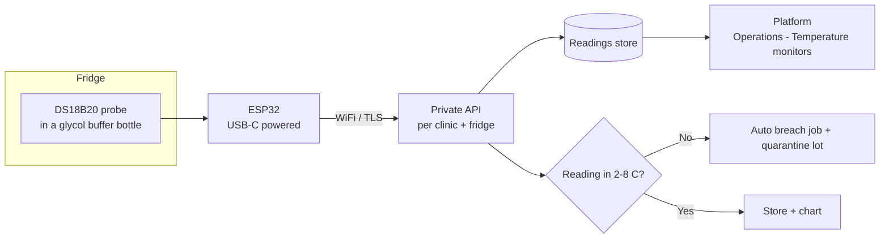
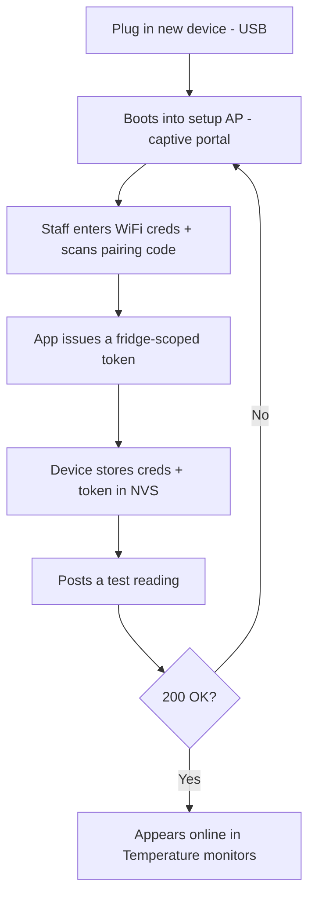

# Fridge temperature monitor — ESP32 hardware & setup

> Reference design for the clinic's own wireless temperature monitor. One small ESP32 device per fridge
> takes a probe reading every few minutes and **POSTs it to this clinic's private API over WiFi**, scoped
> and authenticated **per clinic + per fridge**. The platform stores the series, charts it
> (Operations → Temperature monitors), and **auto-raises a breach job** the moment a reading leaves
> 2–8 °C — closing the gap that manual twice-daily logs leave open overnight.
>
> This is a build-it-yourself spec. It is **not a TGA-registered medical device**; for accreditation,
> validate the probe against a NATA-traceable reference and keep it as a *monitoring aid* alongside the
> required logging.

## 1. How it fits together



## 2. What the device looks like

The finished unit (model **TM-01**) is a palm-sized sealed box that sits **on top of or beside the fridge**.
Only the thin probe cable goes inside; the OLED shows the live product temperature and a status LED reports
WiFi/health at a glance.

<div class="fig">
<svg viewBox="0 0 640 360" xmlns="http://www.w3.org/2000/svg" role="img" aria-label="Isometric rendering of the TM-01 enclosure showing the OLED display, status LED, USB-C cable and probe running into a buffer bottle">
<defs>
<linearGradient id="liq" x1="0" y1="0" x2="0" y2="1"><stop offset="0" stop-color="#a5f3fc"/><stop offset="1" stop-color="#22d3ee"/></linearGradient>
<linearGradient id="ledg" x1="0" y1="0" x2="1" y2="1"><stop offset="0" stop-color="#86efac"/><stop offset="1" stop-color="#16a34a"/></linearGradient>
</defs>
<ellipse cx="318" cy="312" rx="168" ry="26" fill="#0f172a" opacity="0.07"/>
<polygon points="300,120 429.9,195 429.9,290 300,215" fill="#dbe3ec" stroke="#94a3b8" stroke-width="1.4"/>
<polygon points="300,120 204.7,175 204.7,270 300,215" fill="#c4cdd9" stroke="#94a3b8" stroke-width="1.4"/>
<polygon points="300,120 429.9,195 334.6,250 204.7,175" fill="#f1f5f9" stroke="#94a3b8" stroke-width="1.4"/>
<polygon points="300,131 421,200 334.6,239 213,170" fill="none" stroke="#cbd5e1" stroke-width="1"/>
<polygon points="300.4,142 358.9,176 316,200 257.6,167" fill="#0b1220" stroke="#334155" stroke-width="1"/>
<text x="296" y="180" font-family="JetBrains Mono, monospace" font-size="15" font-weight="600" fill="#5eead4" transform="rotate(13 296 180)">4.2°C</text>
<text x="296" y="195" font-family="Inter, sans-serif" font-size="7" fill="#7dd3fc" transform="rotate(13 296 195)">FRIDGE 1 · OK</text>
<circle cx="392" cy="206" r="6" fill="url(#ledg)" stroke="#15803d" stroke-width="0.8"/>
<circle cx="392" cy="206" r="11" fill="#22c55e" opacity="0.18"/>
<text x="232" y="250" font-family="Inter, sans-serif" font-size="9" font-weight="700" fill="#475569" transform="rotate(30 232 250)" opacity="0.8">TLA · TM-01</text>
<rect x="198" y="244" width="14" height="9" rx="2" fill="#1f2937" transform="rotate(30 205 248)"/>
<path d="M205,255 C170,300 150,320 120,338" fill="none" stroke="#111827" stroke-width="5" stroke-linecap="round"/>
<text x="96" y="352" font-family="Inter, sans-serif" font-size="10" fill="#64748b">USB-C 5V</text>
<rect x="424" y="232" width="18" height="12" rx="2" fill="#9aa6b2" stroke="#64748b" stroke-width="0.8" transform="rotate(30 433 238)"/>
<path d="M440,240 C470,250 488,255 500,266" fill="none" stroke="#111827" stroke-width="4" stroke-linecap="round"/>
<rect x="486" y="250" width="56" height="74" rx="12" fill="url(#liq)" stroke="#0891b2" stroke-width="1.4" opacity="0.85"/>
<rect x="486" y="250" width="56" height="14" rx="7" fill="#e2e8f0" stroke="#94a3b8" stroke-width="1"/>
<rect x="508" y="246" width="12" height="10" rx="2" fill="#cbd5e1" stroke="#94a3b8" stroke-width="0.8"/>
<path d="M514,256 L514,300" stroke="#111827" stroke-width="3" stroke-linecap="round"/>
<rect x="510" y="296" width="8" height="20" rx="4" fill="#9aa6b2" stroke="#64748b" stroke-width="0.8"/>
<text x="514" y="338" font-family="Inter, sans-serif" font-size="10" fill="#64748b" text-anchor="middle">glycol buffer</text>
<text x="116" y="70" font-family="Inter, sans-serif" font-size="13" font-weight="700" fill="#0f172a">TM-01 wireless fridge monitor</text>
<text x="116" y="88" font-family="Inter, sans-serif" font-size="11" fill="#64748b">OLED live °C · status LED · USB-C power · 1–3 m waterproof probe</text>
</svg>
<p class="cap"><b>Figure 2.1</b> — Concept rendering of the TM-01 unit. Board, OLED and power stay <i>outside</i> the fridge; only the waterproof probe (in a glycol buffer bottle) goes in.</p>
</div>

<div class="fig">
<svg viewBox="0 0 640 360" xmlns="http://www.w3.org/2000/svg" role="img" aria-label="Cross-section showing the monitor on top of a fridge with the probe cable passing through the door gasket into a buffer bottle, and WiFi uplink to the private API">
<rect x="60" y="40" width="230" height="290" rx="10" fill="#eef2f6" stroke="#94a3b8" stroke-width="2"/>
<rect x="60" y="40" width="230" height="290" rx="10" fill="#ffffff" opacity="0.5"/>
<line x1="60" y1="120" x2="290" y2="120" stroke="#cbd5e1" stroke-width="2"/>
<line x1="60" y1="200" x2="290" y2="200" stroke="#cbd5e1" stroke-width="2"/>
<line x1="60" y1="270" x2="290" y2="270" stroke="#cbd5e1" stroke-width="2"/>
<text x="72" y="60" font-family="Inter, sans-serif" font-size="10" fill="#64748b">Fridge (2–8 °C)</text>
<rect x="120" y="150" width="40" height="46" rx="9" fill="#a5f3fc" stroke="#0891b2" stroke-width="1.6" opacity="0.85"/>
<rect x="120" y="150" width="40" height="10" rx="5" fill="#e2e8f0" stroke="#94a3b8"/>
<path d="M140,158 L140,188" stroke="#111827" stroke-width="3" stroke-linecap="round"/>
<rect x="136" y="184" width="8" height="14" rx="4" fill="#9aa6b2" stroke="#64748b"/>
<text x="140" y="214" font-family="Inter, sans-serif" font-size="9" fill="#475569" text-anchor="middle">probe + buffer</text>
<path d="M140,150 C170,120 250,118 300,118" fill="none" stroke="#111827" stroke-width="4" stroke-linecap="round"/>
<rect x="286" y="108" width="14" height="24" rx="3" fill="#475569"/>
<text x="293" y="148" font-family="Inter, sans-serif" font-size="9" fill="#64748b" text-anchor="middle">gasket pass-through</text>
<rect x="320" y="70" width="120" height="60" rx="10" fill="#f1f5f9" stroke="#64748b" stroke-width="2"/>
<rect x="332" y="84" width="50" height="24" rx="3" fill="#0b1220"/>
<text x="357" y="100" font-family="JetBrains Mono, monospace" font-size="11" font-weight="600" fill="#5eead4" text-anchor="middle">4.2°C</text>
<circle cx="420" cy="96" r="6" fill="#22c55e"/>
<text x="380" y="148" font-family="Inter, sans-serif" font-size="10" fill="#0f172a" text-anchor="middle" font-weight="600">TM-01 (outside, powered)</text>
<path d="M455,80 q18,-6 26,8" fill="none" stroke="#0d9488" stroke-width="2.4"/>
<path d="M462,72 q26,-8 38,12" fill="none" stroke="#0d9488" stroke-width="2.4" opacity="0.7"/>
<path d="M469,64 q34,-10 50,16" fill="none" stroke="#0d9488" stroke-width="2.4" opacity="0.45"/>
<rect x="500" y="150" width="120" height="56" rx="12" fill="#f0fdfa" stroke="#0d9488" stroke-width="2"/>
<text x="560" y="174" font-family="Inter, sans-serif" font-size="12" font-weight="700" fill="#0f766e" text-anchor="middle">Private API</text>
<text x="560" y="192" font-family="Inter, sans-serif" font-size="10" fill="#0f766e" text-anchor="middle">per clinic + fridge</text>
<path d="M455,150 C500,140 480,170 500,175" fill="none" stroke="#0d9488" stroke-width="2" stroke-dasharray="5 4"/>
<text x="500" y="120" font-family="Inter, sans-serif" font-size="10" fill="#0d9488" text-anchor="middle">WiFi / TLS</text>
<rect x="500" y="226" width="120" height="60" rx="12" fill="#fff" stroke="#cbd5e1" stroke-width="1.6"/>
<text x="560" y="250" font-family="Inter, sans-serif" font-size="11" font-weight="700" fill="#0f172a" text-anchor="middle">Platform chart</text>
<polyline points="512,272 528,266 544,274 560,260 576,268 592,256 608,264" fill="none" stroke="#0d9488" stroke-width="2"/>
<path d="M560,206 L560,224" stroke="#cbd5e1" stroke-width="2" marker-end="url(#)"/>
</svg>
<p class="cap"><b>Figure 2.2</b> — In-situ install. Probe in the fridge, electronics outside, thin cable through the door gasket, readings streamed over WiFi/TLS to the private endpoint and charted.</p>
</div>

## 3. Bill of materials (per monitor)

| Part | Suggested | Notes |
|---|---|---|
| MCU | **ESP32-C3** Super Mini (or ESP32-S3 / DevKitC) | WiFi + USB; C3 is cheap & low-power. Any ESP32 with WiFi works. |
| Temperature probe | **DS18B20, waterproof, on a 1–3 m cable** | Digital 1-Wire; the cable lets the board sit *outside* the fridge while the tip sits in the buffer. |
| Pull-up resistor | 4.7 kΩ | Between DS18B20 data and 3V3. |
| Thermal buffer | Small bottle of **glycol** (or 30–50 ml water) | Probe tip submerged. Damps door-opening spikes so readings track the *product*, not the air — the "Strive for 5" principle. |
| Power | **USB-C 5 V** wall adapter + cable | Always-on. Fridge interiors often have no outlet, so power the board outside and run only the thin probe cable in past the door gasket. |
| Backup (optional) | CR2032 + holder, **or** a small LiPo + TP4056, **or** a supercap | Keeps the clock + last buffer alive through short power cuts and lets it alarm on mains loss. |
| Status (optional) | 0.91" OLED (SSD1306, I2C) | Shows current °C + WiFi state on the device. |
| Offline buffer (optional) | microSD module, or just use internal flash/NVS | Stores readings when WiFi/API is unreachable, replays on reconnect. |
| Cable gland | **PG7 / M12** nylon gland | Seals the probe cable where it leaves the box → IP54. |
| Enclosure | Small ABS box (see §5) | 3D-printable or off-the-shelf; board outside the fridge, gasket-safe flat probe cable. |

## 4. Wiring & schematic

| Signal | DS18B20 | ESP32-C3 pin |
|---|---|---|
| VCC | Red | 3V3 |
| GND | Black | GND |
| Data | Yellow | GPIO 4 (with 4.7 kΩ pull-up to 3V3) |
| OLED SDA | — | GPIO 8 |
| OLED SCL | — | GPIO 9 |

> Use the DS18B20 in **external-power mode** (VCC connected), not parasitic, for reliable fridge readings.

<div class="fig">
<svg viewBox="0 0 660 420" xmlns="http://www.w3.org/2000/svg" role="img" aria-label="Wiring schematic: ESP32-C3 connected to a DS18B20 probe with a 4.7k pull-up resistor and an SSD1306 OLED over I2C, with colour-coded power, ground and signal wires">
<rect x="40" y="150" width="170" height="150" rx="10" fill="#0e7468" stroke="#0b5d54" stroke-width="2"/>
<text x="125" y="178" font-family="Inter, sans-serif" font-size="13" font-weight="700" fill="#ecfeff" text-anchor="middle">ESP32-C3</text>
<text x="125" y="194" font-family="Inter, sans-serif" font-size="10" fill="#99f6e4" text-anchor="middle">Super Mini</text>
<rect x="52" y="206" width="28" height="14" rx="3" fill="#0b1220"/>
<text x="66" y="217" font-family="Inter, sans-serif" font-size="8" fill="#fff" text-anchor="middle">USB-C</text>
<g font-family="JetBrains Mono, monospace" font-size="11" fill="#ecfeff" text-anchor="end">
<circle cx="210" cy="180" r="4" fill="#fca5a5"/><text x="202" y="184">3V3</text>
<circle cx="210" cy="210" r="4" fill="#cbd5e1"/><text x="202" y="214">GND</text>
<circle cx="210" cy="240" r="4" fill="#fbbf24"/><text x="202" y="244">GPIO4</text>
<circle cx="210" cy="270" r="4" fill="#7dd3fc"/><text x="202" y="274">GPIO8</text>
<circle cx="210" cy="296" r="4" fill="#a5b4fc"/><text x="202" y="300">GPIO9</text>
</g>
<rect x="470" y="40" width="150" height="96" rx="10" fill="#1f2937" stroke="#0b1220" stroke-width="2"/>
<text x="545" y="66" font-family="Inter, sans-serif" font-size="12" font-weight="700" fill="#f1f5f9" text-anchor="middle">DS18B20</text>
<text x="545" y="82" font-family="Inter, sans-serif" font-size="9" fill="#94a3b8" text-anchor="middle">waterproof probe</text>
<g font-family="JetBrains Mono, monospace" font-size="10" text-anchor="start">
<circle cx="470" cy="100" r="4" fill="#fca5a5"/><text x="478" y="104" fill="#fca5a5">VCC</text>
<circle cx="470" cy="116" r="4" fill="#fbbf24"/><text x="478" y="120" fill="#fbbf24">DATA</text>
<circle cx="470" cy="132" r="4" fill="#cbd5e1"/><text x="478" y="136" fill="#cbd5e1">GND</text>
</g>
<rect x="470" y="290" width="150" height="96" rx="10" fill="#111827" stroke="#0b1220" stroke-width="2"/>
<rect x="486" y="306" width="118" height="46" rx="3" fill="#0b1f3a"/>
<text x="545" y="334" font-family="JetBrains Mono, monospace" font-size="13" fill="#7dd3fc" text-anchor="middle">4.2°C</text>
<text x="545" y="372" font-family="Inter, sans-serif" font-size="10" fill="#94a3b8" text-anchor="middle">SSD1306 OLED (I²C)</text>
<g font-family="JetBrains Mono, monospace" font-size="9" text-anchor="start">
<circle cx="470" cy="300" r="3.5" fill="#fca5a5"/><circle cx="470" cy="316" r="3.5" fill="#cbd5e1"/><circle cx="470" cy="332" r="3.5" fill="#7dd3fc"/><circle cx="470" cy="348" r="3.5" fill="#a5b4fc"/>
</g>
<path d="M214,180 H300 V100 H466" fill="none" stroke="#ef4444" stroke-width="2.5"/>
<path d="M214,210 H280 V132 H466" fill="none" stroke="#64748b" stroke-width="2.5"/>
<path d="M214,240 H360 V116 H466" fill="none" stroke="#f59e0b" stroke-width="2.5"/>
<path d="M360,116 V70 H320" fill="none" stroke="#f59e0b" stroke-width="1.6" stroke-dasharray="3 3"/>
<g transform="translate(300,40)"><path d="M0,30 L8,18 L16,42 L24,18 L32,42 L40,30" fill="none" stroke="#0f172a" stroke-width="2"/><text x="20" y="14" font-family="Inter, sans-serif" font-size="10" fill="#0f172a" text-anchor="middle">4.7 kΩ</text></g>
<path d="M300,70 V100" fill="none" stroke="#ef4444" stroke-width="1.6" stroke-dasharray="3 3"/>
<path d="M214,180 H330 V300 H466" fill="none" stroke="#ef4444" stroke-width="2.5" opacity="0.55"/>
<path d="M214,210 H350 V316 H466" fill="none" stroke="#64748b" stroke-width="2.5" opacity="0.55"/>
<path d="M214,270 H430 V332 H466" fill="none" stroke="#7dd3fc" stroke-width="2.5"/>
<path d="M214,296 H410 V348 H466" fill="none" stroke="#a5b4fc" stroke-width="2.5"/>
<g font-family="Inter, sans-serif" font-size="11" transform="translate(48,330)">
<rect x="0" y="0" width="14" height="6" fill="#ef4444"/><text x="20" y="6" fill="#475569">VCC 3V3</text>
<rect x="100" y="0" width="14" height="6" fill="#64748b"/><text x="120" y="6" fill="#475569">GND</text>
<rect x="170" y="0" width="14" height="6" fill="#f59e0b"/><text x="190" y="6" fill="#475569">1-Wire data</text>
<rect x="290" y="0" width="14" height="6" fill="#7dd3fc"/><text x="310" y="6" fill="#475569">SDA</text>
<rect x="350" y="0" width="14" height="6" fill="#a5b4fc"/><text x="370" y="6" fill="#475569">SCL</text>
</g>
</svg>
<p class="cap"><b>Figure 4.1</b> — Connection schematic. The 4.7 kΩ pull-up sits between the 1-Wire <b>DATA</b> line (GPIO4) and <b>3V3</b>. The OLED is optional and shares I²C on GPIO8/9.</p>
</div>

## 5. Enclosure & 3D design

The case is a two-part **snap/screw ABS box**: a base shell that carries the board on internal standoffs and a
removable lid with the OLED window. The probe cable leaves through a sealed **PG7 cable gland** on one short
side; **USB-C** enters through a slot on the opposite side. Two **mounting ears** let it screw to the wall or
the side of the fridge.

> **Interactive 3D model.** Drag to rotate, scroll to zoom. Use **Exploded view** to separate lid / PCB / base
> and **Ghost lid** to see the internals.

<div class="viewer3d" data-model="enclosure"></div>

<div class="fig">
<svg viewBox="0 0 660 320" xmlns="http://www.w3.org/2000/svg" role="img" aria-label="Dimensioned engineering drawing: top view 72 by 50 mm and side view 72 by 30 mm with an 8 mm lid, cable gland and USB-C slot">
<g transform="translate(40,40)">
<text x="0" y="-12" font-family="Inter, sans-serif" font-size="12" font-weight="700" fill="#0f172a">Top view</text>
<rect x="0" y="0" width="220" height="150" rx="8" fill="#f8fafc" stroke="#334155" stroke-width="2"/>
<rect x="14" y="14" width="192" height="122" rx="4" fill="none" stroke="#cbd5e1" stroke-width="1" stroke-dasharray="4 3"/>
<rect x="90" y="40" width="80" height="44" rx="3" fill="#0b1220"/><text x="130" y="66" font-family="Inter, sans-serif" font-size="9" fill="#5eead4" text-anchor="middle">OLED</text>
<circle cx="44" cy="112" r="6" fill="#22c55e"/><text x="44" y="132" font-family="Inter, sans-serif" font-size="8" fill="#475569" text-anchor="middle">LED</text>
<rect x="-12" y="60" width="14" height="30" rx="2" fill="#9aa6b2" stroke="#64748b"/><text x="-30" y="78" font-family="Inter, sans-serif" font-size="8" fill="#475569" text-anchor="end">gland</text>
<rect x="218" y="64" width="12" height="22" rx="2" fill="#1f2937"/><text x="250" y="78" font-family="Inter, sans-serif" font-size="8" fill="#475569">USB-C</text>
<circle cx="36" cy="-2" r="3" fill="none" stroke="#64748b"/><circle cx="184" cy="-2" r="3" fill="none" stroke="#64748b"/>
<line x1="0" y1="172" x2="220" y2="172" stroke="#0d9488" stroke-width="1"/><line x1="0" y1="166" x2="0" y2="178" stroke="#0d9488"/><line x1="220" y1="166" x2="220" y2="178" stroke="#0d9488"/><text x="110" y="186" font-family="JetBrains Mono, monospace" font-size="11" fill="#0d9488" text-anchor="middle">72 mm</text>
<line x1="-18" y1="0" x2="-18" y2="150" stroke="#0d9488" stroke-width="1"/><line x1="-24" y1="0" x2="-12" y2="0" stroke="#0d9488"/><line x1="-24" y1="150" x2="-12" y2="150" stroke="#0d9488"/><text x="-22" y="78" font-family="JetBrains Mono, monospace" font-size="11" fill="#0d9488" text-anchor="middle" transform="rotate(-90 -22 78)">50 mm</text>
</g>
<g transform="translate(380,40)">
<text x="0" y="-12" font-family="Inter, sans-serif" font-size="12" font-weight="700" fill="#0f172a">Side view</text>
<rect x="0" y="0" width="220" height="90" rx="6" fill="#f1f5f9" stroke="#334155" stroke-width="2"/>
<line x1="0" y1="24" x2="220" y2="24" stroke="#94a3b8" stroke-width="1.5"/><text x="228" y="16" font-family="Inter, sans-serif" font-size="8" fill="#475569">lid</text>
<rect x="-14" y="40" width="16" height="14" rx="2" fill="#9aa6b2" stroke="#64748b"/><circle cx="-14" cy="47" r="5" fill="#1f2937"/><text x="-18" y="74" font-family="Inter, sans-serif" font-size="8" fill="#475569" text-anchor="end">PG7 gland</text>
<rect x="218" y="44" width="10" height="12" rx="2" fill="#1f2937"/>
<rect x="40" y="90" width="60" height="8" rx="2" fill="#cbd5e1" stroke="#64748b"/><rect x="120" y="90" width="60" height="8" rx="2" fill="#cbd5e1" stroke="#64748b"/><text x="110" y="112" font-family="Inter, sans-serif" font-size="8" fill="#475569" text-anchor="middle">mounting ears (⌀4.2 screw)</text>
<line x1="240" y1="0" x2="240" y2="90" stroke="#0d9488" stroke-width="1"/><line x1="234" y1="0" x2="246" y2="0" stroke="#0d9488"/><line x1="234" y1="90" x2="246" y2="90" stroke="#0d9488"/><text x="244" y="48" font-family="JetBrains Mono, monospace" font-size="11" fill="#0d9488" transform="rotate(-90 244 48)" text-anchor="middle">30 mm</text>
<line x1="0" y1="-6" x2="0" y2="24" stroke="#0d9488" stroke-width="1"/><line x1="0" y1="24" x2="20" y2="24" stroke="#0d9488" stroke-dasharray="2 2"/><text x="6" y="-10" font-family="JetBrains Mono, monospace" font-size="10" fill="#0d9488">8</text>
</g>
</svg>
<p class="cap"><b>Figure 5.1</b> — Dimensioned drawing. Outer envelope <b>72 × 50 × 30 mm</b>, 2.5 mm walls, 8 mm lid, PG7 gland + USB-C slot on opposing short walls, two M4 mounting ears.</p>
</div>

<div class="fig">
<svg viewBox="0 0 460 380" xmlns="http://www.w3.org/2000/svg" role="img" aria-label="Exploded assembly diagram showing, top to bottom, the lid, gasket, ESP32 PCB, base shell and the probe assembly">
<g stroke="#94a3b8" stroke-width="1.4">
<rect x="150" y="20" width="160" height="40" rx="8" fill="#e7ecf2"/>
<rect x="200" y="30" width="60" height="20" rx="3" fill="#0b1220" stroke="none"/>
<rect x="150" y="90" width="160" height="10" rx="5" fill="#fca5a5"/>
<rect x="160" y="130" width="140" height="22" rx="4" fill="#0e7468"/>
<rect x="172" y="136" width="22" height="12" rx="2" fill="#9aa6b2"/>
<rect x="150" y="185" width="160" height="95" rx="10" fill="#f4f6f9"/>
<rect x="162" y="197" width="136" height="71" rx="6" fill="#e2e8f0"/>
</g>
<g font-family="Inter, sans-serif" font-size="11" fill="#334155">
<line x1="310" y1="40" x2="372" y2="40" stroke="#cbd5e1"/><text x="378" y="44">Lid + OLED window</text>
<line x1="310" y1="95" x2="372" y2="95" stroke="#cbd5e1"/><text x="378" y="99">Gasket (IP54 seal)</text>
<line x1="300" y1="141" x2="372" y2="141" stroke="#cbd5e1"/><text x="378" y="145">ESP32-C3 PCB</text>
<line x1="310" y1="232" x2="372" y2="232" stroke="#cbd5e1"/><text x="378" y="228">Base shell +</text><text x="378" y="242">standoffs</text>
</g>
<line x1="230" y1="62" x2="230" y2="86" stroke="#0d9488" stroke-width="1" stroke-dasharray="3 3"/>
<line x1="230" y1="102" x2="230" y2="126" stroke="#0d9488" stroke-width="1" stroke-dasharray="3 3"/>
<line x1="230" y1="154" x2="230" y2="181" stroke="#0d9488" stroke-width="1" stroke-dasharray="3 3"/>
<g stroke="#94a3b8" stroke-width="1.4">
<rect x="56" y="232" width="14" height="14" rx="3" fill="#9aa6b2"/>
<path d="M63,246 C63,290 90,300 120,300" fill="none" stroke="#111827" stroke-width="3"/>
<rect x="116" y="294" width="10" height="14" rx="3" fill="#9aa6b2"/>
</g>
<text x="40" y="226" font-family="Inter, sans-serif" font-size="11" fill="#334155">PG7 gland +</text>
<text x="40" y="328" font-family="Inter, sans-serif" font-size="11" fill="#334155">DS18B20 probe</text>
<text x="150" y="360" font-family="Inter, sans-serif" font-size="11" font-weight="700" fill="#0f172a">Exploded assembly</text>
</svg>
<p class="cap"><b>Figure 5.2</b> — Exploded assembly. The same parts you can pull apart in the interactive model above.</p>
</div>

### CAD / print notes

- **Format:** parametric model authored in FreeCAD/Fusion; ship `STEP` (editable) + `STL` (print-ready) +
  `3MF`. The interactive viewer above is a lightweight WebGL preview, not the manufacturing file.
- **Print settings:** ABS or ASA (heat/fridge-condensation tolerant), 0.2 mm layers, 3 perimeters, 20–30 %
  infill. Add a 0.2 mm clearance on the lid lip for a clean snap.
- **Sealing:** PG7 gland on the probe side, a 1.5 mm gasket groove under the lid, USB-C as the only other
  opening → roughly **IP54**. Mount **gland-down** so condensation can't pool at the seal.
- **Standoffs:** four M2 bosses, board height 7 mm off the floor; lid screws are M2.5 brass heat-set inserts.
- **Mounting:** two M4 ears, 36 mm hole spacing, for a wall plate or VHB tape to the fridge side.

## 6. Placement & calibration

- Submerge the probe tip in the **glycol/buffer bottle**, sat on a middle shelf away from the walls, fan and door.
- Run the **thin probe cable through the door gasket**; keep the ESP32 + USB power *outside* the fridge (condensation & cold are bad for the board and battery).
- **Calibrate** against a NATA-traceable reference thermometer at install and at least **annually**; store the offset in NVS so the firmware applies it (`tempC += cal_offset`).
- Set the **alert thresholds to 2–8 °C** (the platform also enforces this server-side). Treat a single brief restock spike per the clinic's cold-chain policy.

## 7. Firmware

**Stack:** Arduino-ESP32 (or ESP-IDF). Libraries: `OneWire`, `DallasTemperature`, `WiFi`/`WiFiClientSecure`, `HTTPClient`, `ArduinoJson`, `time.h` (NTP), and `WiFiManager` for first-run provisioning. Optionally `ArduinoOTA`/`Update` for OTA.

**Loop, in plain terms:**
1. On boot, connect WiFi (captive-portal provisioning if no creds), sync time via NTP.
2. Every `interval` (default 5 min): read the probe, apply calibration.
3. Build a JSON reading and **POST it over TLS** with the device bearer token.
4. On success, clear that reading from the buffer; on failure (WiFi/API down), **append to a local buffer** and retry next cycle (newest-first replay).
5. Deep-sleep or `delay` between cycles; feed the watchdog; report `rssi`, `battery`, `uptime`, `fw` in each post.

### Sample sketch (abridged)

```cpp
#include <WiFiClientSecure.h>
#include <HTTPClient.h>
#include <OneWire.h>
#include <DallasTemperature.h>
#include <ArduinoJson.h>
#include <time.h>

// --- provisioned per device (store in NVS / WiFiManager params, do NOT hardcode in prod) ---
const char* WIFI_SSID   = "ClinicWiFi";
const char* WIFI_PASS   = "********";
const char* API_URL     = "https://api.clinicplatform.au/v1/clinics/the-lounge/fridges/f1/readings";
const char* DEVICE_TOKEN= "dvc_live_x9f...";          // bearer, clinic+fridge scoped
const char* DEVICE_ID   = "TM-01";
const float CAL_OFFSET  = -0.2;                        // from calibration
const uint32_t INTERVAL_MS = 5UL * 60UL * 1000UL;

OneWire oneWire(4);
DallasTemperature sensors(&oneWire);

void connectWifi() {
  WiFi.mode(WIFI_STA); WiFi.begin(WIFI_SSID, WIFI_PASS);
  for (int i = 0; i < 40 && WiFi.status() != WL_CONNECTED; i++) delay(250);
  configTime(0, 0, "pool.ntp.org");                   // UTC; server stores ISO-8601
}

bool postReading(float tempC) {
  if (WiFi.status() != WL_CONNECTED) connectWifi();
  if (WiFi.status() != WL_CONNECTED) return false;

  StaticJsonDocument<256> doc;
  doc["device_id"] = DEVICE_ID;
  doc["temp_c"]    = round(tempC * 10) / 10.0;
  doc["unit"]      = "C";
  time_t now = time(nullptr); char ts[25];
  strftime(ts, sizeof(ts), "%Y-%m-%dT%H:%M:%SZ", gmtime(&now));
  doc["ts"]        = ts;
  doc["rssi"]      = WiFi.RSSI();
  doc["fw"]        = "v1.4.2";
  String body; serializeJson(doc, body);

  WiFiClientSecure client; client.setInsecure();      // prod: pin the CA cert instead
  HTTPClient http; http.begin(client, API_URL);
  http.addHeader("Content-Type", "application/json");
  http.addHeader("Authorization", String("Bearer ") + DEVICE_TOKEN);
  http.addHeader("Idempotency-Key", String(DEVICE_ID) + "-" + ts);
  int code = http.POST(body); http.end();
  return code == 200 || code == 201 || code == 202;
}

void setup() {
  sensors.begin(); connectWifi();
}

void loop() {
  sensors.requestTemperatures();
  float t = sensors.getTempCByIndex(0) + CAL_OFFSET;
  if (t > -50 && t < 50) {                              // sanity
    if (!postReading(t)) { /* buffer to NVS/SD, replay next cycle */ }
  }
  delay(INTERVAL_MS);                                   // or esp_deep_sleep with RTC wake
}
```

> The abridged sketch omits the **NVS/SD offline buffer**, **WiFiManager captive-portal provisioning**,
> **watchdog**, **OTA**, and **CA-pinning** for brevity — all four are required for a production unit.

## 8. API contract (private, per clinic + fridge)

**Endpoint** — fridge id is in the path so the token can be scoped to exactly one fridge:

```
POST https://api.clinicplatform.au/v1/clinics/{clinicSlug}/fridges/{fridgeId}/readings
Authorization: Bearer <device-token>     # clinic + fridge scoped, rotatable
Content-Type: application/json
Idempotency-Key: <device-id>-<iso-ts>     # dedupes retries
```

**Body:**

```json
{
  "device_id": "TM-01",
  "temp_c": 4.2,
  "unit": "C",
  "ts": "2026-06-20T23:05:00Z",
  "rssi": -58,
  "battery": "ok",
  "fw": "v1.4.2"
}
```

**Response `202 Accepted`:**

```json
{ "stored": true, "in_range": true, "alert": null, "server_ts": "2026-06-20T23:05:01Z" }
```

If a reading is out of range the server stores it, returns `"in_range": false`, quarantines stock on that
fridge and raises a breach job — the device doesn't decide policy, it just reports. Example call:

```bash
curl -X POST "https://api.clinicplatform.au/v1/clinics/the-lounge/fridges/f1/readings" \
  -H "Authorization: Bearer dvc_live_x9f..." \
  -H "Content-Type: application/json" \
  -H "Idempotency-Key: TM-01-2026-06-20T23:05:00Z" \
  -d '{"device_id":"TM-01","temp_c":4.2,"unit":"C","ts":"2026-06-20T23:05:00Z","rssi":-58,"fw":"v1.4.2"}'
```

## 9. Security & provisioning

- **Per-device bearer token**, scoped to one clinic + one fridge, issued from the app when you pair the device; **rotatable/revocable** without touching the firmware build.
- **TLS only** (HTTPS). Production firmware **pins the API's CA/cert** rather than `setInsecure()`.
- **No secrets in source / git.** WiFi creds + token are entered once via a **captive-portal (WiFiManager)** and stored in NVS; a factory-reset clears them.
- **Idempotency key** so retried posts after a flaky connection don't double-count.
- Treat readings as **operational data, not patient data** — but keep the endpoint inside the same AU-resident, audited platform.



## 10. Reliability

- **Offline buffer:** when WiFi or the API is unreachable, append readings to NVS/SD and replay newest-first on reconnect, so an overnight outage doesn't lose the trail.
- **Time:** sync NTP; send **UTC ISO-8601** so the server owns local-time display.
- **Mains-loss alarm:** with a backup cell/supercap, the device can post a `"power":"battery"` event so the app flags "monitor on backup" before it dies.
- **Heartbeat:** the server treats *no reading for >2 intervals* as **offline** and raises a "monitor offline" job (mirrored in the device list).
- **OTA updates:** firmware version is reported each post; the fleet view offers a one-click OTA when a unit is behind.
- **Watchdog:** reset on a hung WiFi/HTTP stack.

## 11. What the app does with it

- **Operations → Temperature monitors:** fleet view — online/offline, signal, firmware, power, per-fridge sparkline, and a device-detail chart + recent-readings feed + endpoint/auth info.
- **Operations → Open / close & fridge:** each fridge card shows the **live current temp + 12 h sparkline + min/max**; the manual twice-daily log stays as a fallback for audit.
- **Excursion → breach pathway:** an out-of-range reading quarantines the affected lot ("Do not use") and raises a **facility breach job** to the Lead Nurse — the same pathway a manual excursion triggers.
- **Offline / firmware-behind / battery-low** monitors raise a **facility job** so they get fixed before they matter.

## Related

- App area: [Front desk & operations (plain-language review)](../review/01-front-desk-and-operations.md)
- Requirements: `REQ-MED-7` (cold-chain log), `REQ-FAC-5` (breach pathway), `REQ-INT-7` (device webhooks/API)
- ADRs: **ADR-0026** (front-desk operations), **ADR-0031** (the breach/job pathway), **ADR-0036** (webhooks/API phasing)
- Compliance: `C13` (cold-chain), "Strive for 5" National Vaccine Storage Guidelines
