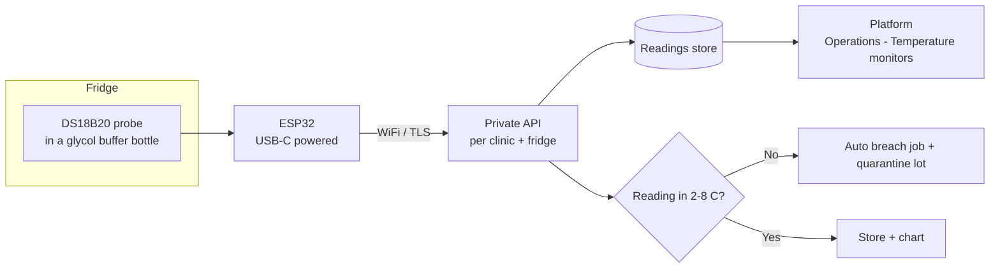
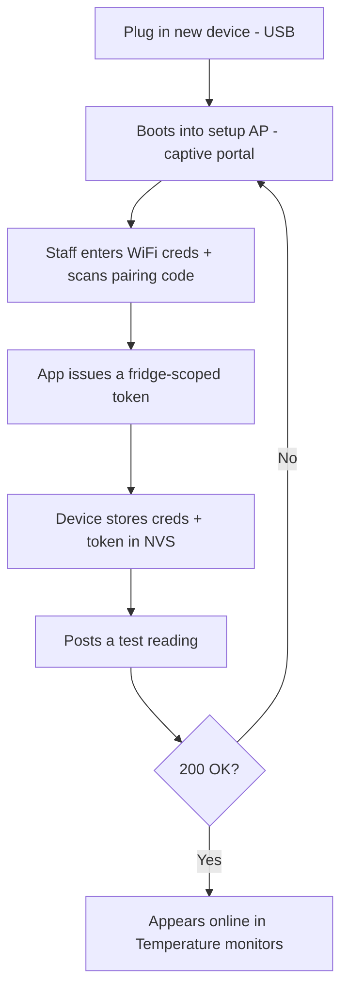

# Fridge temperature monitor — ESP32 hardware & setup

> Reference design for the clinic's own wireless temperature monitor. One small ESP32 device per fridge
> takes a probe reading every few minutes and **POSTs it to this clinic's private API over WiFi**, scoped
> and authenticated **per clinic + per fridge**. The platform stores the series, charts it
> (Operations → Temperature monitors), and **auto-raises a breach job** the moment a reading leaves
> 2–8 °C — closing the gap that manual twice-daily logs leave open overnight.
>
> This is a build-it-yourself spec. It is **not a TGA-registered medical device**; for accreditation,
> validate the probe against a NATA-traceable reference and keep it as a *monitoring aid* alongside the
> required logging.

## 1. How it fits together



## 2. Bill of materials (per monitor)

| Part | Suggested | Notes |
|---|---|---|
| MCU | **ESP32-C3** Super Mini (or ESP32-S3 / DevKitC) | WiFi + USB; C3 is cheap & low-power. Any ESP32 with WiFi works. |
| Temperature probe | **DS18B20, waterproof, on a 1–3 m cable** | Digital 1-Wire; the cable lets the board sit *outside* the fridge while the tip sits in the buffer. |
| Pull-up resistor | 4.7 kΩ | Between DS18B20 data and 3V3. |
| Thermal buffer | Small bottle of **glycol** (or 30–50 ml water) | Probe tip submerged. Damps door-opening spikes so readings track the *product*, not the air — the "Strive for 5" principle. |
| Power | **USB-C 5 V** wall adapter + cable | Always-on. Fridge interiors often have no outlet, so power the board outside and run only the thin probe cable in past the door gasket. |
| Backup (optional) | CR2032 + holder, **or** a small LiPo + TP4056, **or** a supercap | Keeps the clock + last buffer alive through short power cuts and lets it alarm on mains loss. |
| Status (optional) | 0.91" OLED (SSD1306, I2C) | Shows current °C + WiFi state on the device. |
| Offline buffer (optional) | microSD module, or just use internal flash/NVS | Stores readings when WiFi/API is unreachable, replays on reconnect. |
| Enclosure | Small ABS box | Board outside the fridge; route the gasket-safe flat probe cable. |

## 3. Wiring (DS18B20 + optional OLED)

| Signal | DS18B20 | ESP32-C3 pin |
|---|---|---|
| VCC | Red | 3V3 |
| GND | Black | GND |
| Data | Yellow | GPIO 4 (with 4.7 kΩ pull-up to 3V3) |
| OLED SDA | — | GPIO 8 |
| OLED SCL | — | GPIO 9 |

> Use the DS18B20 in **external-power mode** (VCC connected), not parasitic, for reliable fridge readings.

## 4. Placement & calibration

- Submerge the probe tip in the **glycol/buffer bottle**, sat on a middle shelf away from the walls, fan and door.
- Run the **thin probe cable through the door gasket**; keep the ESP32 + USB power *outside* the fridge (condensation & cold are bad for the board and battery).
- **Calibrate** against a NATA-traceable reference thermometer at install and at least **annually**; store the offset in NVS so the firmware applies it (`tempC += cal_offset`).
- Set the **alert thresholds to 2–8 °C** (the platform also enforces this server-side). Treat a single brief restock spike per the clinic's cold-chain policy.

## 5. Firmware

**Stack:** Arduino-ESP32 (or ESP-IDF). Libraries: `OneWire`, `DallasTemperature`, `WiFi`/`WiFiClientSecure`, `HTTPClient`, `ArduinoJson`, `time.h` (NTP), and `WiFiManager` for first-run provisioning. Optionally `ArduinoOTA`/`Update` for OTA.

**Loop, in plain terms:**
1. On boot, connect WiFi (captive-portal provisioning if no creds), sync time via NTP.
2. Every `interval` (default 5 min): read the probe, apply calibration.
3. Build a JSON reading and **POST it over TLS** with the device bearer token.
4. On success, clear that reading from the buffer; on failure (WiFi/API down), **append to a local buffer** and retry next cycle (newest-first replay).
5. Deep-sleep or `delay` between cycles; feed the watchdog; report `rssi`, `battery`, `uptime`, `fw` in each post.

### Sample sketch (abridged)

```cpp
#include <WiFiClientSecure.h>
#include <HTTPClient.h>
#include <OneWire.h>
#include <DallasTemperature.h>
#include <ArduinoJson.h>
#include <time.h>

// --- provisioned per device (store in NVS / WiFiManager params, do NOT hardcode in prod) ---
const char* WIFI_SSID   = "ClinicWiFi";
const char* WIFI_PASS   = "********";
const char* API_URL     = "https://api.clinicplatform.au/v1/clinics/the-lounge/fridges/f1/readings";
const char* DEVICE_TOKEN= "dvc_live_x9f...";          // bearer, clinic+fridge scoped
const char* DEVICE_ID   = "TM-01";
const float CAL_OFFSET  = -0.2;                        // from calibration
const uint32_t INTERVAL_MS = 5UL * 60UL * 1000UL;

OneWire oneWire(4);
DallasTemperature sensors(&oneWire);

void connectWifi() {
  WiFi.mode(WIFI_STA); WiFi.begin(WIFI_SSID, WIFI_PASS);
  for (int i = 0; i < 40 && WiFi.status() != WL_CONNECTED; i++) delay(250);
  configTime(0, 0, "pool.ntp.org");                   // UTC; server stores ISO-8601
}

bool postReading(float tempC) {
  if (WiFi.status() != WL_CONNECTED) connectWifi();
  if (WiFi.status() != WL_CONNECTED) return false;

  StaticJsonDocument<256> doc;
  doc["device_id"] = DEVICE_ID;
  doc["temp_c"]    = round(tempC * 10) / 10.0;
  doc["unit"]      = "C";
  time_t now = time(nullptr); char ts[25];
  strftime(ts, sizeof(ts), "%Y-%m-%dT%H:%M:%SZ", gmtime(&now));
  doc["ts"]        = ts;
  doc["rssi"]      = WiFi.RSSI();
  doc["fw"]        = "v1.4.2";
  String body; serializeJson(doc, body);

  WiFiClientSecure client; client.setInsecure();      // prod: pin the CA cert instead
  HTTPClient http; http.begin(client, API_URL);
  http.addHeader("Content-Type", "application/json");
  http.addHeader("Authorization", String("Bearer ") + DEVICE_TOKEN);
  http.addHeader("Idempotency-Key", String(DEVICE_ID) + "-" + ts);
  int code = http.POST(body); http.end();
  return code == 200 || code == 201 || code == 202;
}

void setup() {
  sensors.begin(); connectWifi();
}

void loop() {
  sensors.requestTemperatures();
  float t = sensors.getTempCByIndex(0) + CAL_OFFSET;
  if (t > -50 && t < 50) {                              // sanity
    if (!postReading(t)) { /* buffer to NVS/SD, replay next cycle */ }
  }
  delay(INTERVAL_MS);                                   // or esp_deep_sleep with RTC wake
}
```

> The abridged sketch omits the **NVS/SD offline buffer**, **WiFiManager captive-portal provisioning**,
> **watchdog**, **OTA**, and **CA-pinning** for brevity — all four are required for a production unit.

## 6. API contract (private, per clinic + fridge)

**Endpoint** — fridge id is in the path so the token can be scoped to exactly one fridge:

```
POST https://api.clinicplatform.au/v1/clinics/{clinicSlug}/fridges/{fridgeId}/readings
Authorization: Bearer <device-token>     # clinic + fridge scoped, rotatable
Content-Type: application/json
Idempotency-Key: <device-id>-<iso-ts>     # dedupes retries
```

**Body:**

```json
{
  "device_id": "TM-01",
  "temp_c": 4.2,
  "unit": "C",
  "ts": "2026-06-20T23:05:00Z",
  "rssi": -58,
  "battery": "ok",
  "fw": "v1.4.2"
}
```

**Response `202 Accepted`:**

```json
{ "stored": true, "in_range": true, "alert": null, "server_ts": "2026-06-20T23:05:01Z" }
```

If a reading is out of range the server stores it, returns `"in_range": false`, quarantines stock on that
fridge and raises a breach job — the device doesn't decide policy, it just reports. Example call:

```bash
curl -X POST "https://api.clinicplatform.au/v1/clinics/the-lounge/fridges/f1/readings" \
  -H "Authorization: Bearer dvc_live_x9f..." \
  -H "Content-Type: application/json" \
  -H "Idempotency-Key: TM-01-2026-06-20T23:05:00Z" \
  -d '{"device_id":"TM-01","temp_c":4.2,"unit":"C","ts":"2026-06-20T23:05:00Z","rssi":-58,"fw":"v1.4.2"}'
```

## 7. Security & provisioning

- **Per-device bearer token**, scoped to one clinic + one fridge, issued from the app when you pair the device; **rotatable/revocable** without touching the firmware build.
- **TLS only** (HTTPS). Production firmware **pins the API's CA/cert** rather than `setInsecure()`.
- **No secrets in source / git.** WiFi creds + token are entered once via a **captive-portal (WiFiManager)** and stored in NVS; a factory-reset clears them.
- **Idempotency key** so retried posts after a flaky connection don't double-count.
- Treat readings as **operational data, not patient data** — but keep the endpoint inside the same AU-resident, audited platform.



## 8. Reliability

- **Offline buffer:** when WiFi or the API is unreachable, append readings to NVS/SD and replay newest-first on reconnect, so an overnight outage doesn't lose the trail.
- **Time:** sync NTP; send **UTC ISO-8601** so the server owns local-time display.
- **Mains-loss alarm:** with a backup cell/supercap, the device can post a `"power":"battery"` event so the app flags "monitor on backup" before it dies.
- **Heartbeat:** the server treats *no reading for >2 intervals* as **offline** and raises a "monitor offline" job (mirrored in the device list).
- **OTA updates:** firmware version is reported each post; the fleet view offers a one-click OTA when a unit is behind.
- **Watchdog:** reset on a hung WiFi/HTTP stack.

## 9. What the app does with it

- **Operations → Temperature monitors:** fleet view — online/offline, signal, firmware, power, per-fridge sparkline, and a device-detail chart + recent-readings feed + endpoint/auth info.
- **Operations → Open / close & fridge:** each fridge card shows the **live current temp + 12 h sparkline + min/max**; the manual twice-daily log stays as a fallback for audit.
- **Excursion → breach pathway:** an out-of-range reading quarantines the affected lot ("Do not use") and raises a **facility breach job** to the Lead Nurse — the same pathway a manual excursion triggers.
- **Offline / firmware-behind / battery-low** monitors raise a **facility job** so they get fixed before they matter.

## Related

- App area: [Front desk & operations overview](../overviews/01-front-desk-operations.md)
- Requirements: `REQ-MED-7` (cold-chain log), `REQ-FAC-5` (breach pathway), `REQ-INT-7` (device webhooks/API)
- ADRs: **ADR-0026** (front-desk operations), **ADR-0031** (the breach/job pathway), **ADR-0036** (webhooks/API phasing)
- Compliance: `C13` (cold-chain), "Strive for 5" National Vaccine Storage Guidelines
