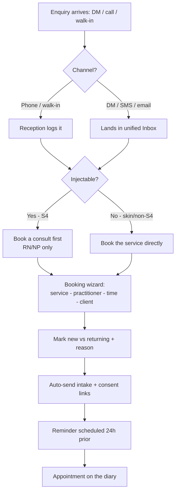
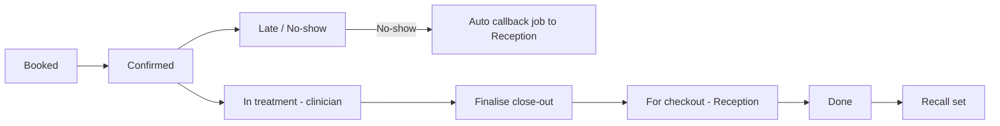
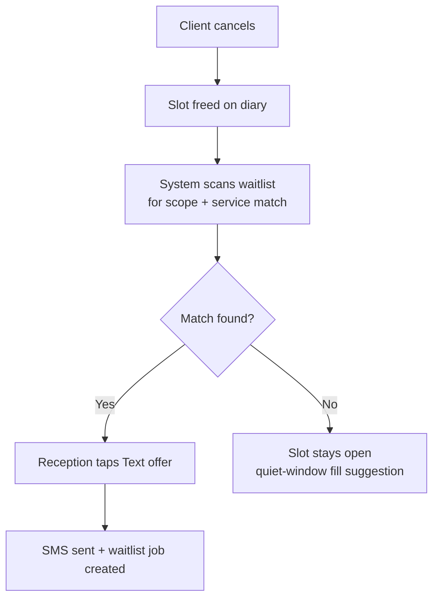
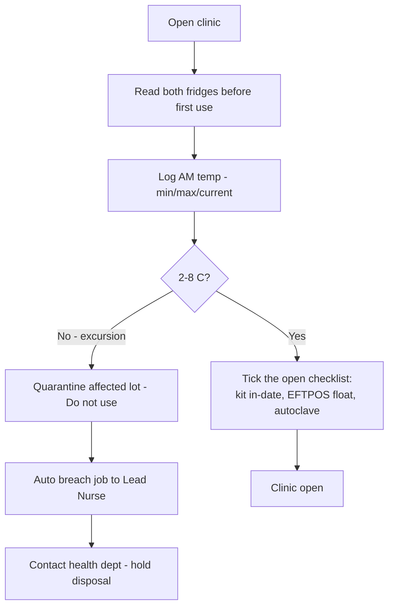

# Front desk, clients & operations — overview

> The front-of-house engine: enquiries, the diary, attendance, clients, the daily-jobs queue and the
> operational/compliance routines that keep the clinic running. Primary owner: **Reception**, with the
> **Lead Nurse** owning facility tasks and the **Owner** overseeing.

## What's in this area

| Function | What it does | When it's used | Primary role(s) |
|---|---|---|---|
| Today board | The live visit board for the day (waiting, in-treatment, for-checkout) | Continuously, all day | Reception, all clinical |
| Booking wizard | Service → practitioner → time → client → confirm; intake/consent auto-sent | Every new/return appointment | Reception |
| Walk-ins & same-day | Start a walk-in; injectables forced to consult-first | Ad hoc | Reception |
| Waitlist auto-fill | Offer a freed slot to a scope-matched client | On cancel / no-show | Reception |
| Late / no-show flags | Flag late attendance; a no-show auto-creates a callback job | As they happen | Reception |
| Clients / CRM | Client 360 — history, plan, consents, comms | Before/after every visit | Reception, clinical |
| Follow-ups (jobs) | One queue for recall, replies, consents, stock, reviews, facility | All day | Everyone (role-scoped) |
| Open / close + fridge log | Twice-daily cold-chain log; open/close checklist | Start & end of day | Reception, Lead Nurse |
| Rooms & devices | Bookable resources + utilisation; conflict flags | When scheduling | Reception, Owner |
| Equipment & maintenance | Autoclave validation, laser service/calibration register | Periodic | Lead Nurse |
| Call log | Inbound calls, missed-call text-back → callback jobs | All day | Reception |

## Workflows

### 1 · From enquiry to booked appointment  — *Reception*

### 2 · The visit lifecycle & hand-offs  — *Reception → clinician → Reception*

### 3 · Cancellation → waitlist fill  — *Reception*

### 4 · Opening the clinic — the cold-chain log  — *Reception / Lead Nurse*

## Roles at a glance

| Role | Responsibilities in this area |
|---|---|
| **Reception** | Enquiries, bookings, walk-ins, waitlist, attendance flags, checkout hand-off, call log, AM/PM fridge + open/close checklist, works most jobs |
| **Lead Nurse** | Facility oversight: fridge/breach, equipment maintenance, owns cold-chain integrity |
| **Owner** | Configures rooms/devices & policy; reviews utilisation; sees the exceptions digest |
| **Clinical (RN/NP/Dermal)** | Read the Today board; pick up their patients; participate in open/close |

## Related

- Requirements: `REQ-BOOK-*`, `REQ-FAC-4..10`, `REQ-MED-7`, `REQ-NOTIF-8`
- ADRs: **ADR-0024** (visit lifecycle), **ADR-0026** (front-desk operations & deposits), **ADR-0023** (jobs queue)
- PRDs: [PRD-02](../prds/PRD-02-booking-scheduling.md), [PRD-11](../prds/PRD-11-facility-complaints.md)
