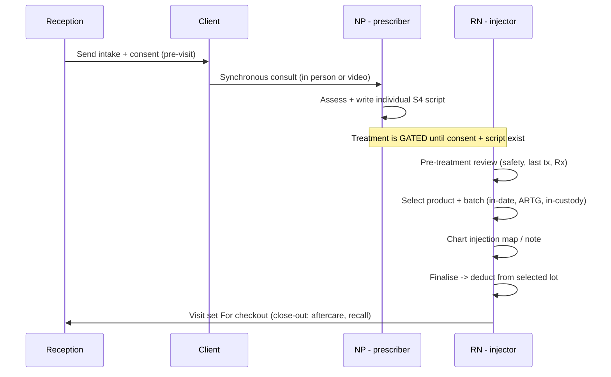
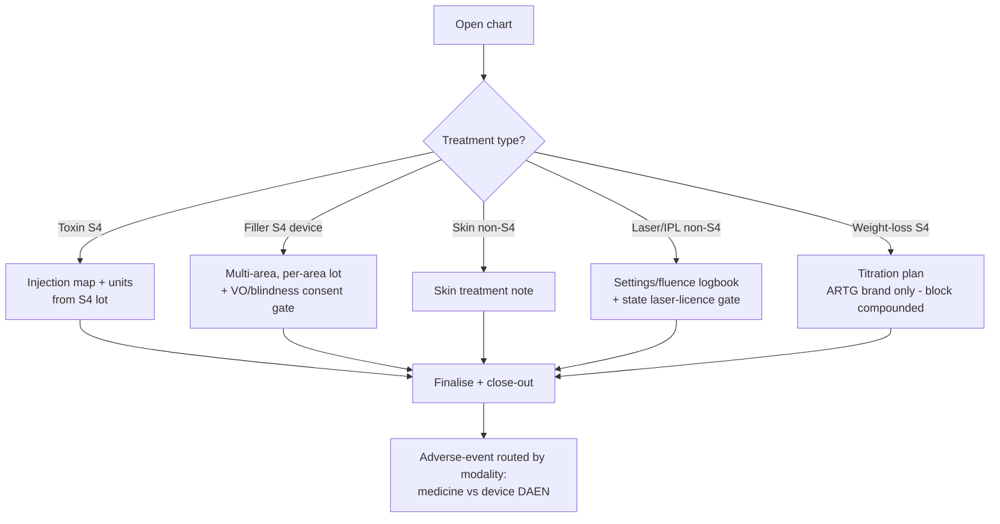
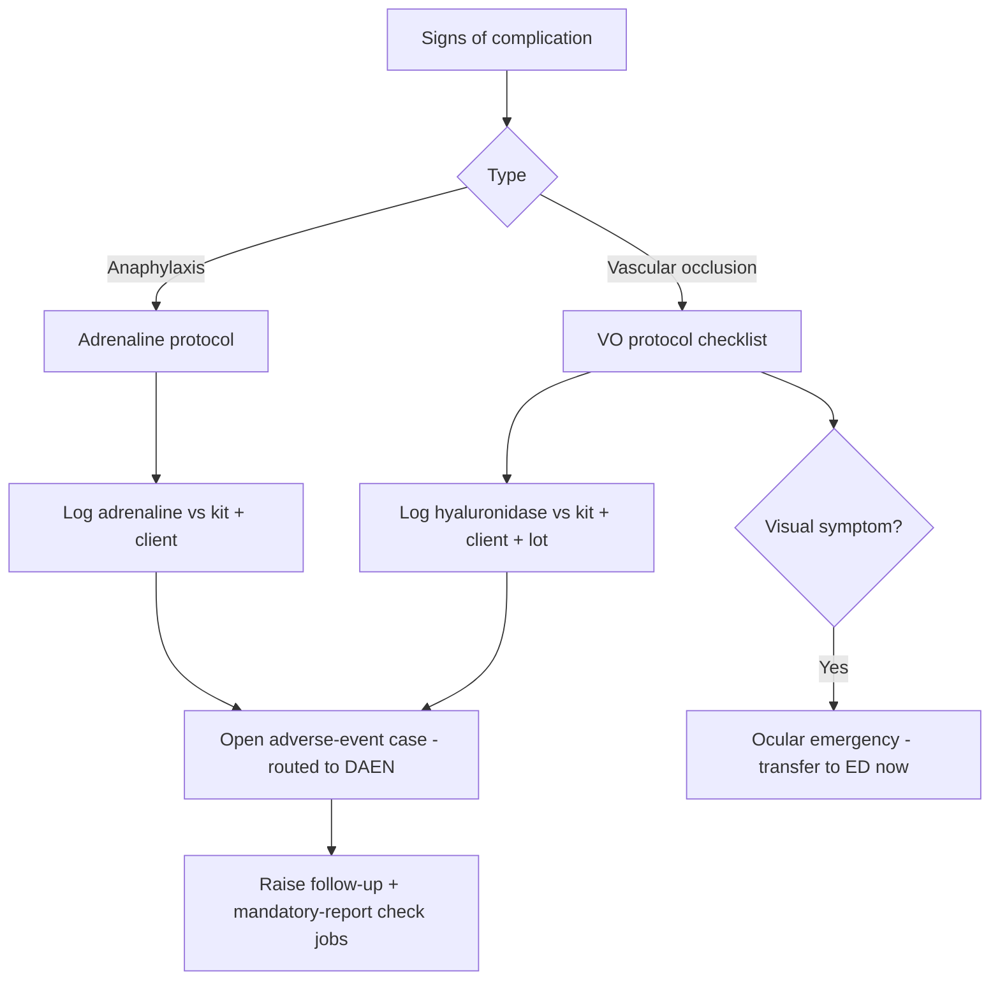

# Clinical — consult, prescribing, charting & treatments — overview

> The clinical core and the compliance moat: a synchronous consult, an individual prescription, a
> modality-aware chart that draws from a specific batch, and the safety flows around it. Primary owners:
> **Nurse Practitioner** (prescriber + S4 custody), **Registered Nurse** (administers on a valid script),
> **Dermal/laser therapist** (non-S4 only).

## What's in this area

| Function | What it does | When it's used | Primary role(s) |
|---|---|---|---|
| Pre-treatment review | Surfaces history, last treatment, consult/Rx status before anything is given | Start of every treatment | RN, NP, Dermal |
| Consult & prescribing | Synchronous consult → individual S4 script | Before any injectable | NP (prescriber) |
| Treatment menu (modality) | One record per modality: S4/device class, DAEN route, unit, rewards/ads, licence | Setup + at chart time | NP, Lead |
| Charting | Product + batch first, then injection map or skin/device note; finalise deducts the lot | Every treatment | RN, NP, Dermal |
| Complication response | VO / anaphylaxis protocol; logs hyaluronidase, opens an adverse-event case | On a complication | RN, NP, Lead |
| Photography | Fixed poses + ghost-overlay before/after | Each treatment | Whoever charts |
| Outcomes & revisions | Touch-up / satisfaction per treatment type | At aftercare | NP, Owner (reporting) |

## Workflows

### 1 · The compliant injectable visit  — *Reception → NP → RN*

### 2 · Modality-aware charting  — *RN / NP / Dermal*

### 3 · Complication response  — *RN/NP, oversight Lead*

## Roles at a glance

| Role | Responsibilities in this area |
|---|---|
| **Nurse Practitioner** | Consult, prescribe, hold S4 custody, manage complications, sign weight-loss titration |
| **Registered Nurse** | Pre-treatment review, administer on a valid script, chart, run the complication protocol |
| **Dermal / laser therapist** | Non-S4 skin & energy-device treatments only (licence-gated); never injectables |
| **Lead Nurse** | Oversees clinical safety, emergency kit, drills |

## Related

- Requirements: `REQ-RX-*`, `REQ-CLIN-2..13`, `REQ-MED-12/13`, `REQ-FAC-4`, compliance `C1/C2/C5/C8/C12`
- ADRs: **ADR-0024** (visit lifecycle), **ADR-0025** (modality model), **ADR-0011** (consult-before-script)
- PRDs: [PRD-04](../prds/PRD-04-consult-prescribing-s4.md), [PRD-05](../prds/PRD-05-clinical-charting.md), [PRD-03](../prds/PRD-03-intake-consent-gating.md)
